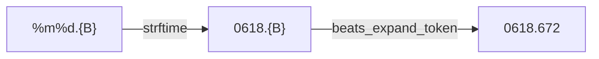

# .beats

The framework gives a face Swatch Internet Time in three pieces: the reading, a timer that redraws exactly as each beat turns over, and a token for putting a beat into a date. A face can show it as the clock itself, in a panel of its own, or in the date line. The reading splits the day into 1000 beats of 86.4 seconds, counted on one clock for everyone, Biel Mean Time, which is UTC plus one hour with no daylight saving. `@000` is midnight in Biel, and `@500` is midday there.

Two of the date formats on the framework's settings page carry a `.beats` reading, such as `0618.672` for the 18th of June at beat 672.

The maths lives in [`beats.h`](../../src/c/core/clock/beats.h) and [`beats.c`](../../src/c/core/clock/beats.c) under `src/c/core/clock/`.

## From the Clock to a Beat

**Into the Biel Day.** `beats_ms_from_hms` takes the UTC hour, minute, second, and millisecond, adds the hour Biel is ahead, and wraps at the end of the day:

```c
int32_t secs = hour * SECS_PER_HOUR + minute * SECS_PER_MIN + second;

return (((secs + BMT_UTC_OFFSET_S) % SECS_PER_DAY) * MS_PER_SEC) + ms;
```

So 23:00 UTC is midnight in Biel and starts beat 0. The largest value is the last millisecond of the day, 86,399,999, which still fits a 32-bit number.

It takes the clock already broken apart rather than a `time_t`, since the maths is in `c/core` and calling `gmtime` is left to the watch side (see [Where the Code Lives](index.md#where-the-code-lives)). [`units.h`](../../src/c/pebble/system/units/units.h) reads the clock with its milliseconds, breaks it apart, and hands the pieces over, and reads `@000` rather than crashing if the clock cannot be broken apart.

**Milliseconds, Not Seconds.** A beat is 86.4 seconds, so most beats start partway through a second. Counting in whole seconds would read the old beat for up to a second after the new one began, which is exactly the moment the face redraws to show it. The watch side reads the clock with `time_ms`, which gives the milliseconds too.

**The Beat Itself.** `beats_from_ms` divides by the length of a beat:

```c
return (int)((ms_into_bmt_day % MS_PER_DAY) / MS_PER_BEAT);
```

Dividing rounds down, so the last millisecond of the day reads 999 rather than a beat 1000 that does not exist. A negative input, from a clock that is not set yet, reads 0.

## Redrawing on Each Beat

A face redrawing on the minute tick alone would show each new beat up to a minute late, so when a face shows a beat, the time store runs a second ticker that fires exactly on each beat boundary.

`ms_until_next_beat` says how long until the next one:

```c
int32_t into_beat = ms_into_bmt_day % MS_PER_BEAT;

return (uint32_t)(MS_PER_BEAT - into_beat);
```

The answer runs from 1 to 86,400 and is never 0. Right on a boundary it gives a whole beat, since a timer set for 0 would fire again straight away and keep firing.

Each time the timer fires, the time store moves the time on and sets the timer again for the next boundary, as [The Time Store](time-store.md#each-tick-in-order) shows.

The beat timer and the minute tick are separate, so a face can run either or both. A face turns the timer on with `beats` in its `TimeConfig`, and only when something on screen shows a beat. `readout_date_shows_beats` says whether the chosen date format carries one. A face that shows no beat never pays for a timer that wakes the watch every 86.4 seconds.

## The {B} Token

A date format is a `strftime` pattern, such as `%m%d.{B}`. `{B}` is not part of `strftime`. It marks where the beat goes.

**Braces, Not a Percent Sign.** The format goes through `strftime` first, and every `%` belongs to it, so `%B` is already the month's name. `strftime` copies anything else through as it is, so `{B}` comes out the other side untouched and is filled in afterwards:



**Three Characters for Three Digits.** A reading is always three digits, and the token is three characters, so `beats_expand_token` writes the digits straight over the token. The string never grows, so it can never run past the buffer it is in, and nothing after the token has to move. A reading outside 0 to 999 is clamped first, since a fourth digit or a minus sign would break that promise. Every token in the string is filled, so a format with two never shows a stray brace.

**Only When It Is There.** `readout_date` checks `beats_has_token` before reading the beat, so a date format without one never breaks the clock apart a second time on every redraw.
