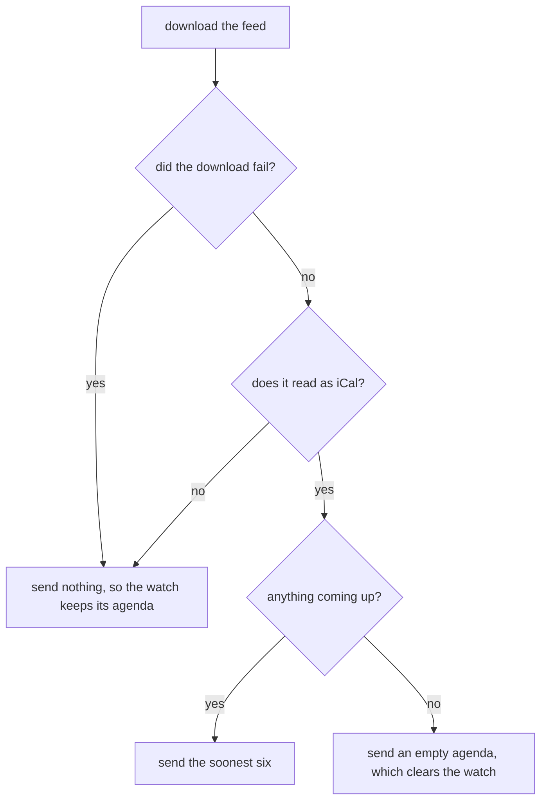

# The Calendar Store

The calendar store puts the wearer's next six events on the watch, each with its start, its end, whether it runs all day, a title, and a place. It reads any calendar that hands out a private iCal link, which covers Google, iCloud, and Outlook, with no account to sign into. The phone downloads the feed and does the hard part: repeating events, moved and cancelled meetings, and time zones. The watch keeps the result, saves it to flash, and asks for a fresh one on a schedule. A face starts the store, hands it a redraw function, and reads the events back.

The watch side lives in [`calendar_store.h`](../../src/c/pebble/io/stores/calendar_store.h) and [`calendar_store.c`](../../src/c/pebble/io/stores/calendar_store.c), and the strip is unpacked by [`calendar_wire.c`](../../src/c/core/wire/calendar_wire.c). The phone side is [`ical.ts`](../../src/ts/calendar/ical.ts) and [`feature.ts`](../../src/ts/calendar/feature.ts) under `src/ts/calendar/`. The polling deadlines, the tag byte on the saved copy, and the save that skips an unchanged agenda are shared with the other stores and covered in [How the Stores Work](stores.md).

## Setting It Up

On the watch, the face starts the store and subscribes its redraw:

```c
calendar_store_init((CalendarConfig){.live = true, .poll_min = 30, .persist_key = CALENDAR_KEY}, NULL);
calendar_store_subscribe(redraw);
```

`live`, `poll_min`, and `persist_key` mean the same as for every store, as [How the Stores Work](stores.md#the-shape-every-store-takes) covers, and a `CalendarSeed` pins a fixed agenda for screenshots.

On the phone, the face lists `calendar` in the `features` it passes to `startPebbleApp` (see [The Phone Side](phone-side.md#features)), and declares the `CALENDAR_STRIP`, `CALENDAR_REQUEST`, and `CALENDAR_ICS_URL` message keys. The settings page's calendar section has one field for the link, with directions for finding it in Google, iCloud, and Outlook. Anyone holding that link can read the calendar, and the page tells the wearer to treat it like a password.

## Downloading the Feed

**Links as the Wearer Pastes Them.** A Subscribe link from iCloud starts `webcal://`, which every calendar app reads as `https://` and the phone's request does not know at all. The phone rewrites it before fetching.

**Past Any Cache.** Each download adds a query parameter that changes every time, so no cache between the phone and the calendar can hand back a copy from before the wearer's last edit. The cost is a feed served from a signed link, such as an S3 presigned URL, which refuses a changed query. The links calendars hand out are not signed.

**A Bad Download Changes Nothing.** What comes back decides what the watch hears:



An error page or a body cut off partway is not a calendar, and says nothing about what is on. Treating it as an empty one would wipe the wearer's agenda every time the network had a bad moment. A feed that reads clean with nothing in it is a real answer, and an empty agenda is how the watch hears that every event was deleted. With no link set at all, the phone sends an empty agenda too, so one left from a removed feed does not stay behind.

A download gives up after 15 seconds. When the wearer changes the link, the phone fetches the new feed straight after the save, and an answer still out for the old link is dropped when it lands, so an old feed can never overwrite a new one. [The Phone Side](phone-side.md#after-a-save) covers that rule for every feature.

## Which Events Make the Strip

The feed is read by [ical.js](https://github.com/kewisch/ical.js), which handles the iCal rules. The framework's part is choosing what the watch shows.

**The Window.** An event makes the list when it has not finished yet and it starts before the end of the sixth day after today, on the phone's clock. That is today and the next six days, so a two-letter weekday code never appears twice in the list. The last day runs to its midnight rather than to six days from the moment of the fetch, so an evening event on it is not dropped while a morning one is kept. A meeting already under way still counts, since it is judged by its end.

**Soonest First.** The events are sorted by start, and the first six go to the watch. An all-day event starts at midnight, so it leads its day.

**Lengths the Feed Leaves Out.** A timed event with no end and no duration is given an hour, so a free and busy panel has a block to shade. An all-day event ends at the midnight after its last day, counted in calendar days rather than 24 hour steps, so it still ends at midnight on a day the clocks change.

**Cancelled Events.** Outlook keeps a cancelled meeting in the feed and marks it cancelled rather than taking it out. Those are left off, and a single cancelled occurrence of a series leaves a gap on that day.

**Repeating Events.** The phone walks each repeating event from its first occurrence and keeps the ones inside the window. Days the feed excludes are skipped. An occurrence the feed moved or renamed is read from its own entry, with its own time and title, and it is judged by where it landed, so a meeting moved into this week from next month still shows. Moved occurrences are matched to their series by its ID. Left to itself, ical.js applies every moved occurrence in the calendar to every series, so one moved meeting would replace an occurrence in every other series that met at the same time. A moved occurrence whose series is not in the feed shows as a plain event.

**A Cap on the Walk.** Starting the walk near the window would be quicker, but ical.js loses the occurrence count on the way, so a rule that ran its three times last January would come back with three more this week. So the walk starts where the rule does and stops after 10,000 steps. A daily rule set up as long as 27 years ago still reaches this week. An hourly one set up more than about 14 months ago does not, and it is left off with a line in the phone's log rather than vanishing without a word.

**One Bad Event Costs Only Itself.** ical.js throws on a rule it cannot walk and on an event with no start. That event is skipped, and the rest of the calendar still shows.

**Time Zones.** A feed states a timed event in a named zone and defines that name in the feed itself, and ical.js matches the two. So Outlook's `Eastern Standard Time`, which is not a name the phone knows, needs no table. A zone the feed names but never defines has no answer, and its times are read on the phone's own clock.

## What Reaches the Watch

**Absolute Times.** Each event's start and end go as seconds since the epoch, so the watch works out "in 20 minutes" against its own clock between polls rather than showing a countdown frozen at the moment of the fetch. An end past 2038 is pinned to the largest the field holds, as [The Message Formats](message-formats.md#the-agenda) covers.

**Plain ASCII Text.** The phone flattens each title and place to the characters the watch fonts carry, as [The Message Formats](message-formats.md#text-on-the-way-over) covers. The title is cut to 24 characters and the place to 16. An event with no title goes over as `(no title)`.

**A Bad Strip Changes Nothing.** A count above six is pinned to six, and a message that runs short is refused whole, so the store keeps the agenda it had rather than half of a new one.

**When the Phone Sends.** The phone sends an agenda when its code starts, whenever the watch asks, and when the link changes. Its slow refresh fills in when the watch has not asked, as [The Phone Side](phone-side.md#the-background-refresh) covers.

## On the Watch

**Reading It Back.** `calendar_store_strip` gives the whole agenda, and `calendar_store_event` gives one event or `NULL` past the filled count. The store keeps the agenda exactly as the phone sent it. An event that finishes between polls stays in the list until the next one arrives, so a panel that shows what is next skips anything already over:

```c
static const CalendarEvent *next_event(time_t now)
{
    const CalendarStrip *strip = calendar_store_strip();

    for (uint8_t index = 0; index < strip->count; index++)
    {
        if (strip->event[index].end > now)
        {
            return &strip->event[index];
        }
    }

    return NULL;
}
```

**Saved to Flash.** Six events do not fit in a single persist key, which holds 256 bytes, so the store saves the first four and the time they arrived. A relaunch shows those four straight away, and the first ask brings the full six back. A change that only touches the fifth or sixth event leaves the saved four the same, so it writes nothing. The restore gives every title and place a closing zero, so a damaged copy cannot send a panel past the end of the text. A failed write waits for the next agenda that differs, for the reason in [How the Stores Work](stores.md#skipping-unchanged-writes).

**How Old It Is.** `calendar_store_age_s` gives the seconds since the last agenda arrived, or -1 for none. A face can pass it to `store_poll_reconnect_due` to catch up after the phone reconnects, as [How the Stores Work](stores.md#polling-on-wall-clock-deadlines) shows.
