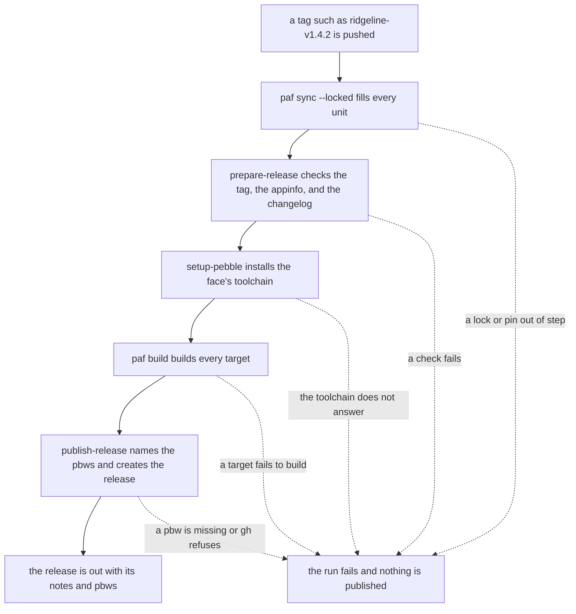

# Releases

A face repo releases one face at a time by pushing a tag named for the face and its version, such as `ridgeline-v1.4.2`. The release workflow reads the face out of the tag, checks the tag against the face's appinfo and changelog before anything is installed, builds the face on the toolchain CI uses, and publishes a GitHub release with the face's `.pbw` files attached and its changelog entry as the notes. Pushing the tag is the whole release process. Each face in a repo of several keeps its own version and its own releases.

The checks are in [`prepare-release`](../../.github/actions/prepare-release/action.yml), with the tag and changelog reading in [`lib.js`](../../.github/actions/prepare-release/scripts/lib.js) and the checks themselves in [`prepare-release.js`](../../.github/actions/prepare-release/scripts/prepare-release.js). Publishing is [`publish-release`](../../.github/actions/publish-release/action.yml), with [`publish-release.js`](../../.github/actions/publish-release/scripts/publish-release.js). The face lookup they share is in [`lib.js`](../../.github/shared/lib.js). The sync and `setup-pebble` steps are on [Building in CI](ci-builds.md).

## The Release Workflow

This is a face repo's whole release workflow, with its comments taken out:

```yaml
name: Release

run-name: ${{ github.event.head_commit.message }}

on:
  push:
    tags: ['*-v*']

jobs:
  release:
    runs-on: ubuntu-latest
    permissions:
      contents: write

    steps:
      - uses: actions/checkout@v7

      - uses: AKlitbo/pebble-app-framework-cli/.github/actions/sync@v2.0.0

      - name: Prepare Release
        id: release
        uses: AKlitbo/pebble-app-framework/.github/actions/prepare-release@v4.0.0

      - uses: AKlitbo/pebble-app-framework/.github/actions/setup-pebble@v4.0.0
        with:
          face: ${{ steps.release.outputs.face }}

      - name: Build Watchface
        run: paf build ${{ steps.release.outputs.face }}

      - name: Publish Release
        uses: AKlitbo/pebble-app-framework/.github/actions/publish-release@v4.0.0
        with:
          face: ${{ steps.release.outputs.face }}
          version: ${{ steps.release.outputs.version }}
          title: ${{ steps.release.outputs.title }}
          notes-file: ${{ steps.release.outputs.notes-file }}
```

**The Trigger.** Any tag matching `*-v*` starts it. Branch pushes never do. A tag that matches the pattern but is not a face release, such as `docs-v2`, reaches `prepare-release` and stops there.

**The Sync Has No Face.** The face is only known once `prepare-release` has read the tag, and `prepare-release` needs the face's `paf/` filled to read it. So the sync runs with no `face` and fills every unit in the repo, with `--locked` as always.

**Permissions.** `contents: write` lets the job's own token create the release and upload the files. Both release actions take that token by default, and nothing else needs to be set up.

**The Run's Name.** `run-name` names the run after the commit being released. Left unset, GitHub shows the workflow's name for a tag on any commit but the branch tip, which says nothing about what shipped.

From the tag to the published release, with every point that can stop it:



Nothing is published before the last step, so a run that stops earlier leaves no release behind.

## Finding the Face from the Tag

A release tag is shaped `<face>-v<version>`. `prepare-release` splits it at the last `-v` with a digit straight after it. A face name can hold `-v` itself, as in `retro-vapor`, and so can a pre-release label, as in `-very.1`, and neither is followed by a digit, so `retro-vapor-v2.0.0-very.1` still splits into `retro-vapor` and `2.0.0-very.1`. A tag with no such `-v` stops the release with the shape it should have.

**The Face's Name.** A face goes by the name the tools give it where it builds. A face that is its own unit, at the repo root or in a folder under `watchfaces/` or `watchapps/`, goes by the `name` in its appinfo, since its folder is named after wherever it was cloned. A face in a family goes by its folder's name beside the family's `core/`. So the LCARS face at its repo's root releases as `lcars-stardate-v1.13.0`, and Ridgeline in the Sketchbook family as `ridgeline-v1.4.2`.

**Finding Its Unit.** The action looks at the repo root and every folder under `watchfaces/` and `watchapps/` for a face of that name, which also tells it the unit the face builds from. Then it lists the faces with [`faces.ts`](../../src/tools/shared/faces.ts) from that unit's own `paf/`, the same lookup the face's build uses, even when the action comes from a newer tag. A name that matches no face stops the release there.

**One Name, One Face.** A face's name is its release tag, so two faces with the same name anywhere in the repo stop the lookup with both paths, rather than one being picked. Picking one would publish the wrong face's build and notes under the tag.

## What prepare-release Checks

Every check that can stop a release runs here, before the SDK install and the build, so a mistyped tag or an undated changelog costs seconds rather than a build.

**The Framework.** The unit's `paf/` has to hold a framework, and its `package.json` has to carry a version shaped like a release. That version is the framework tag the release builds on, and it goes on the summary. A `paf/` copied from a release candidate or a local clone carries the release's version too, so this check cannot tell them apart. The `--locked` sync in the same workflow already refused a local clone, and candidate tags are not released from.

**The Version.** The face's version is read from the same place the build reads it, which is the appinfo's `version`, or the unit's `package.json` version when the appinfo has none. It has to match the version in the tag, since a tag that disagrees with the face is a typo, and a published release cannot be cleanly taken back. It also has to be shaped `X.Y.Z` or `X.Y.Z-label`, such as `1.11.0` or `1.11.0-rc.1`. A version with build metadata, such as `1.11.0+2`, is refused, since `publish-release` could not read a label from it and would publish it as the latest release.

**Target Platforms.** The appinfo has to list `targetPlatforms`, since each `.pbw` on the release is named after the platforms it installs on. Finding that out after the SDK install and the whole build would waste both.

**The Changelog.** The face's `CHANGELOG.md` beside its appinfo has to hold a Keep a Changelog heading for the version, such as `## [1.4.2] - 2026-09-27`. A version with no heading of its own stops the release, which includes one still written up under `Unreleased`. So does a heading with no date, or with a date that does not exist, such as `2026-19-07` or `2026-02-30`. The entry under the heading has to hold some text.

**Not Already Released.** The action asks `gh` for a release under the tag. One that exists stops the run with a message to delete it first, since republishing over a shipped release is not something to do without noticing. A `gh` failure for any other reason stops it too, since the same problem would only show again once the build was done.

**What It Hands On.** Once every check passes, it writes the release notes to a file and gives the next steps the face, the version, the title, and the notes file. The title is the appinfo's `displayName` and the version, such as `Ridgeline 1.4.2`, and falls back to the face's name when the appinfo has no display name. A short table on the job summary names the face, the version, the framework tag, and the changelog entry it used.

### The Notes Are the Changelog Entry

The notes are the changelog entry as written, so there is no second copy to keep in step. The entry runs from its heading to the next `## [...]` heading, or to the link references a changelog closes with, whichever comes first, and the blank lines either side are trimmed. A line with the date goes above it. For Gridlock's 1.5.0, the notes open like this:

```
Released 2026-09-27.

### Added

- Added support for stock symbols outside the US, indexes, and currency pairs, such as 7203.T, ^GSPC, EURUSD=X, and BTC/USD. The watch shows the first 11 characters.
```

## Building the Face

`setup-pebble` runs with the face `prepare-release` found, so the release installs the same SDK and pebble-tool the face's framework records and its CI builds with. A release built on a different toolchain from CI would be a release nobody tested.

`paf build` then builds every target the face declares. The release workflow runs no memory report.

## What publish-release Attaches

`publish-release` builds nothing. It takes what the build left in the unit's `targets/` and publishes it.

**Every Target.** It asks the face's own [`build-manifests.ts`](../../src/tools/manifest/build-manifests.ts) for the face's targets, the same list the build worked from. A face can build more than one target from one source, such as a watchface and a watchapp, and each target's `.pbw` is attached.

**Named for What It Installs On.** The build names each `.pbw` after its target with no version, which is fine in a build folder and no help on a release page where several versions sit side by side. So each one is copied under a release name read from its target's manifest:

| Target Builds For | Asset Name | Example |
| :-- | :-- | :-- |
| one platform | `<target>-<platform>-<version>.pbw` | `gridlock-face-emery-1.5.0.pbw` |
| several platforms | `<target>-<version>.pbw` | `ridgeline-1.4.2.pbw` |

A `.pbw` built for several platforms carries a binary for each, so naming it after any one of them would mislead.

**Nothing Goes Out Short.** A target with no `.pbw`, or whose manifest lists no platforms, stops the step before `gh` runs, so a release never goes out missing a file. `gh release create` then creates the release with the title, the notes, and every file in one call.

**The Tag Has to Exist.** The call passes `--verify-tag`. Without it, `gh` creates a tag that was never pushed at the default branch's tip, and the release would carry `.pbw` files built from another commit.

**Pre-Releases.** A version with a label, such as `2.0.0-rc.1`, is published as a pre-release. GitHub never shows a pre-release as the repo's latest, so a wearer following the latest release keeps the last real one.

The release's address goes on the job summary with a table of the files attached, the target each came from, and the platforms it installs on.
