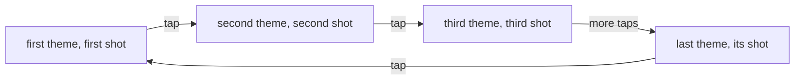
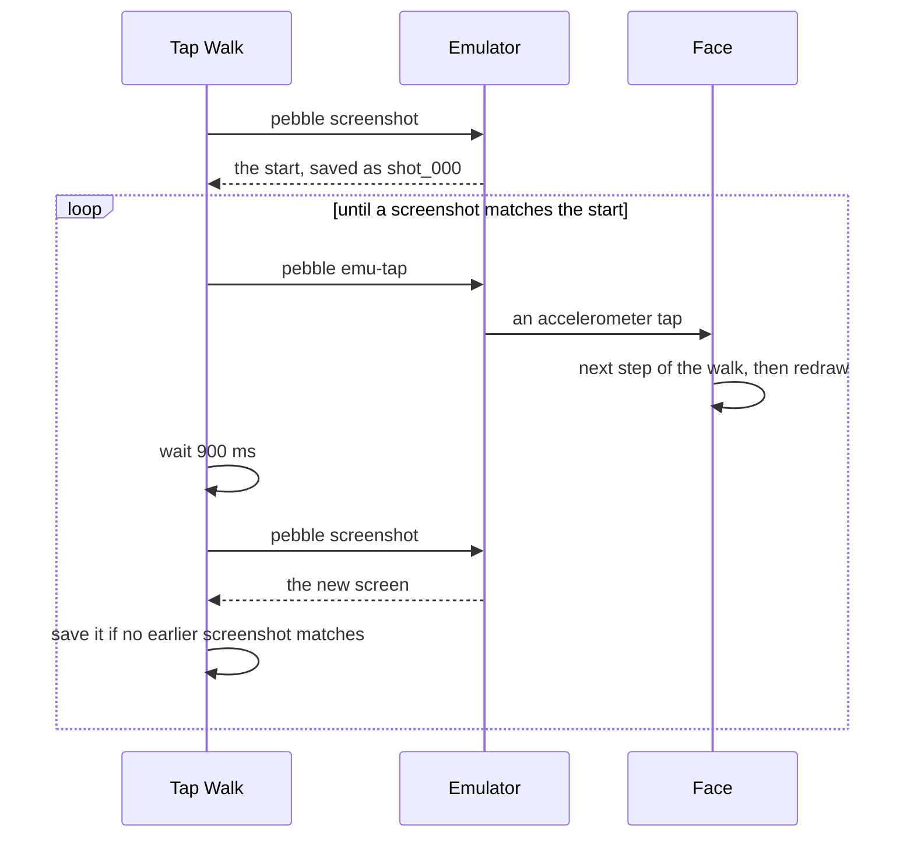

# The Dev Plugin

The `dev` plugin is for working on a face rather than wearing it. On the watch it has a harness that fills the stores with fixed readings and steps the face through its themes on a tap, so the same build draws the same screen every time it runs. On the computer, `clay-preview` builds the face's settings page into a file a browser opens, and `tap-walk` drives the emulator through the harness and saves a screenshot of every screen it reaches. A face lists the plugin once and turns the harness on only in a dev build, so none of it reaches a release.

The harness is [`dev_walk.h`](../../src/plugins/dev/c/dev/dev_walk.h) and [`dev_walk.c`](../../src/plugins/dev/c/dev/dev_walk.c) under `src/plugins/dev/c/dev/`. The tools are [`clay-preview.ts`](../../src/plugins/dev/clay-preview.ts) and [`tap-walk.ts`](../../src/plugins/dev/tap-walk.ts) beside it. A face runs them with `paf tool <face> clay-preview` and `paf tool <face> tap-walk`, which [the paf commands](../paf/commands.md#paf-tool) cover.

## Listing the Plugin

A unit lists the plugin under `plugins` in its `paf.config.json`, as `"dev": {}`. It takes no settings. `paf` then copies it into the unit's `paf/plugins/dev/`, and both tools become available to every face in the unit.

**The Harness Joins the Build.** The build stages each folder under a listed plugin's `c/` beside the framework's own C, so the plugin's `c/dev/` lands as `dev/` and a face includes `dev/dev_walk.h`. A face can keep its own `src/c/dev/` folder, since only whole paths clash. A face with its own `dev/dev_walk.h` stops the build, which names both files rather than compile against whichever one the include path finds first.

## Fixed Readings for Screenshots

`dev_walk_seed_stores(hour, minute)` starts the time, weather, health, system, and location stores from one fixture, with `live` false and the clock pinned. A face calls it in place of those stores' live inits. The stock and calendar stores are not part of the fixture, so a face that shows either seeds it itself. A seeded store shows its seed and nothing else, and [How the Stores Work](stores.md#seeded-for-screenshots) covers why nothing from the phone or the watch's services can replace it.

**The Fixture.** The readings come from a table of shots, one per step of the theme walk below, and the first shot is what a face shows with no walk running: 21 degrees and partly cloudy, a heart rate of 72, 8,431 steps, the battery at 64 percent, the phone connected, and the Quiet Time mark down. Every shot also carries the same 420 calories, 7 hours 11 minutes of sleep, 52 active minutes, and 5.3 km walked. The battery never reads as charging, and the system store has no next alarm.

**The Pinned Clock.** The time store gets the face's hour and minute with the seconds at 0, and no ticker runs. The date is not pinned. It comes from the watch's clock when the stores are seeded, so a face that shows the date draws the day it runs, and a screenshot taken tomorrow differs in the date alone.

**Everything Else Reads as Missing.** The weather seed starts from `WEATHER_SEED_EMPTY` and sets only the temperature and the condition. Humidity, wind, UV, sunrise, sunset, the high and low, and the forecast all keep their no-data values, so a panel showing one draws dashes rather than a 0 that looks real. A face whose screenshots need those readings writes its own walk with a fuller fixture, as below.

**Only What the Face Declares.** The weather and location stores are only filled for a face that declares their message keys. [`appmessage_features.h`](../../src/c/pebble/io/appmessage/appmessage_features.h) defines `APPMESSAGE_HAS_WEATHER` when the face declares all four weather keys and `APPMESSAGE_HAS_LOCATION` when it declares both coordinate keys, which [Talking to the Phone](talking-to-the-phone.md) explains. Without them the store is still started, empty and not live. A face without weather can still link a readout that reads the weather store, and an untouched store would hold zeros where a started one holds its no-data values.

**The Coordinates Are Text.** The location store keeps whatever text the face's phone code formats, as [The Location Store](location-store.md#how-a-fix-arrives) covers. The fixture's coordinates are the text `33-44` and `-112-07`, so a face that formats its coordinates as decimals or with hemisphere letters shows the fixture in a style its real readings never take.

## The Theme Walk

`dev_walk_init(mode, apply_theme)` starts the harness once the engine is up. `apply_theme` is the face's own hook for a theme change, such as recolouring its zones or swapping a frame picture. The harness runs it, then calls `engine_rebuild` so the whole face repaints.

With `DEV_WALK_NONE` that is all it does, and the face shows the fixture in whichever theme its settings hold. With `DEV_WALK_THEMES` it forces the first theme and subscribes to the accelerometer's tap service. Each tap moves to the next theme, seeds the stores again from the shot with the same number, sets that shot's Quiet Time mark, runs the face's hook, and rebuilds. After the last theme a tap comes back to the first:



**A Range of Readings.** The table holds eight shots, spread across temperatures from -8 to 35 degrees, six different conditions, a battery from 8 to 100 percent, the phone dropped in two shots, and the Quiet Time mark up in four. A sheet of every theme is also a sheet of how the face draws a flat battery, a lost phone, or snow. A face with fewer than eight themes uses the first shots, and a ninth theme starts the table again.

**The Number of Themes.** The walk asks the settings layer how many values the theme setting allows, which is the same count that caps a theme sent from the phone. Every theme the watch accepts is in the walk, without the walk being told how many there are. A face with no theme setting gets a count of 0, so every tap redraws the first theme and the walk never moves.

**Nothing Is Saved.** The theme and the Quiet Time mark are written with `settings_set_u8`, which changes the value in memory and never touches flash. A walk on the emulator leaves the theme the face had saved there as it was. On a face that has no Quiet Time setting, the write does nothing.

**A Face's Own Walks.** A walk is a tap handler that changes one thing and rebuilds, so a face can write its own beside the plugin's. The LCARS face steps its readout slots through every readout it offers, with a fuller weather fixture so no slot shows dashes and a different clock on each step, and has a second walk that steps the weather condition through every icon, day and night. Both live in the face's own `src/c/dev/` and seed the stores the same way, and `tap-walk` drives them like the theme walk.

## Turning It On for a Dev Build

A face keeps its switches in one header of its own, such as `src/c/dev/dev.h`, with a master switch that stays at 0 in every build it ships. The hooks are `static inline` and turn into nothing when the switch is off, so the face's `main.c` calls them without any `#if` of its own:

```c
// src/c/dev/dev.h
#pragma once
#include <pebble.h>

#define DEV_MODE 0             // 1 boots the face on the fixture. 0 in anything shipped
#define DEV_TAP_WALK_THEMES 0  // 1 makes a tap step to the next theme

#if DEV_MODE
#include "dev/dev_walk.h"
#endif

static inline bool dev_seed_stores(void)
{
#if DEV_MODE
    dev_walk_seed_stores(10, 42);
    return true;
#else
    return false;
#endif
}

static inline void dev_start(void (*apply_theme)(void))
{
#if DEV_MODE
    dev_walk_init(DEV_TAP_WALK_THEMES ? DEV_WALK_THEMES : DEV_WALK_NONE, apply_theme);
#else
    (void)apply_theme;
#endif
}

static inline void dev_stop(void)
{
#if DEV_MODE
    dev_walk_deinit();
#endif
}
```

`main.c` skips the live inits when the stores were seeded, starts the walk once the engine is built, and stops it on the way out, which drops the tap subscription:

```c
if (!dev_seed_stores())
{
    time_store_init((TimeConfig){.live = true, .minute_tick = true}, NULL);
    weather_store_init((WeatherConfig){.live = true, .poll_min = 30, .persist_key = WEATHER_KEY}, NULL);
    // and the rest of the face's live inits
}

engine_init(window, build_face);
window_stack_push(window, true);
dev_start(apply_theme);
```

`tap-walk`'s hints name `DEV_MODE` and `DEV_TAP_WALK_THEMES` in `src/c/dev/dev.h`, so a face that keeps the same names and the same file gets hints that name its own switches.

**Out of a Release.** With the switch at 0, `dev_seed_stores` returns false, the live inits run, and the face never includes the harness's header. `dev_walk.c` is still compiled for every face in a unit that lists the plugin. The Pebble SDK puts each function in its own section and has the linker drop any section nothing calls, so a face that never calls the harness ships none of it. Nothing checks the switch at build time, so it is up to the face to commit it at 0.

**A Settings Save Unpins the Clock.** A store stays seeded until something starts it live. A face whose settings handler calls `time_store_reconfigure` with `live` true starts the ticker again, so a save from the settings page on the emulator's phone puts the real time back on the face at the next minute. Seeding the time store again on a tap puts the pinned time back but leaves the ticker running, so the next minute moves the clock on again until the face restarts.

## Previewing the Settings Page

`clay-preview` builds a face's real settings page into `paf/plugins/dev/clay-preview.html`, a plain HTML file a desktop browser opens. It compiles the face's phone code into its build sandbox the way the build does, copies the committed `*.g.js` components beside it, and hands the default export of the face's `src/pkjs/config.ts` to the same Clay the face bundles. A face with no `config.ts` of its own stops with a line saying so. It needs Node and nothing from the Pebble SDK.

```sh
paf tool <face> clay-preview --watch
```

The value it adds over the phone is the console. A page whose script fails to parse, such as one with a component method written in shorthand, shows its error in the browser's console, where on the phone the settings screen just never opens. [The Settings Page](settings-page.md#the-serialization-trap) covers the mistakes that cause it.

**Stand-Ins for the Phone.** Clay expects to run inside PebbleKit JS, so the preview gives it a `Pebble` object that reports the chosen platform on firmware 4.3, a `localStorage`, and a map of the face's message keys built from its `pebble.appinfo.json`. The ids in the map are made up, since rendering only needs the names. With `Pebble` defined, Clay's `generateUrl` returns the page as one data URL, which [The Serialization Trap](settings-page.md#the-serialization-trap) covers, and the preview decodes it into the file. Clay notes which watch opened the page when PebbleKit JS reports it is ready, which never happens under Node, so the preview fills that in itself. Without it, Clay's filters would see no watch and every item would show.

**Watching for Changes.** `--watch` rebuilds the page after every save until stopped. It follows the face's `src/pkjs/`, its family core's `pkjs/` when it has one, and the framework's `ts/`. A burst of saves inside 150 ms rolls into one rebuild. Each rebuild drops Node's module cache and compiles again without emptying the earlier output, so it is an incremental compile rather than a cold one. Nothing reloads the browser, so refresh it after each rebuild. A failed rebuild prints its error and keeps watching. An edit to builder pieces triggers a rebuild too, but the page reads the committed component, so run `paf gen <face> clay` first, as [A Face's Own Builder](settings-page.md#a-faces-own-builder) explains.

**A Returning Wearer.** `--settings=<file>` opens the page filled from a file of saved values. Without it every preview is a fresh install on the page's defaults, and a bug that only shows once something is saved never shows. The file holds what Clay saves on the phone, each message key's name with its value, which [The Life of a Setting](life-of-a-setting.md) shows arriving there:

```json
{ "APPEARANCE_THEME": "2", "APPEARANCE_QUIET_TIME_ICON": true }
```

A select's value is text, as it is on the phone. A path that names no file stops the tool. A file that is not valid JSON does not, since Clay catches it, prints the parse error in the terminal, and opens the page on its defaults.

**A Round Watch.** `--platform=<name>` opens the page as if from that watch, `emery` by default. With `--platform=gabbro` the items a face filters by capability drop out the way they would there, as [The Settings Page](settings-page.md#building-the-page-from-sections) covers. The name goes to Clay as typed and is not checked against the watches that exist.

### What the Preview Leaves Out

**Save.** The Save button sends the page to `pebblejs://close`, which only the phone app answers, so nothing happens. None of the face's phone code runs beyond building the page, so nothing is fetched or sent to a watch.

**The Watch's Copy.** On the phone, the page opens on what Clay saved there, and the phone fills that from the watch's own settings when it holds none, as [The Life of a Setting](life-of-a-setting.md#after-a-reinstall) shows. The preview has no watch and keeps nothing between runs, so it opens on the defaults or on the `--settings` file.

**Which Components Are Registered.** The phone registers the location search and the components the face passes to `startPebbleApp`. The preview registers every component it finds instead: each `*.g.js` in the face's `src/pkjs/clay/` that has the shape of a component, plus the framework's location search and hidden store. A page that uses a component the face forgot to pass renders in the preview and breaks on the phone.

**The Custom Function.** The preview finds Clay's custom function as a `customClay` export of the face's `config.ts`, beside the default export. A face that defines it somewhere else and passes it to `startPebbleApp` gets a preview without it, so a face keeps it in `config.ts` and imports it from there.

**The Web View.** A desktop browser is not the phone app's web view. Spacing at phone width and anything the web view handles differently only show on the phone.

## Walking the Emulator with `tap-walk`

`tap-walk` takes a screenshot of every screen a face's walk reaches. It needs a face built with `DEV_MODE` on and a walk switched on, the emulator, and the Pebble SDK's `pebble` command, so it runs where the build does, which on Windows means WSL. It takes the start, then taps, waits, and takes another, until a screenshot matches the start:



```sh
paf build my-face
paf tool my-face tap-walk --install
```

**Telling Screens Apart.** Each screenshot's PNG bytes are hashed with SHA-256. The clock is pinned, so the same step of a walk always draws the same bytes, and a match with the start means the walk has come round. A screenshot that matches an earlier one is skipped without using up a number, so the saved files run `shot_000.png`, `shot_001.png`, and on with no gaps. Two themes that happen to draw the same screen save once.

**When the Taps Change Nothing.** A walk has at least two screens, so a first tap that draws the start again stops the tool with a hint to check the switches. That catches a face built with `DEV_MODE` off, with no walk switched on, or with no theme setting to walk. Anything that changes the screen outside the walk, such as a clock left live after a settings save, keeps the start from ever coming back. The tool gives up after 200 taps and names the folder holding what it saved so far.

**Installing, Not Building.** `--install` puts the `.pbw` from `targets/<target>/build/` on the emulator and gives it two seconds to start. It stops when there is no build there yet. It never builds, since `paf build` is what knows when a new message key or a framework change needs a clean build. Without `--install` the walk runs on whatever face is already on the emulator. `--emulator=<name>` picks the emulator to walk, `emery` by default. `--target=<target>` picks which build `--install` installs, so it stops without `--install`, and a face with more than one target stops until one is picked.

**A Stuck Emulator.** Each screenshot or tap gets 30 seconds before the tool stops, since both normally finish in well under one. The install and the first screenshot can boot the emulator, which on WSL can take a minute or more, so they get three minutes. `pebble` prints its own progress on stderr, and the tool holds that back and shows it only when a step fails, where it says why.

**The Out Folder.** `--out=<folder>` names where the screenshots go, `.tmp/tap-walk-shots` in the unit by default. The folder is emptied at the start of each walk, once the install has worked, so it only ever holds one walk's screenshots. Because it is emptied, the tool refuses a folder outside the unit, the unit itself, or one holding anything other than earlier screenshots and the files an operating system leaves when someone opens a folder, such as `Thumbs.db`. The default sits under `.tmp/`, so a repo that gitignores `.tmp/` keeps the screenshots out of its commits. Each screenshot lands in a temporary file first and only moves into the folder once it is kept, so a step that fails partway never leaves a half-written screenshot among the others.
