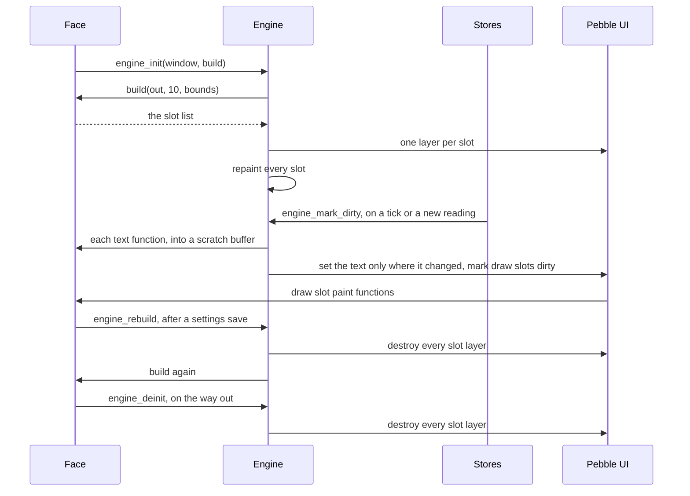

# The Engine

The engine turns a face's list of what goes where into the layers Pebble draws, and keeps them up to date. A face writes one build function that describes its screen as slots, each one a piece of text or a custom painted area. The engine makes a layer for every slot, refreshes the text when a store changes, skips the work when nothing did, and throws the whole screen away and builds it again when the settings change. A face never creates, tracks, or frees a layer of its own for anything the engine draws.

It lives in [`engine.h`](../../src/c/pebble/ui/engine/engine.h) and [`engine.c`](../../src/c/pebble/ui/engine/engine.c) under `src/c/pebble/ui/engine/`.

## Describing the Screen as Slots

A slot is one of two kinds, and an `EngineSlot` sets the fields for one or the other, never both.

**A Text Slot.** It names a `Zone`, which is where the text sits plus the font, alignment, colour, and up to three smaller fonts to step down to when the text is too wide (see [Text That Fits Its Slot](#text-that-fits-its-slot)), and a function that writes the text. A text slot left without a function stays empty. The function has the same shape as every one of the framework's [Readouts](readouts.md), so a slot can show the clock or the temperature with no code of the face's own.

**A Draw Slot.** It names a frame and a paint function, plus an optional pointer handed back to that function. This is for anything that is not a line of text: a gauge, an icon, a chart, or a backdrop that covers the whole window.

The build function fills the engine's array and returns how many slots it wrote:

```c
static void draw_backdrop(GContext *ctx, GRect bounds, const void *data)
{
    // paints the whole window, under everything else
}

static uint8_t build(EngineSlot *out, uint8_t max, GRect bounds)
{
    uint8_t i = 0;

    out[i++] = (EngineSlot){.frame = bounds, .draw = draw_backdrop};
    out[i++] = (EngineSlot){.zone = &s_zones[ZONE_TIME], .text = readout_time};
    out[i++] = (EngineSlot){.zone = &s_zones[ZONE_DATE], .text = readout_date};

    if (show_weather())
    {
        out[i++] = (EngineSlot){.zone = &s_zones[ZONE_TEMP], .text = readout_weather_temp};
    }

    return i;
}
```

`bounds` is the window's full area, which is what a backdrop or an overlay takes as its frame. The function runs again on every rebuild, so it can read the settings and return a different screen each time. A grid face works out its cells here, and a fixed face can swap one tall block for two smaller slots.

**Ten Slots at Most.** The engine keeps its slots in fixed arrays of ten, so it never allocates for them. The build writes straight into that array and has to stop at `max`. A count past ten is cut back to ten, which keeps the engine's own loops inside the arrays, but a build that wrote past the end has already done its damage by then.

**The Text Function Takes No Context.** It gets only a buffer and its size, so it cannot be told which slot it is filling. A face that shows the same kind of reading in four places writes four one-line wrappers, each with its slot baked in. That keeps a slot down to a single function pointer and keeps every readout callable on its own, outside the engine.

## Text That Fits Its Slot

A city name or a long date can be wider than the space a face drew for it. A zone, in [`zone.h`](../../src/c/pebble/ui/zone.h) and [`zone.c`](../../src/c/pebble/ui/zone.c), holds the main font and up to three smaller fonts, each with an area of its own. `zone_set_text_fit` measures the text in each font from the largest down and uses the first one it fits in:

```c
static const Zone s_city = {
    .rect = GRect(0, 100, 144, 30), .font_id = FONT_LARGE, .align = GTextAlignmentCenter, .color = GColorWhite,
    .font_id_fallback = FONT_MEDIUM, .rect_fallback = GRect(0, 104, 144, 24),
    .font_id_fallback2 = FONT_SMALL, .rect_fallback2 = GRect(0, 108, 144, 18),
};
```

**Its Own Area for Each Size.** Each smaller font gets its own rectangle, so a face can move a smaller line down to stay on the same baseline as the larger one, rather than having it float to the top of the space.

**A Little Room Spare.** The text has to fit 2 pixels inside the area's width, so a string that just touches the edge steps down rather than sitting against it.

**Leaving a Size Out.** A zone uses fewer sizes by leaving an area zero-sized, which is how an unset field in a C struct reads anyway, so a face only fills in the sizes it has. The search stops at the first zero-sized area.

**When Nothing Fits.** Text too wide even for the smallest size uses that size anyway, and the text layer cuts it short with an ellipsis. The text is still shown rather than dropped.

The fonts are named by slot rather than held as loaded fonts, which is what lets a zone be a `static const` table, as [Fonts](fonts.md) covers.

## From a Slot List to Layers

`engine_init` takes the window and the build function, runs the build, and makes the layers in the order the slots came back.

**Making a Text Slot.** It becomes a `TextLayer` with a clear background, set up with the zone's main font, alignment, and colour.

**Making a Draw Slot.** It becomes a plain `Layer` at the slot's frame, carrying its slot number. When Pebble draws it, the engine calls the face's paint function with the layer's own bounds and the slot's data pointer. The bounds start at 0,0, so the paint function draws in the slot's own space, and anything it draws past the frame is clipped.

**Stacking.** Each layer is added on top of the window's root layer as it is made, so the first slot sits at the bottom and the last on top. A backdrop goes first and the text after it. A layer the face adds before `engine_init`, such as a background picture, sits under every slot.

**Running out of Memory.** A layer that cannot be created leaves its slot empty rather than crashing. The rest of the screen still draws, and a repaint skips the empty slot. This matters most on a rebuild, which runs on every settings save while the heap is at its fullest.

Once every layer exists, the engine repaints all of them so the first frame has real text in it.

## Repainting

A face hands `engine_mark_dirty` to each store it reads from, and the store calls it whenever its reading changes. The time store calls it on every tick.

```c
engine_init(window, build);

time_store_subscribe(engine_mark_dirty);
weather_store_subscribe(engine_mark_dirty);
health_store_subscribe(engine_mark_dirty);
```

**Marking a Draw Slot.** Its layer is marked dirty, and Pebble calls its paint function on the next frame.

**Refreshing a Text Slot.** The engine runs its text function into a scratch buffer and compares the result with what the slot showed last. Most of the time it is the same, since the date reads the same all day and a new weather reading leaves the clock alone. An unchanged string stops there. Only a changed one is copied into the slot's own buffer and fitted to the zone, which measures the text in up to four fonts to find the largest that fits (see [Text That Fits Its Slot](#text-that-fits-its-slot)). A `TextLayer` keeps a pointer to its text rather than a copy, which is why each slot holds its string in a buffer that outlives the repaint.

**24 Characters, Terminator Included.** Each slot's buffer holds 23 characters of text. A longer string is cut to fit before it reaches the layer.

**Repainting Only What Changed.** A face with many slots can give each one a set of tags, a bit for each store it reads, and call `engine_mark_dirty_tags` with the bits that changed. A slot repaints when its tags share a bit with the change. A slot with no tags repaints on every change, which is why the plain `engine_mark_dirty` passes every bit at once. A store's subscriber takes no arguments, so the face writes a small function per store:

```c
enum { TAG_TIME = 1 << 0, TAG_WEATHER = 1 << 1 };

static void on_weather_changed(void)
{
    engine_mark_dirty_tags(TAG_WEATHER);
}

weather_store_subscribe(on_weather_changed);
```

A grid face sets each cell's tags from the stores its panel reads, so a weather reply repaints the weather panels and leaves the stock chart alone.

## Rebuilding

`engine_rebuild` destroys every slot layer and runs the build again. A face calls it from its settings handler:

```c
static void on_settings_changed(bool time_or_date_changed)
{
    // load whatever the new settings need first, such as a different background picture
    engine_rebuild();
}
```

A repaint only refreshes what a slot shows. A rebuild is needed whenever the settings change the slots themselves: which slots exist, where they sit, or a zone's colour, which a `TextLayer` only takes when it is made. The settings page sends every setting on every save, so the face rebuilds on any save rather than working out which ones touch the layout.

**Old Layers Go First.** Every layer is freed before any new one is made, so a rebuild never holds two copies of the screen at once.

**Every Slot Fits Again.** The rebuild clears each slot's last string, so the first repaint fits every text slot afresh against its new zone. A rebuild ends with a full repaint, so nothing else needs calling after it.

**New Layers Land on Top.** The rebuilt slot layers are added above whatever is already on the root layer. A layer the face adds after `engine_init` ends up underneath the slots after the first rebuild, so anything that has to sit above them belongs in a draw slot.

A face can also rebuild for reasons of its own. The Mosaic faces rebuild when the night or Quiet Time layout takes over, as [Layout Strings](layout-strings.md) covers.

## The Whole Lifecycle



`engine_deinit` frees the slot layers and nothing else. The window, the fonts, and any picture the face loaded are still the face's to free, and the window has to outlive the engine's layers.
