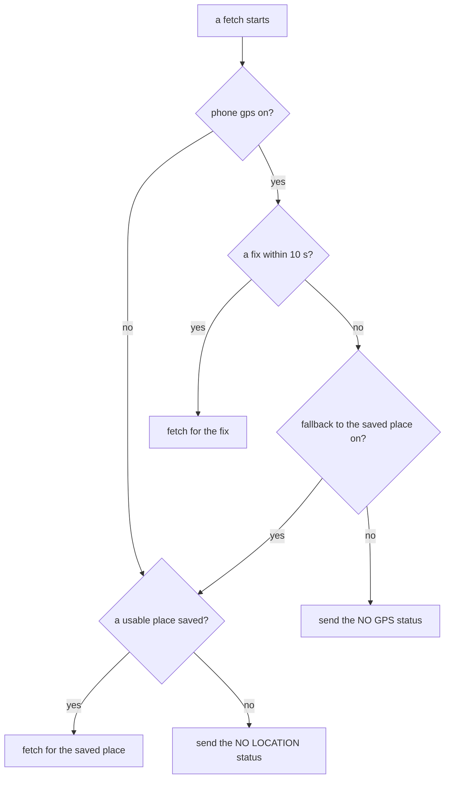

# Fetching the Weather

The weather feature gets the weather on the phone and sends it to the watch as one message: the temperature, the condition, whichever extra readings the face shows, and an hourly and a daily forecast strip. It finds the wearer's location, asks the provider the wearer picked, turns each provider's answer into the same reading, moves every time onto the watch's clock, and decides when a fetch is worth making. A face lists the feature, declares the keys for what it shows, and never talks to a provider itself.

The feature lives under `src/ts/weather/`, in [`feature.ts`](../../src/ts/weather/feature.ts), with the provider choice in [`weather.ts`](../../src/ts/weather/weather.ts), the shared parsing in [`util.ts`](../../src/ts/weather/util.ts), the condition catalogue in [`conditions.ts`](../../src/ts/weather/conditions.ts), and one file per provider in [`openmeteo.ts`](../../src/ts/weather/providers/openmeteo.ts), [`owm.ts`](../../src/ts/weather/providers/owm.ts), and [`weatherapi.ts`](../../src/ts/weather/providers/weatherapi.ts). It leans on the helpers every fetching feature shares in `src/ts/pkjs/`: [`request.ts`](../../src/ts/pkjs/request.ts), [`round.ts`](../../src/ts/pkjs/round.ts), [`asks.ts`](../../src/ts/pkjs/asks.ts), [`place.ts`](../../src/ts/pkjs/place.ts), and [`providers.ts`](../../src/ts/pkjs/providers.ts). This page covers the phone. What the watch does with the message is on [The Weather Store](weather-store.md) and [Weather Readings](weather-readings.md).

## Setting It Up

The face imports `weather` from `ts/weather/feature` and lists it when it starts:

```ts
app.startPebbleApp({
  clayConfig,
  features: [weather],
});
```

A face that leaves the feature out of `features` carries none of the weather code in its phone bundle and fetches nothing, as [Features](phone-side.md#features) covers.

**The Keys.** A face with weather declares `WEATHER_REQUEST`, `WEATHER_TEMPERATURE`, `WEATHER_CONDITIONS`, and `WEATHER_OK`. Without any one of them the feature fetches nothing and logs the keys that are missing. Everything else is chosen by key. The phone only sends a reading such as the humidity when the face declares its key, and only fetches the forecast when the face declares `WEATHER_FORECAST_HOURLY` or `WEATHER_FORECAST_DAILY`. `WEATHER_CONDITION_LABEL` also brings the condition's long name, such as `Partly Cloudy`, since the watch has no table of names of its own.

**The Settings.** `buildConfig` adds the provider, the API key, the temperature unit, the GPS toggle, the fallback toggle, and the saved place to the settings page when the face passes `location`, `weather`, and `temperature`. A change to any of these after a save fetches again.

**Coordinates.** A face that shows where the wearer is passes `weather.withCoords(formatCoords)` in place of `weather`, and its formatter adds the coordinate keys to every weather message. [The Location Store](location-store.md) covers the formatter and the watch side.

## Choosing a Provider

The wearer picks the source on the settings page:

* **Open-Meteo** is the default and needs no key. One request brings back the current reading, every extra, the sun times, and both forecast strips.
* **OpenWeatherMap** needs a key. Its free current weather endpoint has no UV index, dew point, day's high and low, chance of rain, or forecast, so the phone asks Open-Meteo for those at the same moment. A face that shows none of them skips the Open-Meteo call.
* **WeatherAPI.com** needs a key. Its two day forecast covers every reading, but it has no strips in the shape the watch takes, so when the face shows a strip the phone borrows it from Open-Meteo at the same moment.

The paired requests run side by side, and the result goes to the watch once both have answered. When only the Open-Meteo half fails, the reading still goes without the borrowed parts rather than not at all, and [The Weather Store](weather-store.md) covers how the watch keeps today's high and low from going stale then.

**The Key.** It is trimmed and cut to 64 characters, the most the settings page takes. With OpenWeatherMap or WeatherAPI chosen and no key saved, the phone sends a `NO API KEY` status without making a request.

## Where the Location Comes From

Each fetch reads the location settings afresh and picks one place:



**The Saved Place.** The settings page saves the coordinates of the place the wearer picked, so no provider ever looks a name up at fetch time, and every provider gets the same coordinates for the same place. [`place.ts`](../../src/ts/pkjs/place.ts) drops a latitude outside -90 to 90 or a longitude outside -180 to 180, and a place with no usable pair counts as none saved.

**The GPS Fix.** The phone accepts a fix up to 10 minutes old, since a cold start has no fresh one, and the weather barely moves in that time. The Pebble app does not reliably honour the location request's own timeout, so the phone gives up after 10 seconds on a timer of its own and takes the fallback. A phone with no location service counts as a failed fix. With GPS off, the saved place is used whatever the fallback toggle says.

**Coordinates on the Way to the Watch.** The result carries the coordinates the reading was for, or for WeatherAPI the coordinates it placed the query at. A failed fetch carries none, and the face's formatter runs on it anyway, so a face can show its own text for no fix rather than keep the last place.

## A Fetch Round

Each fetch is a round, and weather keeps to the rules every fetching feature shares. A round starts when the phone code starts, when the watch asks, on the slow tick when nothing has asked since the last one, and 250 ms after a save that changed a weather setting, as [The Background Refresh](phone-side.md#the-background-refresh) and [After a Save](phone-side.md#after-a-save) cover.

Until its first reading lands, the watch asks again every few seconds, as [The Weather Store](weather-store.md) covers, and an ask while a round is out is dropped, so it never starts a second GPS fix or spends a second provider call. A save shuts out a round still running, so a reading in the old unit or for the old city never reaches the watch after it. [The Phone Side](phone-side.md#after-a-save) covers both.

**Timeouts.** Every request gives up after 15 seconds on a timer of the phone's own, so every fetch answers, and a round has a 60 second cap on each try as a last guard. A round that hits the cap is closed and sends nothing, so it cannot hold off every later ask.

**Retries.** A failed fetch is tried again 5 seconds later, and once more 15 seconds after that, so a cold launch with the GPS still warming or the network not up yet recovers rather than sitting blank until the next poll. `NO LOCATION`, `NO API KEY`, `INVALID KEY`, `RATE LIMIT`, and `LOC NOT FOUND` are never tried again, since each waits on the wearer or on the provider's quota, and another try would fail the same way and spend another call.

**What a Failed Fetch Sends.** Each failed try goes to the watch with the ok flag at 0, a temperature of 0, and a status word in place of the condition:

| Status | Means |
| :-- | :-- |
| `NO LOCATION` | no usable saved place to fall back on |
| `NO GPS` | the fix failed and the fallback is off |
| `NO API KEY` | the provider needs a key and none is saved |
| `INVALID KEY` | the provider refused the key, as with OpenWeatherMap's 401 or WeatherAPI's codes for a bad or disabled key |
| `RATE LIMIT` | the key's call allowance is used up, as with OpenWeatherMap's 429 or WeatherAPI's monthly quota |
| `LOC NOT FOUND` | WeatherAPI could not place the query |
| `API ERROR` | the provider reported some other error |
| `NO WX DATA` | the reply had no current reading or no usable temperature |
| `BAD WX DATA` | the request worked but the reply was not JSON |
| `NET ERROR` | the request failed or timed out with no reply to read |

The message carries no extras and no strips, so the watch keeps those as they were. The watch keeps the last good temperature and condition too and only logs the status, as [Weather Readings](weather-readings.md) covers.

## Turning an Answer into a Reading

Every provider's answer becomes the same reading, so nothing after the provider knows which one answered.

**The Condition Catalogue.** [`conditions.ts`](../../src/ts/weather/conditions.ts) lists every condition the watch knows, each with the short label that goes over the wire, such as `PCLDY`, and its long name. The watch's icon table is generated from the same list, as [Icons](icons.md#weather-icons) covers. A condition the catalogue does not know goes over as `UNKNOWN`.

**From Each Provider.** Open-Meteo's WMO codes map to the catalogue by range, and a null or unknown code reads as `UNKNOWN` rather than landing on fog. OpenWeatherMap sends a word such as `Rain` or `Mist`, which goes through a short table of provider words to the nearest condition, and its icon code splits its one `Clouds` word into partly cloudy and cloudy. WeatherAPI's numeric code is the same in every language it answers in, so it maps straight to a condition, and an unlisted code falls back to the text through the same word table.

**Day and Night.** Open-Meteo and WeatherAPI flag whether the current reading is by day or by night, and OpenWeatherMap ends its icon code in `n` after dark. After dark the phone adds `_NIGHT` to the label, as in `RAIN_NIGHT`. A reading with no flag counts as day, so a missing flag never puts a moon on the face at noon.

## The Forecast Strips

The strips always come from Open-Meteo, from the provider's own request or the borrowed one, and only for a face that declares a strip key.

**Hourly.** Eight columns two hours apart, the most the watch holds, starting at the first hour at or after now. Each carries the condition as its one byte code and the temperature, and a column after dark, by Open-Meteo's own flag for that hour, gets the night bit so the watch draws the night icon for it.

**Daily.** Eight days starting on the phone's today, each with the condition and the day's high and low. The daily strip never sets the night bit, since a whole day has no night of its own.

**Columns with Gaps.** A column's temperature is rounded and held to -99 to 199, and a missing one goes over as the no-data value rather than a 0 that would read as a real temperature. A strip whose first hour or first date cannot be read is dropped whole rather than sent with every column labelled wrong.

## Units and Values

**Units.** The phone asks every provider for the wearer's temperature unit, so the reading arrives ready to show. When the wearer switches unit, the watch converts what it holds until the new fetch lands, as [Weather Readings](weather-readings.md) covers. Wind is always in km/h, and pressure is in hPa at sea level. Open-Meteo's ground level pressure would read about 170 hPa low in Denver, so the phone asks it for the sea level figure the other providers send.

**Whole Numbers.** Every number is rounded before it goes. The feels like temperature, the dew point, and the day's high and low are held to -99 to 199, so a provider glitch cannot overflow a three digit label. A value the provider sent as null or left out is not sent at all, so the watch shows its no-data value rather than 0% rain or a UV index of 0.

**Today's High and Low.** The high, the low, and the chance of rain are for the phone's today, since the watch keeps them as today's. A city on another date may not have the phone's today in its reply, and then they are left out rather than taken from the wrong day.

## Times on the Watch's Clock

The watch keeps the phone's clock, so every time the phone sends has to be on that clock, even for a weather location in another zone. [Sunrise and Sunset](sunrise-and-sunset.md) covers what that means on the face.

**Open-Meteo.** The phone sends its own time zone name with the request, and Open-Meteo answers with every time on the phone's clock. The name is only sent when its offset now matches the phone's clock, since a wrong name would put every time off. Without a name, or when Open-Meteo refuses it, the phone asks in the location's own zone and moves each time by the gap between the two clocks, and the refusal costs a second request.

**OpenWeatherMap.** Its sun times come as UTC seconds, which the phone reads on its own clock.

**WeatherAPI.** Its sun times are on the location's own clock, and the phone moves them by the offset between the local time and the UTC seconds it sends beside them.

**The Strips.** The hourly strip's first hour and the daily strip's first weekday are on the phone's clock too. When Open-Meteo answered in the location's zone and the gap between the two clocks is not a whole number of hours, the hour label rounds down, so a column can read up to 45 minutes early but never behind the watch's own hour. A city behind the phone's date has its days before the phone's today taken off the front, so the watch never shows a finished day as one six days ahead.

## Sending It to the Watch

The finished reading goes to the watch as one message, with each extra and strip the face declares and the coordinates from the face's formatter. [The Message Formats](message-formats.md) covers how the strips and coordinates are packed.

It goes through the send queue every message to the watch shares, and a message identical to the last one the watch took is skipped, a failed retry's included, since every send wakes the watch's radio. [The Phone Side](phone-side.md#the-background-refresh) covers the skip, and [The Weather Store](weather-store.md) picks the message up from there.
