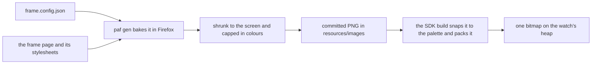

# The Frame Plugin

The `frame` plugin turns a face's frame, drawn as an HTML page with CSS, into the background picture the watch shows behind its readouts. `paf gen <face> background` opens the page in Firefox, empties out the live text the watch draws for itself, takes a picture of the screen area at several times its size, shrinks it to the watch's screen, and writes one PNG for each frame or theme on each platform the face targets. It can fold a bake down to sixteen colours, which halves the memory the watch needs to hold it, and it carries the Pebble palette as CSS variables so a frame's fills land on colours the watch can show.

The generator is [`generate-background.ts`](../../src/plugins/frame/generate-background.ts), and the plugin's [`package.json`](../../src/plugins/frame/package.json) tells `paf` how to run it. The palette is [`pebble-colors.css`](../../src/plugins/frame/css/pebble-colors.css), beside it under `src/plugins/frame/`.



## Listing the Plugin

A unit turns the plugin on by listing it in its `paf.config.json`, the same as the others. It takes no settings:

```json
{
  "plugins": {
    "icons": { "sources": "icons" },
    "frame": {}
  }
}
```

`paf sync` then copies the plugin into `paf/plugins/frame/` and installs Playwright and `sharp` with it. A unit that leaves it out installs neither. [Units](../paf/units.md) covers the plugin list.

The plugin offers one generator, `background`. Under `paf gen <face> all` it only runs for a face that holds a `frame/frame.config.json`, and it gets `--frame all --theme all`, which bakes every background the face has. [paf gen](../paf/commands.md#paf-gen) covers the command.

**Committed, Not Built.** The build never runs the generator. The PNGs it writes are committed with the face, and the plugin adds nothing to `paf check`. A frame page edited without a fresh bake ships the old background, and nothing reports it.

## What a Face Holds

A face keeps its frame under `frame/`, and the bakes land in `resources/images/`:

```
frame/
  frame.config.json
  day~emery.html
  night~emery.html
  css/
    frame.css
resources/images/
  background~emery.png
  background-night~emery.png
```

**One Page per Frame and Platform.** A frame page is named `<frame>~<platform>.html`, so the same frame drawn for a round screen sits beside it as `<frame>~gabbro.html`. Emery bakes at 200 by 228 and gabbro at 260 by 260. A frame counts only when it has a page for a platform the face's appinfo targets, so a draft page for a round screen does not become a second frame of a face that only builds for emery. A face with no appinfo, or none of its platforms known, bakes for emery. A platform the face targets with no page for the frame being baked is skipped with a warning, and the other platforms still bake.

**The Viewport.** The page needs an element with the class `viewport`, sized to the screen in CSS pixels. That element is what gets photographed, and nothing outside it reaches the PNG. A page can lay out the rest however it likes, such as drawing larger and scaling it down with a transform.

**What a Page Links.** A page links the plugin's palette at `../paf/plugins/frame/css/pebble-colors.css`, then its own stylesheets. It can also link anything the browser can load, such as a stylesheet kept elsewhere in the repo or a web font.

**The Config.** `frame/frame.config.json` sets how the face bakes:

```json
{
  "defaultFrame": "day",
  "defaultScale": 4,
  "supportsTheme": false,
  "bareBackgroundBase": "day",
  "clearTextSelectors": [".time", ".date"],
  "hideSelectors": [".label h3"],
  "unpaintSelectors": [".text-bar"],
  "maxColors": 16
}
```

| Field | What It Sets |
| :-- | :-- |
| `defaultFrame` | the frame a run bakes when it names none |
| `defaultScale` | how many times the screen size the browser draws at, unless `--scale` says otherwise |
| `supportsTheme` | whether the face swaps theme sheets over one page, below |
| `bareBackgroundBase` | the frame whose PNG is plain `background`, or `null` for none |
| `clearTextSelectors` | elements whose text is emptied before the picture |
| `hideSelectors` | elements taken out of the layout before the picture |
| `unpaintSelectors` | elements that keep their space but draw nothing |
| `maxColors` | the most colours the bake may keep, left out for no cap |

## Frames and Themes

`supportsTheme` says how a face has its looks.

**A Page per Look.** With `supportsTheme` off, every look is a frame with a page of its own, and each page links its own palette sheets. A `theme_*.css` file such a page links is a plain stylesheet, and the generator never treats it as a theme.

**One Page, Many Palettes.** With `supportsTheme` on, the face has one page and one `frame/css/theme_<name>.css` sheet per theme. For each theme the generator takes out every stylesheet link whose address holds `theme_` and adds that theme's sheet to the page.

**Picking with `--frame` and `--theme`.** Each takes a name or `all`, and `all` means every one the face has:

```sh
paf gen my-face background                     # the default frame
paf gen my-face background --frame night       # one frame
paf gen my-face background --frame all         # every frame
paf gen my-themed-face background --theme dusk # one theme
paf gen my-themed-face background --theme all  # every theme
```

`--frame` also takes the page's file name, so `night~emery.html` picks `night`. The platform tag is dropped and picks nothing, since every platform the face targets is baked whichever page is named. A frame or theme the face does not have is refused with the names it has, and so is a word given without its flag, so a stray name never bakes the default frame over its background.

**What Each Kind of Face Takes.** A face without themes takes `--theme all` and bakes each frame as it stands, and refuses a named theme. A face with themes has to be told which, since a bake with no theme writes a file no theme loads. It also bakes one frame per run, since a themed background is named after its theme alone and a second frame would be written over the first. So a face with themes and more than one frame refuses `--frame all`, and `paf gen <face> all` stops on it. A frame page or theme sheet called `all` is refused wherever it comes from, since the word already means every one.

## Baking a Page

The generator drives Firefox through Playwright. It uses Firefox rather than Chromium, since Chromium clips pseudo-elements drawn at a z-index of -1, which is a common way to draw carve-outs in a frame's chrome.

**Stylesheets First.** Firefox draws a page whose stylesheet is missing without a word, and a frame whose palette sheet went missing would bake with every colour it set left out. So before baking anything, the generator opens every page it is about to bake and checks each local stylesheet link is a file that is there. One missing stops the run before any PNG is rewritten. A sheet from the web is not checked, since one that fails shows as the wrong font rather than a bare frame. A themed run skips the page's own theme links, since it swaps them out anyway.

**Taking Out the Readouts.** For each bake the generator loads the page, swaps in the theme when there is one, and then clears, hides, and unpaints the elements the config names, which takes out everything the watch draws for itself. Hiding closes the layout up around the element, so it suits something nothing else is placed against. Unpainting leaves a hole exactly where the element was, its `::before` and `::after` included, so it suits chrome the watch draws itself.

It then waits for the page's fonts to finish loading, plus a fifth of a second, since a page that has stopped loading can still be waiting to paint a web font.

**Drawn Large, Shrunk Down.** The browser draws the page at `defaultScale` times its size, so at four an emery frame is photographed at 800 by 912. `sharp` shrinks that to the screen with a lanczos3 filter, which keeps the straight edges of the chrome crisp without ripples. The result is soft edges worked out from sixteen browser pixels for each watch pixel. At a scale of one the browser draws at the screen size and its own edges stand. `--scale` overrides it for one run, and a value that is not a number falls back to the default.

## The Pebble Palette

A colour Pebble shows 64 colours. Each of red, green, and blue is one of four levels, 00, 55, AA, or FF. `pebble-colors.css` names all of them as CSS variables after their `GColor` constants, and a face's sheets set their colours from them:

```css
:root {
  --panel: var(--GColorPictonBlue);
  --accent: var(--GColorChromeYellow);
  --background: var(--GColorBlack);
}
```

A fill set this way lands on a colour the watch has, with nothing to round. The variable's name is also the constant the C side passes, so a readout the watch draws over a panel can match it exactly.

**The Edges Are off the Palette.** Fills are exact, but every edge between two fills is anti-aliased by the browser and again by the shrink, which leaves in-between colours the watch does not have. The PNG keeps them as they are. When the face builds, the SDK rounds each channel to the nearest of the four levels, so an edge pixel lands on whichever palette colour is closest. What decides the memory the background costs is how many palette colours the whole picture lands on after that rounding, not how many colours the PNG holds.

## What a Background Costs

The SDK stores a bitmap in the smallest form its colours allow. Up to two palette colours pack at one bit a pixel, up to four at two bits, and up to sixteen at four bits, each with a small colour table. Anything more is stored at eight bits a pixel, every pixel its own colour. A full-screen background held on the watch takes:

| Screen | 2 Bits | 4 Bits | 8 Bits |
| :-- | :-- | :-- | :-- |
| Emery, 200 by 228 | 11,400 bytes | 22,800 bytes | 45,600 bytes |
| Gabbro, 260 by 260 | 16,900 bytes | 33,800 bytes | 67,600 bytes |

Emery and gabbro give an app 128 KB in all, for its code, its static data, and its heap together. A background at eight bits takes over a third of that on emery and over half on gabbro, before the face has loaded a font or an icon. The jump from sixteen colours to seventeen costs another 22 KB on emery, and the seventeenth is usually a few edge pixels off a curve. On a face that is already full, that is the difference between the background loading and `gbitmap_create_with_resource` handing back NULL.

Four of IDE VSCode's six themes land on twenty or more palette colours, and its config sets no cap, so those ship at eight bits.

## Keeping to Sixteen Colours

`maxColors` caps the bake. After the shrink, the generator sorts every pixel by the palette colour the SDK will round it to, with the same rounding on each colour channel, and counts each. While there are more colours than the cap, it takes the one with the fewest pixels and folds it into the nearest colour left, by straight-line distance across red, green, blue, and see-through. Ties go by the colour's value, so baking the same art again folds it the same way.

Only the pixels in a folded colour are repainted, each to the exact palette colour it joined. Every other pixel keeps the value the shrink gave it, so the anti-aliasing everywhere else is left alone. The colours that go are anti-aliasing crumbs off curved chrome, a handful of pixels each, so the fold is hard to spot.

**Fewest Pixels Goes First.** The fold goes by count alone. A small colour that matters, such as a one-pixel accent line, can be the rarest and is folded like any crumb. A frame drawn from sixteen real colours has no room for edge crumbs at all, and its smallest real colour is what gets folded. The cap works best on art with a few colours to spare.

**Lower Caps.** Sixteen is the cap that matters most, but the same rule holds lower down. A cap of four keeps a frame drawn in two or three colours at two bits a pixel, half the memory of four bits.

**Making the Build Refuse Instead.** The cap only covers bakes made with it. The SDK can also stop a build whose background has gone over, through the bitmap's `memoryFormat` in the appinfo. `SmallestPalette` packs at the smallest bit depth up to four bits, and fails the build with too many colours rather than storing the bitmap at eight:

```json
{ "type": "bitmap", "name": "IMAGE_BG_DAY", "file": "images/background.png", "memoryFormat": "SmallestPalette" }
```

## The Output Files

Every PNG carries its platform as a `~<platform>` tag, and its name comes from what was baked:

| Bake | File |
| :-- | :-- |
| a theme | `background-<theme>~<platform>.png` |
| the `bareBackgroundBase` frame | `background~<platform>.png` |
| any other frame | `background-<frame>~<platform>.png` |

`--out` writes somewhere else, with its path from the unit's root. The platform tag is added to the name, and a run that bakes several frames or several themes adds the frame or theme to each name, so they land beside each other rather than over each other or over the committed backgrounds.

**How the Build Finds Them.** The face lists each background in its appinfo without the tag, and the SDK picks the file tagged for the platform it is building:

```json
{ "type": "bitmap", "name": "IMAGE_BG_DAY", "file": "images/background.png" },
{ "type": "bitmap", "name": "IMAGE_BG_NIGHT", "file": "images/background-night.png" }
```

The face then picks the resource id for the wearer's theme and loads it, usually onto a `BitmapLayer` at the bottom of the window. A face that frees the old background before it loads the next one when the theme changes only ever holds one:

```c
gbitmap_destroy(s_frame_bitmap);
s_frame_bitmap = gbitmap_create_with_resource(bg_resource_for_theme(theme));
bitmap_layer_set_bitmap(s_frame_layer, s_frame_bitmap);
```
