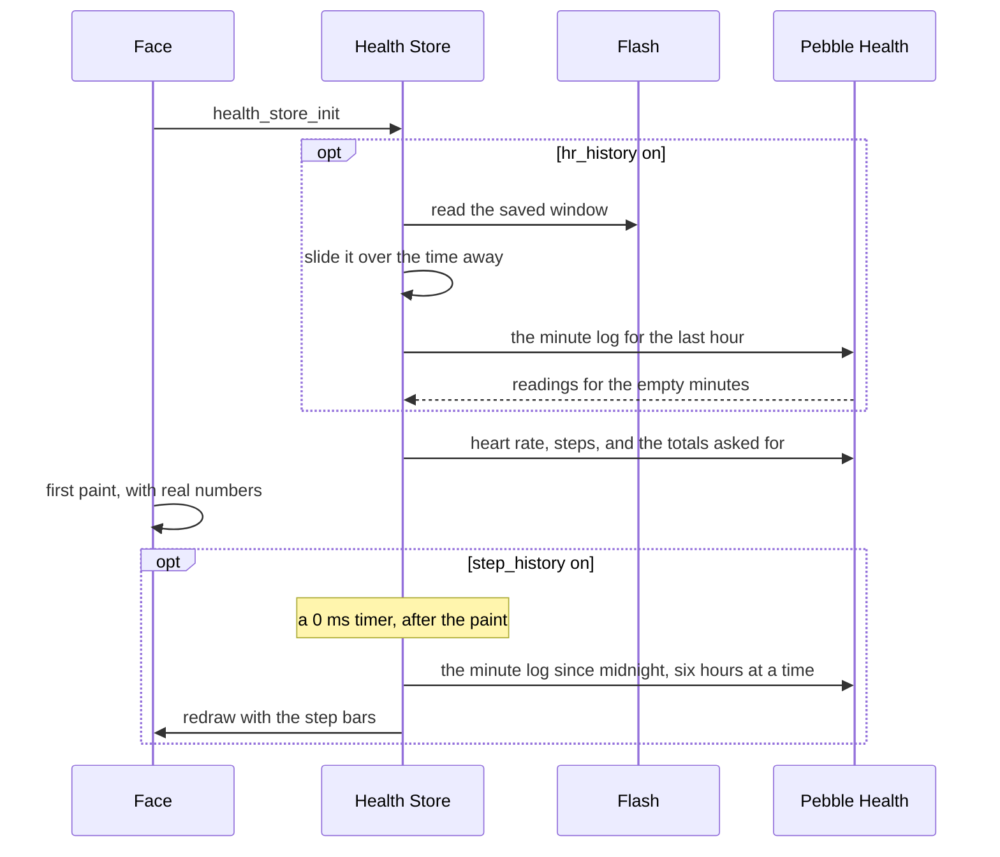

# The Health Store

The health store gives a face the wearer's numbers from Pebble Health: heart rate, steps, distance, active calories, sleep, and active minutes. For a face that draws charts it also keeps the last hour of heart rate, a reading a minute, and today's steps hour by hour. Nothing goes through the phone. What the store handles is cost. Some of these reads block on the watch's flash, the charts need scans of the watch's minute log, and Pebble Health sends events every few seconds while the wearer walks. The store holds the costly reads to once a minute, reads only what the face asked for, and keeps what it has already worked out, so a face can show health readings without a health read on every redraw.

It lives in [`health_store.h`](../../src/c/pebble/io/stores/health_store.h) and [`health_store.c`](../../src/c/pebble/io/stores/health_store.c). The arithmetic behind the two charts, which hour is finished and where a minute record lands in the heart rate window, is in [`step_hours.c`](../../src/c/core/health/step_hours.c) and [`minute_window.c`](../../src/c/core/health/minute_window.c) under `src/c/core/health/`. Those are the parts that can be wrong without anyone noticing, such as a bar that quietly loses the last minute of every hour, so they sit in `c/core` (see [Where the Code Lives](index.md#where-the-code-lives)). The store takes its turn on the face's cadence like the others, as [How the Stores Work](stores.md#riding-the-faces-cadence) covers, but it asks the watch rather than the phone.

## Setting It Up

The face starts the store with the readings it shows turned on, then subscribes its redraw:

```c
health_store_init((HealthConfig){.live = true, .hr_history = true, .distance = true,
                                 .persist_key = HEALTH_KEY}, NULL);
health_store_subscribe(redraw);
```

The face also lists `health` under `capabilities` in its `pebble.appinfo.json`, as the SDK asks of any app that reads Pebble Health.

The heart rate and the step count are always read. Each of the others has its own flag:

* **`sleep`, `active`, `calories`, and `distance`** read the day's sleep, active minutes, active calories, and walked distance. A total left off is never read, and its getter keeps returning its no-data value.
* **`hr_history`** keeps the hour of heart rate for a graph, and saves it to flash under `persist_key`.
* **`step_history`** keeps today's steps by the hour for a bar chart.

A `HealthSeed` pins fixed numbers and curves for screenshots, as [How the Stores Work](stores.md#seeded-for-screenshots) covers.

## What Each Read Costs

**Heart Rate.** A peek at the watch's current reading, which is cheap. A watch with no heart rate sensor, or no reading yet, gives -1, and the framework's `readout_hr` draws dashes for it.

**Steps.** Today's total. The watch keeps it to hand, so it is cheap too. No reading, such as with Health turned off, gives -1.

**Sleep, Active Minutes, Calories, and Distance.** Each of these costs a blocking flash read every time it is asked for, which is why a face pays only for the ones it shows. Sleep and active minutes arrive in seconds and are turned into minutes. Sleep is the watch's total for today.

**Distance Reads 0 for No Data.** Distance gives 0 rather than -1 when there is no reading, so it cannot tell a quiet morning from Health being off. A panel tells the two apart by the step count, which is -1 with no data. The settings page's Stats Readout control can switch the steps readout to distance in miles or kilometres, and a face that offers it turns `distance` on.

Every read first asks the watch whether the reading exists for the span, and takes the no-data value when it does not. A platform built without Pebble Health reads nothing at all, and every getter stays at its no-data value.

## When It Reads

Pebble Health sends an event when something moves, and the store reads only what that event touched:

* **A heart rate update** reads the heart rate.
* **A movement update** reads the day's totals. These arrive every few seconds while walking, and the totals move once a minute at most, so the reads are held to one round a minute and most movement events read nothing at all.
* **A significant update**, such as the day changing, marks every number stale, so it reads everything at once past the minute limit.

Events alone are not enough. Heart rate events are sparse, so a graph built only from them would be dots rather than a line, and movement events stop the moment the wearer sits still, which would leave the step count where it was. So the store also reads on each turn of the face's cadence, normally the minute tick. A turn that lands in a minute an event already covered reads nothing new.

**A Redraw Only When Something Moved.** The store sums its readings before and after each round and asks the face to redraw only when the sum changed. Most minute ticks bring back the same numbers, and a redraw for nothing would rerun every health panel. A face graphing the heart rate still gets a redraw a minute, since its window slides.

## The Heart Rate Window

The window is 60 one-byte slots, oldest on the left and the current minute in the last slot, with 0 meaning no reading. Each time the store reads the heart rate it writes the watch's current reading into the current minute's slot. When the minute moves on, the window slides left and the minutes that passed with no reading are left at 0. A clock that jumps back would put the window's minutes in the future, so it starts over from the new time.

**Why Not the Watch's Own Log.** The watch keeps a minute by minute log, but it only records a heart rate in it now and then. A graph drawn from the log alone would be mostly empty. Peeking the live reading every minute fills it.

**Saved Once a Minute.** The window lives in memory, and a face is closed whenever the wearer opens an app. So on a real reading the store saves the window to flash, at most once a minute. A burst of heart rate events can bring a reading a second, and a flash write blocks, so the limit keeps a burst to one write. The save runs while the store is already awake for a reading, so it costs no extra wake. Saving less often would bring the graph back missing its last few minutes every time the wearer opened an app.

**Back from an App.** On a relaunch the store reads the saved window back, slides it forward over the time the face was away, and clears it if that was an hour or more. Then it fills the empty minutes from the watch's log, so time spent in a watchapp shows whatever the watch recorded. A minute that already holds a reading keeps it, since the live readings come more often than the log's. The log runs behind the clock and its first record can be any minute in the hour, so each record goes in the slot for its own minute rather than in order from the left. With the window ending on the current minute, a first record 50 minutes old lands in slot 9. The read takes room for 60 records, about 720 bytes, from the heap and gives it back straight after.



## Steps by the Hour

The chart has 24 buckets, one per hour from midnight. A quiet hour is a real 0, so the store also says how many buckets are real with `health_store_step_hours`, and a chart draws that many rather than looking for a marker:

```c
const uint16_t *hourly = health_store_step_hourly();
int hours = health_store_step_hours();

for (int hour = 0; hour < hours; hour++)
{
    // one bar of hourly[hour] steps
}
```

**The Hour in Progress Is Free.** Its bar is today's total less the finished hours, so it needs no read of its own. The total and the log come from different places in the watch, so a step or two of disagreement can land on this bar.

**A Finished Hour Is Read Twice, Then Kept.** Reading an hour means scanning the watch's minute log, which blocks. The watch writes each minute's record at the top of the next minute, and at a lower priority than the face. So on the turn the hour rolls over, its last minute is usually not in the log yet. The store reads the hour just gone at the rollover and once more a minute later, then never again for the rest of the day.

**Catching Up at Launch.** A face started partway through the day has every hour since midnight to read. The store reads them six hours at a time, since a scan costs the same whatever span it covers. A launch at 15:30 has fifteen finished hours, which is three scans of six, six, and three. Even batched that is several blocking scans, so the first catch-up waits for a timer that runs after the face's first paint. The face appears straight away and the bars fill in a moment later.

**Room from the Heap.** The scans share room for seven hours of minute records, 420 records of 12 bytes or about 5 KB, from the heap, and give it back when they are done. What a face runs out of first is its app image, and the heap does not count towards it. When the heap is too full to lend it, the scans wait for the next turn.

**Days the Clocks Change.** Each bucket is an hour on the wall clock, so on a 23 or 25 hour day the bars still line up with the hours the chart labels. The batch that holds the repeated hour in autumn runs an hour longer in real time, which is why each scan has room for seven hours rather than six. A new day, or a clock that jumps back, drops the buckets and reads them again.

## What the Histories Cost

The two buffers are part of the store on every face, 60 bytes for the heart rate and 48 for the steps. What the flags turn off is the work. Without `hr_history` there is no read of the log at launch, no window sliding each minute, and no flash write. Without `step_history` there are no log scans and no 5 KB borrowed from the heap. A face that shows only a heart rate and a step count pays for two cheap reads a minute.

## Reading It Back

Each reading has its own getter, such as `health_store_hr` or `health_store_steps`, and each returns its no-data value until there is something to show. The framework's `readout_hr` and `readout_steps` already turn those into text with dashes for no data, as covered in [Readouts](readouts.md). The store reads every number it was asked for once during init, before the face first paints, so a face shows real numbers from its first frame rather than dashes until the first event.
