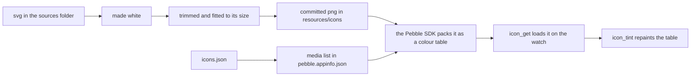

# The Icons Plugin

The `icons` plugin turns a face's SVG icons into the PNGs the watch draws. A face lists each icon in `resources/icons.json` with the SVG it comes from and the size it shows at, and `paf gen <face> icons` draws every one as a white PNG at exactly that size, then writes a matching entry into the face's media list so the C code gets a resource id for each. `paf check` reports a face whose media list has fallen behind its `icons.json`. What happens to the icons on the watch, from the cache to the tint, is on [Icons](icons.md).

The generator is [`generate-icons.ts`](../../src/plugins/icons/generate-icons.ts), the media list code is [`media.ts`](../../src/plugins/icons/media.ts), and the check is [`check-icons.ts`](../../src/plugins/icons/check-icons.ts). The plugin's [`package.json`](../../src/plugins/icons/package.json) names the generator and the check for `paf` under its `paf` key, and brings in sharp, which does the drawing. A unit that does not list the plugin never installs sharp.

## Turning It On

A unit lists the plugin under `plugins` in its `paf.config.json`, with `sources` naming the folder that holds the SVGs:

```json
{
  "plugins": {
    "icons": { "sources": "icons" }
  }
}
```

The folder can have any name, and its path is from the unit's own folder, so a unit under `watchfaces/` reaching a folder at the root of its repo writes `"../../icons"`. Without the setting, the generator reads the folder from the `ICON_SOURCES` environment variable, and with neither it stops and names the setting to add. It also stops when the folder is not there, or holds none of the SVGs the icons read, since a wrong folder would otherwise leave every icon on its old PNG with a warning each and pass. One SVG is enough, so a machine missing some sets still runs. `paf gen <face> icons` on a face whose SVGs are all missing stops too, since that run would draw nothing. Run with no face named, the generator does every face with an `icons.json` and stops only when none of them finds an SVG.

**SVGs by Path.** `icons.json` names each SVG by its path from the sources folder, without the `.svg`, so `status/bluetooth-on` reads `status/bluetooth-on.svg`. The folder can be laid out however suits the unit, with as many folders as it likes, nested as deep as it likes.

**Deprecated Keys.** A path can still open with one of three short keys, each standing for a fixed folder. They are deprecated and go at the next major release.

| Key | Folder | Example |
| :-- | :-- | :-- |
| `wi` | `weather-icons/svg/` | `wi/wi-day-sunny` reads `weather-icons/svg/wi-day-sunny.svg` |
| `ux` | `uxwing/` | `ux/thermometer-icon` reads `uxwing/thermometer-icon.svg` |
| `sr` | `svgrepo/` | `sr/bluetooth-on` reads `svgrepo/bluetooth-on.svg` |

A run warns once for each key a face uses. Write the folder in place of the key, so `wi/wi-day-sunny` becomes `weather-icons/svg/wi-day-sunny`. A name whose SVG is there as written reads from there, so a sources folder with its own `ux/` folder holding the SVG never goes to `uxwing/`. A name that leads outside the sources folder, such as `../shared/bt`, stops the run.

**One Face at a Time.** `paf gen <face> icons` renders one face, and a face with no `resources/icons.json` gets an error saying so. `paf gen <face> all` only runs it on a face that has one.

**Only Regenerating Needs the SVGs.** A face commits its rendered PNGs and its media list, and nothing else reads the SVGs. A fresh clone or a CI job builds from the committed PNGs with no sources folder at all, so a repo can keep third-party artwork it is not free to share in a folder git ignores.

## Listing the Icons

`resources/icons.json` maps each icon's name to its SVG and its size in pixels, width first:

```json
{
  "bluetooth":         { "svg": "status/bluetooth-on",  "size": [14, 14] },
  "thermometer":       { "svg": "status/thermometer",   "size": [13, 17] },
  "thermometer-sm":    { "svg": "status/thermometer",   "size": [10, 13] },
  "weather-now-clear": { "svg": "weather/day-sunny",    "size": [24, 24] }
}
```

The name becomes both the file, `resources/icons/thermometer-sm.png`, and the resource id, `ICON_THERMOMETER_SM`, in capitals with each dash an underscore. The C code reaches it as `RESOURCE_ID_ICON_THERMOMETER_SM`.

**One Size per Icon.** Pebble draws a bitmap at its own size and never scales it, so each icon is drawn at exactly the size it shows at. A face that shows one glyph at two sizes lists it twice under two names, as the thermometer above does. Each face picks its own sizes, so the same condition can be 24 pixels on one face and 12 on another. The same PNG goes to every watch the face builds for.

**Names the Framework Looks For.** A face whose list holds `weather-now-na` gets the framework's weather lookup compiled in, and the lookup then expects the rest of the `weather-now-` set by name. [Icons](icons.md#weather-icons) covers the lookup.

## Drawing an SVG into a PNG

Before sharp draws an SVG, the generator makes its glyph white. Every `fill` or `stroke` written as black becomes white, and an SVG whose root sets no fill gets a white fill and stroke on the root, which is the colour any shape without its own colour takes. A root that already sets a fill, such as `fill="none"` on an outline icon, is left alone so the outline stays open rather than filling in solid. The change is a text replace on the SVG rather than a parsed document, so a colour set any other way, such as in a stylesheet or as a grey, comes through as drawn.

sharp then scales the drawing to fit the box `icons.json` gives, keeping its shape, and fills the rest of the box with clear pixels. A tall glyph in a square box sits centred, with clear space either side.

**Trimming to the Glyph.** Some SVGs draw a small glyph in the middle of a large empty canvas, so it comes out smaller than its neighbours at the same size. An icon marked `trim` is first drawn into a 240 pixel square and cropped to the pixels more than about six percent visible, and only then fitted to its box, so the glyph itself fills it:

```json
"weather-hilo-up": { "svg": "weather/direction-up", "size": [14, 14], "trim": true }
```

Trimming removes the empty space in the SVG once, when the PNG is made. Fitting the trimmed glyph to a box of another shape still leaves clear space on one side, and the watch measures that border for lining icons up by their visible art, as [Lining Up by the Visible Art](icons.md#lining-up-by-the-visible-art) covers.

## Why the Icons Are White



The PNG sharp writes is full colour, but that is not what reaches the watch. The Pebble SDK packs a picture with 16 or fewer colours as a colour table, as [What a Background Costs](frame-plugin.md#what-a-background-costs) covers. A white glyph with soft edges comes out with four entries, clear and white at three levels of see-through, and packs at two bits a pixel.

That table is what `icon_tint` repaints on the watch, so one white PNG serves every theme and any colour the wearer picks, as [Painting an Icon a Colour](icons.md#painting-an-icon-a-colour) covers. Forcing every glyph to one colour is what keeps its table down to those few shades of white. An SVG that kept a second colour would pack more entries and still tint to one flat colour, and past 16 colours it would have no table to tint at all. White is also what the icon shows on a face that draws it without a tint.

## When a Source Is Missing

An icon whose SVG is not in the sources folder keeps the PNG it already has, with a warning, so a machine missing one set still regenerates the rest. That only holds when the PNG is the size `icons.json` asks for. A PNG of another size was drawn before the size changed, and keeping it would draw the old size in the new spot, so the run stops. It also stops when there is no PNG to keep, since the build would fail on the missing resource.

The cost is that a mistyped SVG name on an icon that already has a PNG only warns, and the old PNG ships. The folder checks before any icon is drawn catch the common mistake, a `sources` setting that points at the wrong folder, so the warning is worth keeping a partial set working.

## The Media List

Once the PNGs are drawn, the generator writes one bitmap entry per icon into the `resources.media` list in the face's `pebble.appinfo.json`, which `paf build` turns into the face's `package.json`:

```json
{ "type": "bitmap", "name": "ICON_BLUETOOTH", "file": "icons/bluetooth.png" },
```

**The Icon Block Is Rebuilt Whole.** Any bitmap whose file sits under an `icons/` folder counts as one of the plugin's, and the whole set is replaced from `icons.json`, in its order. An icon taken out of `icons.json` leaves the list, and so does a bitmap added there by hand under `icons/`. Its PNG stays on disk until it is deleted by hand, but nothing packs it.

**Hand Edits That Survive.** An icon the list already had keeps any extra field written on it, such as `targetPlatforms` to ship it on one watch only, or a `memoryFormat`. Running the generator again on a face that has not changed writes the same bytes.

## What `paf check` Catches

`paf check` builds each face's media list again from its `icons.json`, in memory, and compares it with the committed appinfo. An icon added to `icons.json` without a fresh `paf gen` would leave the C code with no resource id for it and the face would not build, so the check names the face and the `paf gen <face> icons` line that fixes it. It also reports a face that has an `icons.json` but no media list to write into. The check reads only JSON, so it needs no sources folder and runs anywhere the unit does, CI included.

It does not look at the PNGs. A new size in `icons.json`, or an icon pointed at a different SVG, leaves the media list as it was, so the check passes while the committed PNG still shows the old one. Running `paf gen <face> icons` after any edit to `icons.json` is what keeps the two in step. [Commands](../paf/commands.md#paf-check) covers `paf check` itself.
