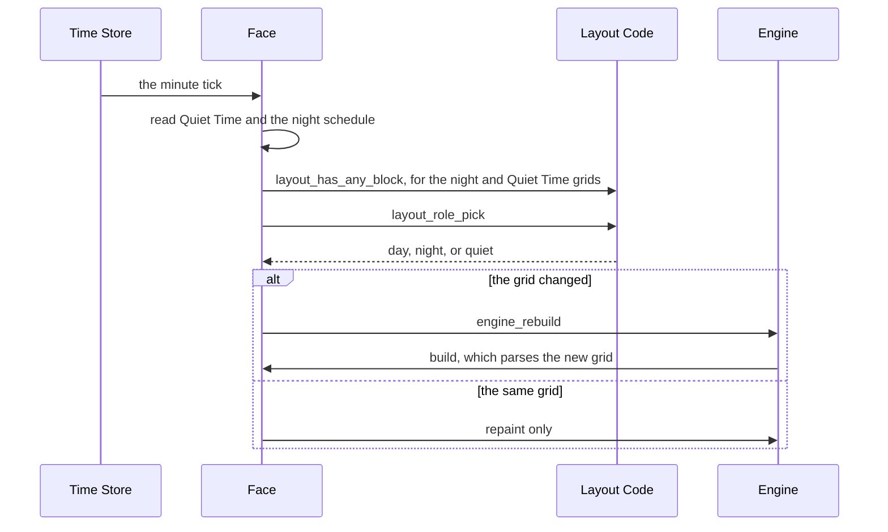

# Layout Strings

Some faces let the wearer build their own screen on the settings page, placing panels on a grid, and can hold more than one grid: one for the day, one for after dark, and one for while Quiet Time is on. The layout code is the part of that every such face needs the same way. It reads the numbers out of a grid sent as text without ever overflowing on a damaged one, tells a grid with real panels in it from an empty or broken one, and picks which of the three grids belongs on the screen right now. A face that adds a night or Quiet Time grid gets the fallbacks for free, so a trigger with no grid behind it never leaves the wearer looking at a blank screen.

It lives in [`layout_string.h`](../../src/c/core/layout/layout_string.h), [`layout_string.c`](../../src/c/core/layout/layout_string.c), [`layout_role.h`](../../src/c/core/layout/layout_role.h), and [`layout_role.c`](../../src/c/core/layout/layout_role.c) under `src/c/core/layout/` (see [Where the Code Lives](index.md#where-the-code-lives)). The face reads Quiet Time, the clock, and its own settings, and passes in plain answers and strings.

## A Grid as Text

A grid reaches the watch as one text setting, a run of records separated by semicolons. The Mosaic faces, for example, write each record as five numbers, the panel and then its row, column, width, and height:

```
3,0,0,2,1;7,1,0,4,2;12,3,2,2,1
```

Each family of faces has its own catalogue of panels, so the panel number means something different on each, and each face parses the rest of a record its own way. The framework only fixes what they all share: records end at a semicolon, every record starts with its panel number, and panel 0 is an empty spot rather than a panel.

Text takes more bytes than packed numbers would, but it rides in a settings message like any other text setting, with no message format of its own between the page and the watch.

**What an Empty Grid Looks Like.** A grid the wearer cleared is sent as `0`, a single empty spot, rather than as an empty string. The watch keeps a text setting's old value when an empty one arrives for a field whose default is not empty (see [Settings on the Watch](settings-on-the-watch.md)), so an empty string would leave the old grid in place.

## Reading a Number

`layout_parse_int` reads a run of digits at a cursor and moves the cursor past them. Every face's parser is built on it:

```c
const char *cursor = layout;
int panel = layout_parse_int(&cursor);
if (*cursor == ',')
{
    cursor++;
}
int row = layout_parse_int(&cursor);
```

**No Digits Reads as 0.** A field with no number in it reads as 0, which makes a record with a missing or mangled panel number an empty spot.

**Too Big Reads as -1.** The grid is saved to flash and read back at launch, and a damaged copy can hold a run of digits far longer than any real field. Reading that into an `int` one digit at a time would overflow it, which C leaves undefined. So the number stops growing past 9999, far above anything the settings page writes, and comes back as -1. A panel number of -1 drops the record, and a face's parser pulls a -1 row or size back to the nearest one that fits, so a damaged number never places a panel off the grid.

**The Cursor Always Moves On.** Even a number that is too big has all its digits skipped. The cursor lands on the next field either way, so one bad field never pushes every field after it out of step.

## Is There Anything in It

`layout_has_any_block(layout, type_count)` answers whether a grid holds at least one real panel. It reads only the first number of each record, and stops at the first one that names a panel between 1 and the end of the face's catalogue.

One test covers every way a grid can be nothing: the `0` of a cleared grid, an empty string, a NULL, and whatever a damaged copy left behind. A panel number past the end of the catalogue does not count either. The settings page's grid builder is shared by a family of faces, and a grid made for a face with more panels can name ones this face does not have.

The answer is what decides whether a night or Quiet Time grid counts as set. A night schedule over an empty night grid, or Quiet Time with an empty Quiet Time grid, leaves the day grid up.

## Which Grid Is Showing

`layout_role_pick` takes four answers and returns the grid that wins:

```c
LayoutRole layout_role_pick(bool quiet_on, bool quiet_set, bool night_on, bool night_set)
{
    if (quiet_on && quiet_set)
    {
        return LAYOUT_ROLE_QUIET;
    }

    if (night_on && night_set)
    {
        return LAYOUT_ROLE_NIGHT;
    }

    return LAYOUT_ROLE_DAY;
}
```

**Quiet Time Comes First.** Someone who set both a Quiet Time grid and a night grid is asking for a quieter screen while the watch is quiet, and that holds whether it is dark out or not.

**A Trigger with No Grid Is Skipped.** Each trigger arrives as a pair, whether it is on and whether it has a grid. One that is on with nothing behind it passes to the next, and the day grid catches everything else. So a wearer can set up only a night grid and Quiet Time changes nothing, or only a Quiet Time grid and the night schedule changes nothing.

Whether it is night comes from the night schedule, which asks whether now falls inside the night window, as [Time Bands and Night Hours](time-bands.md#is-it-night) covers.

## Putting It Together in a Face

A face with more than one grid checks again on every minute tick, after a settings save, and when a weather reply lands, since a newly arrived sunset can mean the night grid should already be up. A new grid moves every panel, which a repaint cannot do, so a change of grid rebuilds the screen:



Most minutes the answer is the same, and the face only repaints. The rebuild happens a few times a day at most, when the night window opens or closes or Quiet Time starts or ends. On launch the face picks the grid before the engine builds its first screen, so a face started at midnight comes straight up on the night grid rather than flashing the day one first.

**Checked Again When Parsing.** The face's parser checks the chosen grid with `layout_has_any_block` once more before reading it, and falls back to the day grid if it comes up empty. The pick and the parse happen at different moments, and a grid that went bad in between still never leaves the screen blank.

**Parsed Once per Change.** A face can keep the last string it parsed and the panels it read from it, so a repaint compares the string and only reads the text again when the grid really changed.

[The Engine](engine.md) covers the rebuild itself.
