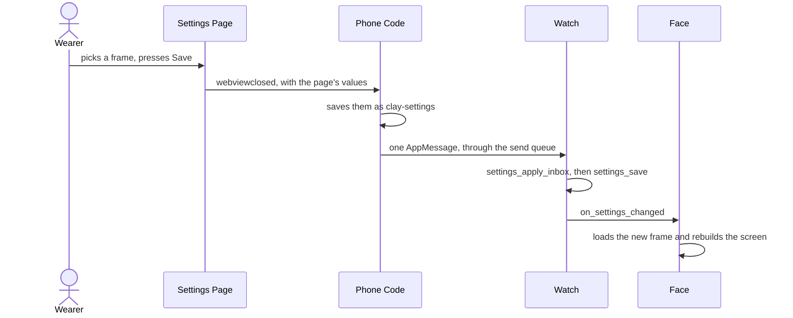
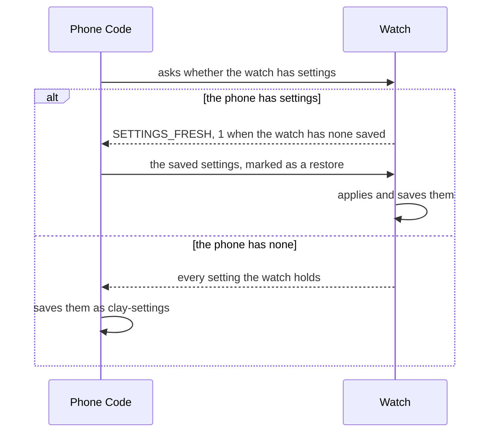

# The Life of a Setting

This page follows one setting from the settings page to the watch redrawing. Along the way the framework handles the parts a face would otherwise write for itself: one queue for every message to the watch, a check on every value as it lands, a single flash write per save, and the settings put back after a reinstall. The example is the LCARS face's frame theme, a choice of nine frames, but every setting takes the same road.

It starts on the settings page, which is built with Clay and shown in the phone app's web view. From there it goes to the phone code, the face's PebbleKit JS running inside the Pebble app, and then to the watch, which keeps every setting in one block of flash and redraws from it.



## On the Settings Page

The face builds its page with `buildConfig` from [`config-builder.ts`](../../src/ts/pkjs/config-builder.ts). It hands over what it needs, such as the list of themes, and `buildConfig` lays out the standard sections in a fixed order, ending with a **Save & Apply to Watch** button. The theme becomes a select:

```ts
{
  'type': 'select',
  'messageKey': 'APPEARANCE_THEME',
  'label': theme.label || 'Frame Theme',
  'description': theme.description || 'Colour scheme for the watch frame.',
  'defaultValue': 0,
  'options': theme.options,
}
```

The `messageKey` is the name the watch knows the setting by. Every key the page uses has to be listed under `messageKeys` in the face's `pebble.appinfo.json`.

**Opening the Page.** Clay opens the page filled in from the values saved on the phone. Just before it does, each feature on the phone takes a snapshot of its own settings, which [The Phone Side](phone-side.md#after-a-save) covers.

**Scratch Space for a Component.** A component that needs to remember something between visits keeps it in a hidden store, as [Scratch State in a Hidden Store](settings-page.md#scratch-state-in-a-hidden-store) covers.

## On the Phone

Pressing Save closes the page, and the phone app fires `webviewclosed` with the page's values as JSON. A page closed without saving sends no values, so nothing goes to the watch.

**Clay Hands Back a Message.** `clay.getSettings` saves the plain values to the phone's `localStorage` under `clay-settings`, then returns them ready to send, keyed by each message key's number. Each kind of control arrives in its own form:

| Control | Sent As |
| :-- | :-- |
| select | text, such as `"3"`, since a select's value is always text |
| toggle | `1` or `0` |
| colour | a number, `0xRRGGBB` |
| slider | a whole number, scaled up by its precision |
| text input | text |

So the theme reaches the watch as the text `"3"`, not the number 3.

**A Second Clock.** A city chosen for a second clock is rewritten as `"offset,label"`, with the offset worked out for the current date, as [Time Zones](time-zones.md#from-the-saved-place-to-the-setting) covers.

**The Fresh Flag.** When the face declares `SETTINGS_FRESH`, the message carries it as `0`, which tells the watch this came from a save on the page. That flag matters after a reinstall, below.

**Through the Send Queue.** The framework sends the save itself rather than letting Clay do it, so it waits its turn in the one queue every message to the watch goes through. [The Phone Side](phone-side.md#the-send-queue) covers the queue and its retries.

**Fetching Again.** Once the save is on its way, each feature compares its settings with its snapshot and fetches again only when one of them changed. A theme change touches none of them, so it fetches nothing. [The Phone Side](phone-side.md#after-a-save) covers the rules.

## On the Watch

**Only the Keys It Knows.** `settings_apply_inbox` walks the face's own list of settings and looks each one up in the message. The list is the table of fields the face hands `settings_init`, which uses the framework's shared entries for the common settings. The LCARS face's theme takes one line:

```c
KNOWN_THEME(offsetof(LcarsSettings, theme), 9),
```

A key in the message that is not on the list is ignored. It still takes up room in the message, though.

**Checked on the Way In.** Each value is checked for its type and range, and one that already matches what the watch holds is skipped, so an unchanged save does not count as a change. [Settings on the Watch](settings-on-the-watch.md#taking-values-from-the-phone) has the rules. A theme past the end of the list reads as the default, so a face adding a theme raises the count in its `KNOWN_THEME` line too.

**Saved to Flash.** When anything changed, `settings_save` writes the whole block of settings to the face's persist key in one write, and the block is read back and checked again at every launch, as [Settings on the Watch](settings-on-the-watch.md#loading-at-launch) covers.

**The Face Is Told.** The watch calls the face's `on_settings_changed`, and the face redraws from the new values. Its flag says whether the time or date layout changed, for a face that can skip work when it did not:

```c
static void on_settings_changed(bool time_or_date_changed)
{
    // load whatever the theme changes, such as the frame picture
    // then rebuild the screen, which reads every setting afresh
}
```

Some settings start more work on the watch:

* **The Temperature Unit.** The weather store converts the reading it already holds, as [Weather Readings](weather-readings.md#switching-units) covers.
* **Anything Weather Depends On.** The watch asks the phone for fresh weather.

**One Message Holds the Whole Page.** Clay sends every message key on every save, including ones the watch never reads, so the face sizes its inbox for the whole page. LCARS asks for 4096 bytes. [Talking to the Phone](talking-to-the-phone.md#opening-the-connection) shows how to work the number out.

## After a Reinstall

A reinstalled face, or a watch that was reset, starts with no settings on the watch. The phone usually still has them, so the two sort it out each time the phone code starts:



The phone is the one that keeps settings for good. Until the restore lands, the watch saves nothing to flash, which [Settings on the Watch](settings-on-the-watch.md#the-fresh-state) explains. A restore also skips the unit conversion, since the reading on the watch was fetched in the restored unit already.
