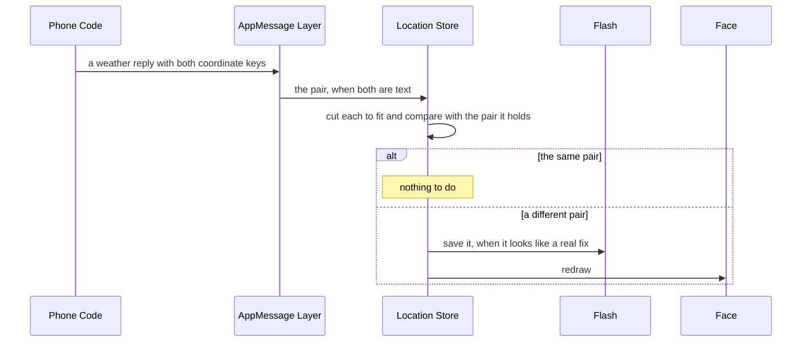

# The Location Store

The location store holds the phone's last location fix as two pieces of text, a latitude and a longitude, for a face that shows where the wearer is. It saves the last real fix to flash so a relaunch shows it straight away, and it never saves the phone's way of saying it has no fix, so a lost GPS signal cannot wipe the last real place. It has no polling of its own. The coordinates ride along with every weather reply.

It lives in [`location_store.h`](../../src/c/pebble/io/stores/location_store.h) and [`location_store.c`](../../src/c/pebble/io/stores/location_store.c), with the check for a real fix in [`coords.h`](../../src/c/core/wire/coords.h) under `src/c/core/wire/`.

## Setting It Up

```c
location_store_init((LocationConfig){.live = true, .persist_key = LOCATION_KEY}, NULL);
location_store_subscribe(engine_mark_dirty);
```

A live store claims the coordinates from incoming messages and restores the last fix from the face's persist key. `location_store_lat` and `location_store_lon` read the text back, empty when there is none, and the framework's latitude and longitude readouts show dashes for empty.

## How a Fix Arrives

The phone sends the coordinates as text the face formats for itself. A face opts in on the phone side with `weather.withCoords`, handing it a function that turns each weather result into its two coordinate keys:

```ts
weather.withCoords((messageKeys, result) => ({
  [messageKeys.LOCATION_LATITUDE]: typeof result.lat === 'number' ? result.lat.toFixed(3) : 'NO FIX',
  [messageKeys.LOCATION_LONGITUDE]: typeof result.lon === 'number' ? result.lon.toFixed(3) : 'NO FIX',
})),
```

The function runs on every result, a failed fetch included, so the face picks its own text for no fix. Since the store keeps text rather than numbers, the face picks the style too: decimals, hemisphere letters, or anything else that fits the design.

On the watch, the AppMessage layer hands the store the pair only when both keys are in the message and both are text. One missing, or one sent as a number, would give the store an empty half and blank a good coordinate, so a message like that leaves the store alone.



**The Same Pair Does Nothing.** A wearer who stays put gets the same two strings with every weather reply, so the store compares first and returns before saving or redrawing anything. The comparison happens after each string is cut to fit its field, so text too long to keep whole does not look new every time.

**Each Half Holds 19 Characters.** Longer text is cut to fit, so a face choosing a format keeps each coordinate within that.

## Telling a Fix from No Fix

`coords_look_real` decides whether a pair is a place. Both halves need at least one digit:

```c
bool coords_look_real(const char *lat, const char *lon)
{
    return has_digit(lat) && has_digit(lon);
}
```

A real coordinate in any format carries digits, and the ways a phone says it has nothing, an empty string or a word like `NO FIX`, never do. The store cannot parse the coordinates, since their format belongs to the face, so this is the whole test.

**Half a Fix Is No Fix.** A pair with one good half and one empty half fails the check. Saving it would leave the saved copy with a coordinate missing, and it would stay missing after every relaunch until a full fix arrived.

**Shown but Not Saved.** A no-fix pair still replaces what the face shows, so the face can show its own no-fix text rather than a place it is no longer sure of. It is never saved, so a relaunch comes back to the last real place. A face that packs both coordinates into the latitude key and leaves the longitude empty never passes the check, so its fix is never saved and a relaunch shows dashes until the next weather reply.

## Saved and Restored

The store saves both strings as one blob to the face's persist key, with the location store's tag in front. A restore checks the blob's size and tag before reading it, then gives each string a closing zero, so damaged bytes cannot run on past the end of a field when it is printed. Only a live store saves, and only a real fix. The save skips a pair already on flash, and with no sync time in the blob the whole of it counts as the reading. [How the Stores Work](stores.md#saving-to-flash) covers the tag, the check, and the skipped write.

## Seeding

```c
LocationSeed seed = {.lat = "43.653", .lon = "-79.383"};
location_store_init((LocationConfig){.live = false}, &seed);
```

The framework's dev plugin seeds it this way for a face that declares the coordinate keys, and starts it empty for one that does not. [How the Stores Work](stores.md#seeded-for-screenshots) covers the rest of seeding.
