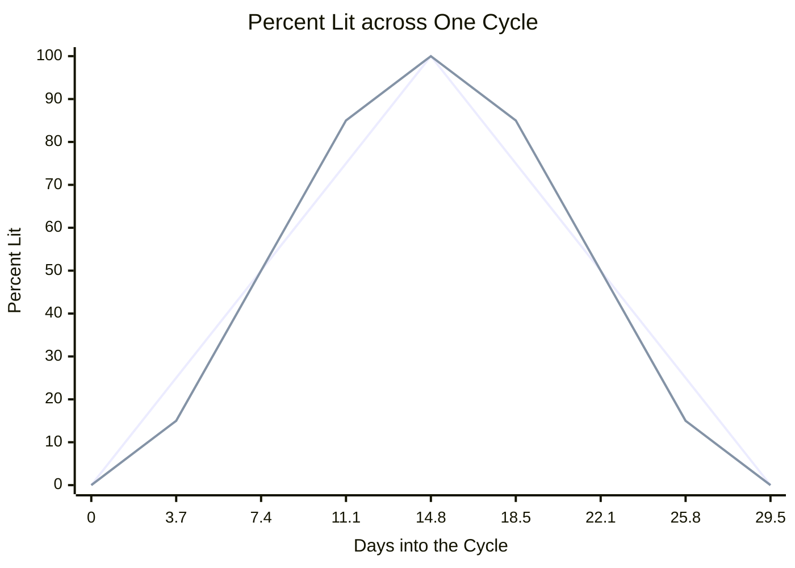

# The Moon

The moon code works out everything a moon panel shows from nothing but the time: which phase picture to show, the phase's name, how much of the moon is lit, and how many days until the next full or new moon. It needs no phone, no location, and no network, so a moon panel works the moment the face starts.

It lives in [`moon.h`](../../src/c/core/clock/moon.h) and [`moon.c`](../../src/c/core/clock/moon.c) under `src/c/core/clock/` (see [Where the Code Lives](index.md#where-the-code-lives)).

## Counting from One Known New Moon

Everything starts from `moon_age_sec`, the number of seconds since the last new moon. It counts from one new moon whose time is known, and divides the time since then by the average length of a moon cycle:

```c
#define MOON_SYNODIC_SEC 2551443   // the average cycle, about 29.53 days
#define MOON_EPOCH_UTC   947182440 // a known new moon, 2000-01-06 18:14 UTC

int32_t age = (int32_t)(utc - MOON_EPOCH_UTC) % MOON_SYNODIC_SEC;
if (age < 0)
{
    age += MOON_SYNODIC_SEC;
}
```

The remainder after dividing is how far into the current cycle the time falls. For any time after the epoch that is all it takes.

**Before the Epoch.** C's `%` keeps the sign of the number it divides, so a time before 2000 gives a negative remainder. Adding one cycle turns it into the same point counted forward. Only a watch whose clock is set wrong ever reads a time that early, and the step keeps every reading in range there too, rather than a picture number or a percent below 0.

**Staying in 32 Bits.** The time since the epoch is cut down to a 32-bit number before the division. A 32-bit count of seconds lasts about 68 years, so it holds until 2068, well past the life of the watch. Dividing a 64-bit number on the watch's processor needs extra helper code that the compiler adds to the app, and keeping the maths in 32 bits leaves that code out of every face that shows the moon.

**How Close It Gets.** Real moon cycles are not all the same length, so the real new moon can land more than half a day either side of the one this counts, though it is usually closer. A face that changes its moon picture every few days barely shows the difference.

## Picking a Phase Picture

`moon_glyph_index(utc, count)` turns the age into one of `count` evenly spaced pictures, with 0 for the new moon:

```c
int idx = (int)(((age * count) + MOON_SYNODIC_SEC / 2) / MOON_SYNODIC_SEC);
return idx % count;
```

Multiplying by `count` before dividing keeps it in whole numbers. Adding half a cycle before the divide rounds to the nearest picture rather than always down, so each picture is centred on its phase. With eight pictures each one covers about 3.7 days, and the full moon picture shows for nearly two days either side of the full moon rather than starting at it.

The last stretch of a cycle rounds up to `count` itself, one past the last picture. The `% count` wraps that back to 0, since the end of one cycle is the new moon that starts the next.

As an example, ten days into a cycle with eight pictures:

```
age      = 10 × 86400               =   864000 seconds
rounded  = 864000 × 8 + 2551443 / 2 =  8187721
index    = 8187721 / 2551443        =        3   (waxing gibbous)
```

`age * count` stays inside a 32-bit number even for a ring of 28 pictures, where it tops out around 71 million.

`moon_phase_name` is the same call with eight pictures, looked up in a table of short names: `NEW`, `WAX CRES`, `1ST QTR`, `WAX GIB`, `FULL`, `WAN GIB`, `3RD QTR`, and `WAN CRES`.

## How Much Is Lit

`moon_illumination_pct` reads 0 at the new moon and 100 at the full moon, in a straight line up and then back down:

```c
int32_t half = MOON_SYNODIC_SEC / 2;
int32_t lit = age <= half ? (age * 100) / half
                          : ((MOON_SYNODIC_SEC - age) * 100) / half;
```

The real lit fraction follows a cosine curve rather than a straight line. In the chart, the straight-sided triangle is what the code uses and the rounder curve is the real moon:



Both agree at new, at the quarters, and at full. In between, the straight line reads up to about 10 points high in the crescents and 10 points low in the gibbous phases. That is close enough for a percent beside a picture, and it keeps the code to whole-number maths with no cosine table or floating point.

## Counting Down to the Next Full or New Moon

`moon_days_to_phase(utc, to_full)` counts the days until the next full moon, or the next new moon when `to_full` is false. The full moon sits half a cycle in, and the new moon at the end of the cycle:

```c
int32_t target = to_full ? MOON_SYNODIC_SEC / 2 : MOON_SYNODIC_SEC;
int32_t until = target - moon_age_sec(utc);
```

The countdown reads 0 for the whole night of the full moon, from half a day before it to half a day after, and it never reads 30. A full moon six hours ago is still tonight's full moon to anyone looking up.

**Rounded to Whole Days.** Half a day is added before dividing by a day, so the count rounds to the nearest day rather than down. At the new moon the full moon is 14.77 days away, which reads 15, and half a day before the full moon the rounding already gives 0.

**Just after the Moon.** A full moon that has passed leaves `until` negative, so a whole cycle is added to point at the next one. For the first half day that leaves it nearly a whole cycle away, which would read 29 or round up to 30, so anything that close to a whole cycle reads 0 instead. Right on the new moon the age is 0, which puts a new moon target a whole cycle out, so that case takes the cycle back off and reads 0 as well.

## Using It in a Face

Each call takes the time as a UTC timestamp, so a face passes `time(NULL)`:

```c
time_t now = time(NULL);

int phase = moon_glyph_index(now, 8);      // 0 new to 7, with 4 the full moon
const char *name = moon_phase_name(now);   // such as "WAX GIB"
int lit = moon_illumination_pct(now);      // 0 to 100
int days = moon_days_to_phase(now, true);  // days to the next full moon
```

The LCARS face's moon slots work this way. Its table of eight moon images is indexed straight by `moon_glyph_index(now, 8)`, so the picture and the `moon_phase_name` text always agree.

Nothing here repaints on its own. A moon panel reads these when the face redraws, and the minute tick is far more often than the moon changes.
