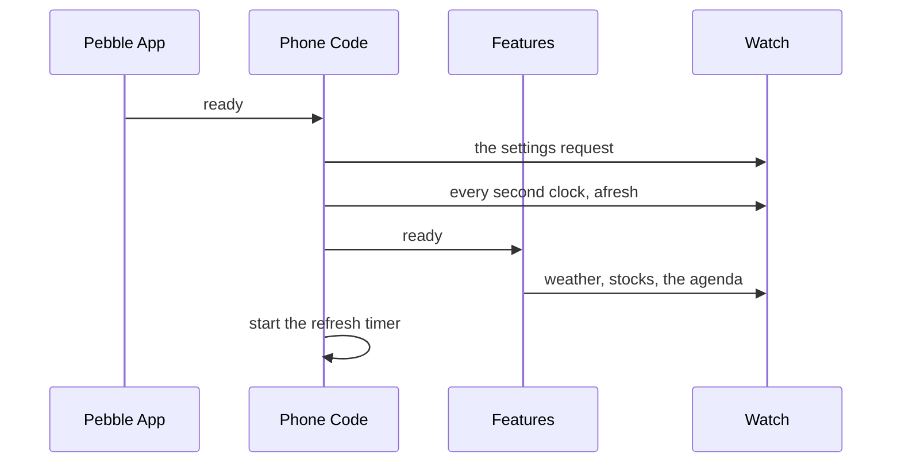
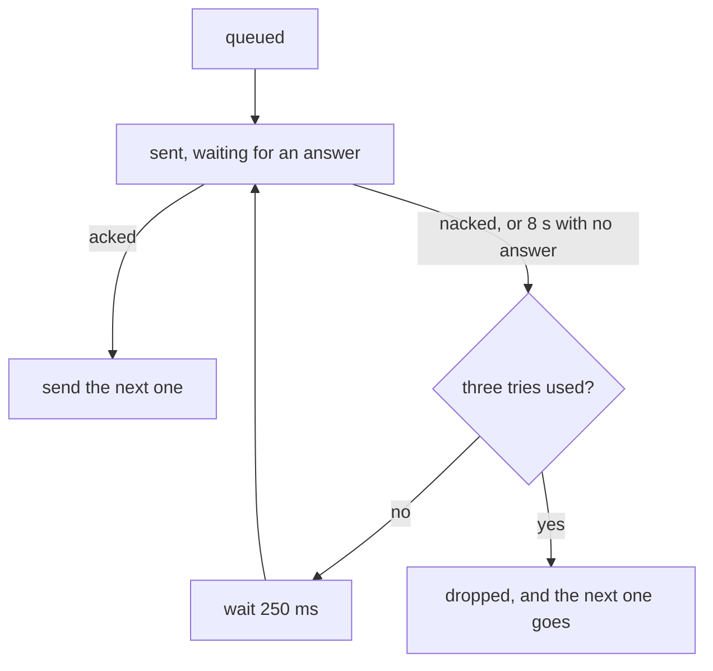

# The Phone Side

A face's phone code is its PebbleKit JS, running inside the Pebble app on the phone. The framework runs all of it from one call. `startPebbleApp` builds the settings page, puts the settings back after a reinstall, keeps second clocks right across daylight saving, sends every message to the watch through one queue, and runs the features the face opted into, such as weather, stocks, and the calendar. A face's own phone code is usually that one call and whatever formatting is its own.

It lives under `src/ts/pkjs/`, in [`app.ts`](../../src/ts/pkjs/app.ts), [`feature.ts`](../../src/ts/pkjs/feature.ts), and [`send-queue.ts`](../../src/ts/pkjs/send-queue.ts), with the rules every fetching feature shares in [`asks.ts`](../../src/ts/pkjs/asks.ts) and [`round.ts`](../../src/ts/pkjs/round.ts).

## Starting the App

A face's entry point hands `startPebbleApp` its settings page and the features it uses:

```ts
app.startPebbleApp({
  clayConfig,
  components: [slotEditor],
  features: [weather, stocks],
});
```

**`clayConfig`.** The settings page, normally built with `buildConfig`. Besides building the page from it, the app reads each setting's default, which fields are second clocks, and each slider's precision.

**`components`.** Any Clay components of the face's own, such as a layout editor. They are registered before the page is built. The location search that the weather location and second clocks use is registered for every face.

**`features`.** The parts of the phone code only some faces need. Each one fetches its own data and sends it to the watch, and the app tells it when anything happens.

## Features

A feature is a function the app calls once, at start, with what every feature shares: the face's message keys, the defaults from its settings page, the send queue, and how long to wait before fetching again after a save. It hands back the hooks the app calls on it:

| Hook | When It Runs |
| :-- | :-- |
| `ready` | the phone code has started, after the settings request has gone out |
| `message` | a message has arrived from the watch |
| `refresh` | the background refresh ticked, with a flag for the slower ticks |
| `configOpened` | the settings page is about to open, while the old settings are still saved |
| `configSaved` | the settings page closed and its new settings are saved |

Every hook is optional. A feature also lists the watch's request keys it answers, such as `WEATHER_REQUEST`. When the watch sends a request no listed feature answers, the app logs one warning naming the key, which is how a face that declares a feature's keys but forgot to list the feature finds out.

**One Feature Cannot Break the Others.** The app runs each hook on its own. A hook that throws is logged and the rest still run, so a feature that breaks on one phone cannot stop the refresh timer, the other features, or a settings restore.

**Only What a Face Lists Is Bundled.** `app.ts` never imports a feature. The face's entry point imports each one it passes, such as `weather` from `ts/weather/feature`, so the bundler leaves every other feature out of the face's phone code, along with the providers behind it. The calendar's iCal library is only copied into the build for a face whose code reaches the calendar reader. The cost is that a face has to name each feature it uses, and one it forgets fetches nothing.

**A Feature Checks Its Own Keys.** Weather that is listed but missing one of its four core message keys fetches nothing and logs which keys are missing, since a fetch would spend provider quota on a reading the watch cannot show. Stocks without `STOCK_STRIP` and a calendar without `CALENDAR_STRIP` skip every fetch, with no log line.

## When the Phone Code Starts

The Pebble app starts the phone code when the face opens, and fires `ready` once it is up. The app then does the same things in the same order every time:



**The Settings Request.** It goes out first. A face that declares `SETTINGS_FRESH` and already has settings on the phone only asks whether the watch booted empty. Any other face asks for the watch's whole copy. The watch turns away anything that arrives before the face has opened its connection, which can be a moment into a launch, and the queue gives up after three quick tries. So when the watch turns the request away, the app waits a second and sends it again, up to 8 more times. The app never asks again for a request the watch took, since the watch queues its reply before it acks, and the first reply ends the run. A repeat of the reply is ignored. What happens with the answer is on [The Life of a Setting](life-of-a-setting.md#after-a-reinstall).

**Every Second Clock Again.** A watch that has just been reset holds no zones, so the app forgets what it last sent and sends every second clock again. [Time Zones](time-zones.md#following-daylight-saving) covers what it sends. A push the watch turned away because the face was not listening yet goes again when the watch's settings reply lands.

**Each Feature Fetches.** A feature's `ready` forgets what the watch last took from it and fetches, so a watch that rebooted with empty stores always gets an answer. The stock feature may hand over the strip it kept on the phone instead, when its quota rules hold the fetch, as [The Stock Store](stock-store.md#surviving-a-restart) covers.

**The Timer Starts Fresh.** The phone suspends PebbleKit JS whenever it likes, and the timer goes with it, so every `ready` stops any old timer and starts a new one.

## Messages from the Watch

The Pebble phone app hands over each message from the watch keyed by message key name rather than by number. The app fills in the number for every key the face declares before anything reads the message, so the settings reply and every feature see it however the phone keyed it. Every message from the watch then goes to every feature's `message` hook, and each one looks for its own request key. A request starts a fetch, unless one is already out, and forgets the copy the watch last took so the answer goes out even when nothing changed.

The watch's reply to the settings request is handled by the app itself. Depending on which side has settings, it restores the watch from the phone or fills the phone's saved settings from the watch. When it fills an empty phone, each feature gets `configOpened` and `configSaved` around the fill, the same as for a save on the page. A feature whose settings moved then fetches again, so a watch set to Fahrenheit does not keep a Celsius reading fetched on the defaults.

## The Background Refresh

While the phone code runs, a timer ticks every 5 minutes. Each tick sends any second clock whose offset moved, then runs every feature's `refresh`. Every sixth tick, about every 30 minutes, is a slow one.

Weather, stocks, and the calendar act only on the slow ticks. The watch asks for each on the interval the wearer picked, so the watch leads. The slow tick only fetches when nothing has asked since the last one. A watch ask, or the phone code starting, marks the feature as asked, so a feature the watch is polling never fetches on the tick as well.

**The Same Answer Is Not Sent Twice.** Each feature keeps the last message the watch took from it, and a refresh that brings back exactly the same one sends nothing. Every send wakes the watch's radio whether or not the reading moved. A send that fails every retry forgets what it kept, so the next one goes out. A watch ask and the phone code starting both forget it too, so the watch always gets an answer when it asks.

## After a Save

Each feature keeps its own list of the settings it cares about. Weather watches the provider, the key, the unit, and the location settings. Stocks watch the provider, the key, and the tickers. The calendar watches its link.

**A Snapshot When the Page Opens.** The page's new values are saved as it closes, so `configOpened` is the last moment the old ones can be read. Each feature takes a snapshot of its own settings then, and the app opens the page.

**A Fetch Only When Its Settings Moved.** When the page closes, the app sends the save to the watch first, since that is the step that saves the new values. Then each feature compares its settings with its snapshot. One whose settings changed fetches again 250 ms later, forced past any quota rule. A save that only touches a colour fetches nothing. The watch may also ask for weather after the same save, and an ask that lands in those 250 ms is folded into the forced fetch rather than starting a second one.

**One Fetch at a Time.** A feature keeps one fetch out at a time. An ask that arrives while one is running is dropped, so the watch asking again does not spend a provider call twice. The forced fetch after a save takes over from one still running, and the older one's answer is thrown away when it lands, so a reading for the old city or the old unit never reaches the watch after the new one. A watchdog closes a fetch that never answers, so it cannot hold off every later one. Weather also tries a failed fetch again after 5 and then 15 seconds, unless the failure waits on the wearer, such as a bad key or a used-up quota.

## The Send Queue

PebbleKit JS allows one message to the watch in flight at a time, and a second one sent meanwhile is dropped with no error. At launch the settings request, the second clocks, the weather, the stocks, and the agenda all go out at the same moment. So every send goes through one queue:



Messages go out in order, one at a time. A nack from the watch usually means it was busy for a moment, so the same message goes again after 250 ms, up to three tries in all. A message that fails every try is dropped so the queue keeps moving, and whoever sent it hears that it failed. The watch's own queue waits far longer between tries, for a different reason, which [Talking to the Phone](talking-to-the-phone.md#sending-one-at-a-time) covers.

**Clay's Own Sending Is Off.** Clay can send the settings to the watch by itself when the page closes, but it would call `Pebble.sendAppMessage` directly, collide with whatever else was in flight, and lose one of them. The app starts Clay with `autoHandleEvents: false` and sends the save through the queue like everything else.

**A Lost Answer Counts as a Failure.** The Pebble app can lose an ack, and a send that waited for it forever would hold up every send behind it. After 8 seconds with no answer the send counts as failed and is tried again. An ack that turns up after that is ignored, so a send that was only slow can reach the watch twice. The watch writes nothing for a value it already holds, so the repeat costs one extra message.

**A Message That Will Not Encode.** A message the Pebble app cannot encode makes the send throw rather than fail. The queue counts it as a failed try, so the throw never reaches whoever queued something else.
