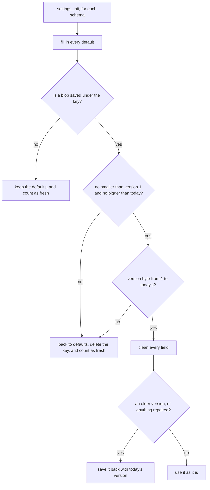

# Settings on the Watch

The settings code keeps every setting a face offers in flash on the watch, and takes care of everything around that: the defaults on a first launch, reading an older version's saved settings after an update, repairing a damaged value before the face draws it, taking new values from the phone, and sending the watch's copy back so the settings page opens filled in. A face describes its settings once, as a table, and never writes load, save, or message code for a single setting.

It lives in [`settings.h`](../../src/c/pebble/system/settings/settings.h) and [`settings.c`](../../src/c/pebble/system/settings/settings.c) under `src/c/pebble/system/settings/`, with the shared settings in [`settings_catalog.h`](../../src/c/pebble/system/settings/settings_catalog.h) and their named values in [`setting_values.h`](../../src/c/pebble/system/settings/setting_values.h). [The Life of a Setting](life-of-a-setting.md) follows one setting from the page to the screen. This page stays on the watch and goes into the machinery underneath.

## Describing the Settings

A face keeps its settings in a plain struct whose first byte is a version number. A table of fields says where each setting sits in that struct, and a schema hands the struct, the table, the version, and a persist key to `settings_init`. A common setting takes one line, and a face's own takes one entry:

```c
static const SettingField s_fields[] = {
    KNOWN_THEME(offsetof(FaceSettings, theme), 4),

    // this face's own setting, a choice of three layouts
    { .id = SETTING_COUNT, .message_key = &MESSAGE_KEY_APPEARANCE_LAYOUT,
      .type = SETTING_ENUM_U8, .offset = offsetof(FaceSettings, layout),
      .enum_count = 3, .default_num = 0 },
};
```

**A Field.** Each entry names its message key, its type, and its offset in the struct. The type is a toggle, a choice from a list, text in a fixed buffer, or a colour, and it decides both how the value travels and how it is checked. A choice carries how many options it has and which one is the default. Text carries its buffer size and its default string. Flags mark the side effects: a change to the date or time format re-renders the clock, and a change to the temperature unit asks for fresh weather.

**The Shared Entries.** The `KNOWN_*` macros fill in a common setting whole, with its message key, type, limits, default, and side effects. A face gives the offset, and a list also takes how many choices the face offers. The lists in `setting_values.h` each end in a count, such as `TIME_FORMAT_COUNT`, so a face that passes it stays in step if the list grows. A theme count is the face's own number, since only the face knows how many themes it ships.

The payoff for using a shared entry is that the framework's own code can find the setting. The date and time readouts read the formats, the steps readout reads its mode, and the Bluetooth vibration reads the pattern the wearer picked, all with no plumbing from the face:

```c
uint8_t time_format = settings_u8(SETTING_TIME_FORMAT);
const char *format = settings_str(SETTING_DATE_FORMAT);
```

`settings_init` builds a lookup from each shared id to its field once, so a read is an array index and a pointer offset. A read of a setting the face never declared gives 0 or an empty string. A shared entry names its message key directly, so a face that uses `KNOWN_THEME` without declaring `APPEARANCE_THEME` in its message keys fails to build at that line rather than on the watch.

**A Face's Own Settings.** A setting only one face has goes in the same table with an id of `SETTING_COUNT` or more. The framework still fills in its default, cleans it, saves it, and carries it to and from the phone. It just has no typed read, so the face reads it straight off its own struct.

## Loading at Launch

`settings_init` loads every schema the face hands it. Each one starts from its defaults, and only then is the saved copy read over the top:



**Growing at the End.** A saved blob from an older version is shorter than today's struct. The read fills in what was saved, and the fields added since keep the defaults that were filled in a moment before. So a new version adds its fields to the end of the struct and bumps the version number, and nothing else has to happen. The cost is that a field can never be moved, removed, or given a new type, since the loader has no step that rewrites one version's layout into another.

**The Smallest Blob.** `min_versioned_size` is the size of the struct when it first shipped, and it never changes after that. A blob smaller than it cannot be a saved copy of this face's settings, because every field past its end would be read from the wrong place.

**Going Back to an Older Build.** A blob bigger than today's struct was written by a newer build, and this one cannot read it. The same goes for a version byte of 0 or one from the future. The settings fall back to defaults and the key is deleted rather than written, so the watch counts as fresh and the phone puts its settings back (see [The Fresh State](#the-fresh-state)). Deleting the key rather than saving the defaults means a relaunch before the phone answers still boots fresh and asks again.

## Cleaning Each Value

Flash can come back damaged, and a damaged byte in a theme number would otherwise send the face looking for a theme that does not exist. So every field is checked after a load:

* **A toggle** holding anything other than 0 or 1 goes back to its default.
* **A choice** at or past the number of options goes back to its default.
* **Text** has to end inside its buffer, hold no control bytes, and say something, unless its default is itself empty. Every byte from 0x20 up counts as text, so a city spelled with an accent keeps its UTF-8 bytes across a reboot rather than reading as damage.
* **A colour** has to be opaque. Every colour the watch paints has both alpha bits set, so a byte without them came from damage rather than from the colour picker.

Anything repaired is saved back once, so the same repair does not run on every launch. The text check is `cstring_setting_is_clean`, in [`number_format.h`](../../src/c/core/text/number_format.h).

## Settings across Several Keys

A persist key holds at most 256 bytes, so a face with more settings than that chains a second schema on through `companion`, with its own key, version, and smallest size. Loading, saving, taking values from the phone, and sending them back all walk the whole chain, and a shared setting can live in any link. `settings_save` writes every link whenever it saves. Saves only follow a message that changed a setting, so a few extra writes then cost less than a checksum per link. A link that a new build adds has nothing saved on its first launch, so the watch counts as fresh and the phone restores everything once, filling the new link with the wearer's values rather than defaults.

## Taking Values from the Phone

`settings_apply_inbox` walks the face's table and looks each key up in the incoming message. It only decodes. It hands back what moved and leaves saving and redrawing to the AppMessage layer, which [Talking to the Phone](talking-to-the-phone.md#what-happens-to-a-message) covers. A key in the message that is not in the table is ignored. Each type has its own checks on the way in.

**A Choice.** Clay sends a select as text, so a choice is normally read with `atoi`. Text that does not start with a digit leaves the setting as it was. A number past the end of the list, or below 0, becomes the default, so a theme of `"12"` on a face with 9 themes reads as theme 0. A choice that arrives as a number, such as from a custom component, is taken as it is.

**A Toggle or a Colour.** A value of the wrong type leaves the setting as it was.

**Empty Text Keeps the Old Value.** An empty string only counts as a value for a field whose default is empty, such as a picker whose None is `""`. For any other field it leaves the setting alone, so a page that sends a blank date format cannot wipe the one the watch holds.

**Text Is Compared at the Size It Will Be Stored.** A string longer than its buffer is cut to fit, and the check for "already holds this value" compares only the part that fits. The date format has 16 bytes, room for 15 characters. A 20 character pattern is cut to 15 when it lands, and the next save sends the same 20 again. Compared whole, that would count as a change on every save, the settings would go to flash again, and the face would be told its date layout changed when nothing did. `cstring_fit_same` measures the incoming text the way the copy cuts it, so the second save reads as unchanged.

**Colours Round to the Watch's Palette.** The phone sends a colour as `0xRRGGBB`. Each channel rounds to the nearest of the four levels the watch can show, and the result is stored as one `GColor` byte. A grey of `0x808080` sits nearest 170 on each channel, so it is stored as `GColorLightGray` and goes back to the phone as `0xAAAAAA`.

**What Moved, Not What Arrived.** The page sends every setting on every save. A field that already holds the incoming value is skipped and flags nothing, so the three flags that come back say what really changed: anything at all, a date or time format, or the temperature unit.

## Sending the Watch's Copy Back

On launch the phone can ask for the watch's whole copy, and does when it holds no settings of its own, so the page opens filled in. `settings_serialize` writes every field in the form the page reads it: a toggle as 0 or 1, a choice as text such as `"3"` since Clay reads a select back as text, text as it is, and a colour as `0xRRGGBB`. `settings_serialized_size_max` gives the worst case the outbox is sized from, and serializing stops at the first field that does not fit. [Talking to the Phone](talking-to-the-phone.md#opening-the-connection) covers the sizing and why a reply that does not fit goes out empty.

## The Fresh State

`settings_was_fresh` is true when any schema in the chain had nothing saved at launch, or had a blob it could not read and reset. Either way some settings are on their defaults because flash was wiped, by a reinstall, a reset, or a step back to an older build. The phone holds the wearer's real settings, so the watch tells it, and the phone sends them back. [The Life of a Setting](life-of-a-setting.md#after-a-reinstall) shows that exchange.

While the watch is fresh, it only saves a message that came from the settings page, either the wearer's own save or the phone's restore. Anything else it takes stays in memory. The phone sends the current time zone on every launch, and that carries a setting too. Saving it would create the key, the watch would stop counting as fresh, and the phone would never restore the rest. Once a message from the page lands, `settings_mark_restored` ends the fresh state and saving goes back to normal.
