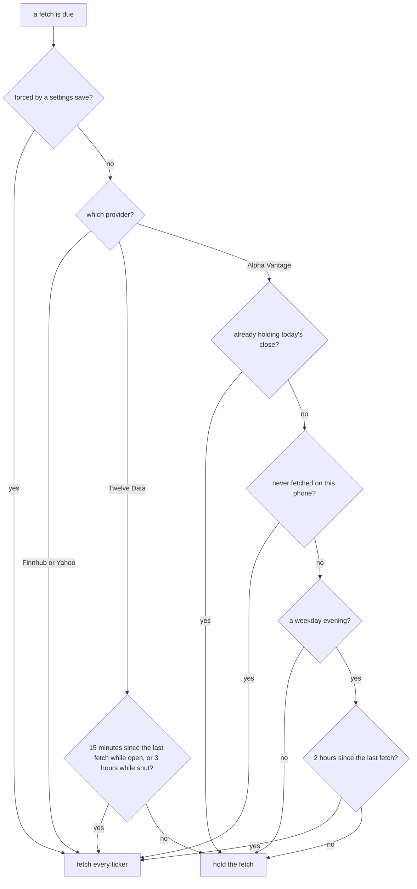

# The Stock Store

The stock store puts a watchlist of up to four quotes on the watch: each ticker, its last price, and the day's change in percent. The face never talks to a stock provider. The phone fetches the quotes, keeps each provider's daily quota in check, and sends one small packed strip. The watch keeps that strip, saves it to flash, and asks for a new one on a schedule. A face starts the store, hands it a redraw function, and reads the slots back.

The watch side lives in [`stock_store.h`](../../src/c/pebble/io/stores/stock_store.h) and [`stock_store.c`](../../src/c/pebble/io/stores/stock_store.c), and the strip is unpacked by [`stock_wire.c`](../../src/c/core/wire/stock_wire.c). The phone side is under `src/ts/stock/`. The polling deadlines, the tag byte on the saved copy, and the save that skips an unchanged strip are shared with the other stores and covered in [How the Stores Work](stores.md).

## Setting It Up

On the watch, the face starts the store and subscribes its redraw:

```c
stock_store_init((StockConfig){.live = true, .poll_min = 15, .persist_key = STOCK_KEY}, NULL);
stock_store_subscribe(redraw);
```

`live`, `poll_min`, and `persist_key` mean the same as for every store, as [How the Stores Work](stores.md#the-shape-every-store-takes) covers, and a `StockSeed` pins a fixed strip for screenshots.

On the phone, the face lists the feature when it starts:

```ts
app.startPebbleApp({
  clayConfig,
  features: [stocks],
});
```

A face that leaves it out does not carry the stock code or any of the providers in its phone bundle, as [The Phone Side](phone-side.md#features) covers. The face also declares the `STOCK_STRIP` and `STOCK_REQUEST` message keys, plus `STOCK_PROVIDER`, `STOCK_API_KEY`, and `STOCK_SYMBOLS` for the settings. The settings page's stock section has a data source, an API key, and a comma list of tickers. A face that lists the feature but not `STOCK_STRIP` gets nothing from it, since there is nowhere on the watch for a strip to land.

## What the Watch Holds

The strip is a count and up to four slots. Each slot carries a label of up to 11 characters, the price in cents, the change in hundredths of a percent, and an `ok` flag. Whole numbers keep floats off the watch, and the framework's formatters turn them back into text:

```c
const StockSlot *slot = stock_store_slot(0);
char price[16];
char change[16];

if (!slot)
{
    // nothing has arrived yet, or the wearer cleared the list
}
else if (slot->ok)
{
    fmt_hundredths(price, sizeof(price), slot->price_cents);  // 26174 reads "261.74"
    fmt_pct_signed(change, sizeof(change), slot->change_pct); // 125 reads "+1.25%"
}
else
{
    // slot->symbol holds a status word, such as "RATE LIMIT"
}
```

`stock_store_slot` returns `NULL` past the filled count, so a panel never reads a slot that holds nothing.

**Status Words in Place of a Ticker.** When a quote fails, the slot is sent with `ok` false and a short status in the label: `INVALID KEY`, `RATE LIMIT`, `NO ACCESS`, `NO SYMBOL`, `NO DATA`, `NO API KEY`, `NET ERROR`, or `ERR`. A panel that prints the label shows the wearer what went wrong, and the label width of 11 characters is set by the longest of these.

**The Limits of the Numbers.** The change rides in 16 bits, so a move past 327.67 percent either way reads as exactly that rather than wrapping, as [The Message Formats](message-formats.md#the-watchlist) covers. Only the percent change is sent, not the change in dollars.

## From the Phone to the Strip

The phone packs the strip as a count byte and then each slot end to end, a layout covered with the others in [The Message Formats](message-formats.md#the-watchlist).

**Labels Go over as Plain ASCII.** The phone flattens each label to the characters the watch fonts carry, as [The Message Formats](message-formats.md#text-on-the-way-over) covers, and cuts it to 11 characters. The settings page takes tickers up to 15 characters long, such as `BINANCE:BTCUSDT`, and the watch shows the first 11.

**A Bad Strip Changes Nothing.** A message cut short is refused whole, and the store keeps the strip it had, so it never shows half a watchlist.

**One Redraw per Strip.** A strip that reads clean replaces the whole watchlist at once, and the face redraws once for it.

## Choosing a Provider

The wearer picks the source on the settings page. Each answers one request per ticker.

* **Finnhub** is the default. It gives real-time US quotes on a free key. Its free plan refuses tickers outside the US, which shows as `NO ACCESS`.
* **Yahoo** is real-time, needs no key, and covers the most markets, including indices and crypto. It is an unofficial feed and can change without notice. It sends no change field, so the phone works the change out from the previous close.
* **Twelve Data** covers global markets on a free key that allows 800 calls a day.
* **Alpha Vantage** has end of day prices only, on a free key that allows 25 calls a day.

Every provider's reply is turned into the same quote shape, so the rest of the feature never knows which one answered. A provider that reports trouble in its body with a 200 status, as Alpha Vantage and Twelve Data do, is read for it, so a hit cap shows as `RATE LIMIT` rather than an empty quote.

## Keeping Under the Quota

The watch asks on the interval the face set. On a free plan that interval can spend a day's quota by lunchtime, so the phone decides per provider whether an ask is worth a call. It reads the market's state on New York's clock: open from 09:30 to 16:00 on weekdays, the evening from 16:00 to 22:00, and shut the rest of the time.



**Twelve Data.** With four tickers and a watch asking every 15 minutes or faster, a weekday comes to at most 26 fetches while the market is open and 6 while it is shut. That is 128 calls against the 800 the free key allows.

**Alpha Vantage.** It publishes the day's close at no fixed time after the bell, so the phone tries in the evening, two hours apart, and stops as soon as the quote's trading day is today. That is at most three tries, 12 calls of the 25, and nothing at all once the close is in. A phone that has never fetched gets one call at any hour, so a new install does not sit blank until the evening.

**No Holiday Table.** The schedule knows weekdays, not market holidays. On a US holiday Alpha Vantage spends its evening tries finding no new close, and Twelve Data polls at the open rate. Both stay inside their quotas.

**Clock Trouble.** A last fetch stamped in the future means the phone's clock went back, and the gate lets the next fetch through rather than shutting until the clock catches up. A phone that cannot read New York's time zone at all treats every moment as a Sunday, so a metered provider is never polled through a weekend by mistake.

**Settings That Change the Answer.** When the wearer changes the provider, the key, or the tickers, the phone forgets the old strip and its stamps, drops any fetch still out for the old list, and fetches again past the gate, as [The Phone Side](phone-side.md#after-a-save) covers. A save that touches nothing stock related fetches nothing.

## Surviving a Restart

The phone kills its PebbleKit JS whenever it likes, and the gate above is only worth anything if it remembers when it last fetched. So the phone keeps a small cache in `localStorage`, under a key of its own: the time of the last fetch, the trading day of the last good quote, and the last strip with a real quote in it. Clay rewrites its own settings blob on every save, which is why the cache sits beside it rather than inside it. Each field is checked on its own when it is read back, so one damaged field costs only itself.

**Which Fetches Count.** A round with a good quote records the time and the trading day. A round where the provider answered with nothing good, such as `RATE LIMIT` or `NO SYMBOL`, still records the time, since that answer spent a call on a metered plan. A round the provider never answered, a network blip, records nothing, so the next ask tries again.

**What the Watch Is Sent.** A strip with a good quote goes to the watch and becomes the kept strip. A provider's error, such as `INVALID KEY`, goes too, since the wearer has to act on it. A round lost to the network sends the kept strip instead when there is one, so the watch never swaps good quotes for a row of `NET ERROR`.

**A Held Fetch Still Answers.** When the watch asks and the gate holds, the phone sends the kept strip. That matters most for Alpha Vantage after the close: a watch that was just reset would otherwise sit blank until tomorrow's evening window. The same happens when the phone's code starts and the gate holds.

**One Round at a Time.** Each ticker is a separate request, and the strip goes once the last one answers, in the order the wearer typed them. A second ask while a round is out is dropped, so the quota is never spent twice for one answer. A request gives up after 15 seconds and a whole round after 30, so a request that never answers cannot block every fetch after it.

**When the Phone Asks on Its Own.** The watch's asks lead, and the phone's slow refresh only fetches when the watch has not asked since the last one, as [The Phone Side](phone-side.md#the-background-refresh) covers.

**Clearing the List.** An empty ticker list sends a strip with a count of zero, which is how the watch hears that its list was cleared.

## On the Watch

**The First Ask.** A live store asks once shortly after launch, as [How the Stores Work](stores.md#polling-on-wall-clock-deadlines) covers. It needs no retry loop like the weather store's, since the phone sends a strip on its own as soon as its code starts.

**Saved to Flash.** The whole strip and the time it arrived are saved to the face's persist key, and a relaunch shows the last strip straight away. The restore pins a count above four to an empty list and gives every label a closing zero, so a damaged copy cannot send a panel past the end of the slots. A failed write waits for the next strip that differs, for the reason in [How the Stores Work](stores.md#skipping-unchanged-writes).

**How Old It Is.** `stock_store_age_s` gives the seconds since the last strip arrived, or -1 for none. A face can pass it to `store_poll_reconnect_due` to catch up after the phone reconnects, as [How the Stores Work](stores.md#polling-on-wall-clock-deadlines) shows.
