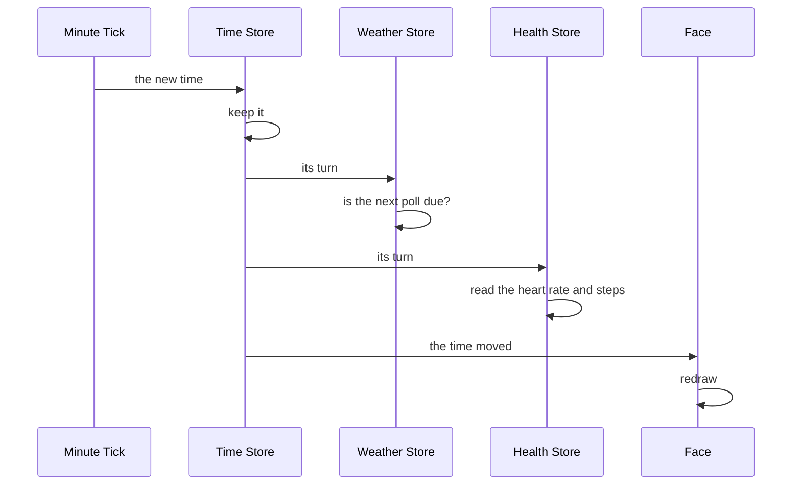
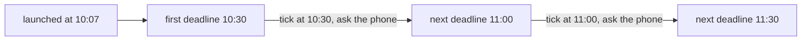

# How the Stores Work

A store is the part of the framework that holds one kind of reading on the watch, such as the time, the battery, or the weather. It listens to the watch's own services or to the phone, keeps the latest reading, and tells the face when to redraw. A face starts each store it needs and then only reads from it, so it never handles a tick, a battery event, or a message from the phone itself. Every store follows the same shape, and the timing, polling, and saving code they share is written once, so a fix to any of it reaches every store.

The stores live under `src/c/pebble/io/stores/`:

| Store | Holds | Fed By |
| :-- | :-- | :-- |
| [Time](time-store.md) | the current time | the minute tick or the .beats timer |
| [System](system-store.md) | the battery, the phone connection, and the next alarm | the watch's battery and connection services |
| [Location](location-store.md) | the phone's last location fix | the phone, alongside the weather |
| [Weather](weather-store.md) | the latest weather and the forecast strips | the phone |
| [Stocks](stock-store.md) | a watchlist | the phone |
| [Calendar](calendar-store.md) | the next few events | the phone |
| [Health](health-store.md) | heart rate, steps, sleep, and activity | the watch's health service |

## The Shape Every Store Takes

A face sets up its stores once, at launch, and hands each one the function that redraws the screen:

```c
system_store_init((SystemConfig){.live = true, .vibe = vibe_bt_transition}, NULL);
time_store_init((TimeConfig){.live = true, .minute_tick = true}, NULL);
weather_store_init((WeatherConfig){.live = true, .poll_min = 30, .persist_key = WEATHER_KEY}, NULL);

system_store_subscribe(engine_mark_dirty);
time_store_subscribe(engine_mark_dirty);
weather_store_subscribe(engine_mark_dirty);
```

**The Config.** Every store takes a small struct of rules, and every one of them has `live`. A live store claims its messages or its services, polls, and saves to flash. The stores that ask the phone for data take `poll_min`, the minutes between asks, and the ones that save take `persist_key`, the flash slot to save into. The face picks the key, so a store never takes one the face already uses. The config is built from the face's own settings, so a store never reads a setting itself.

**The Seed.** The second argument is an optional reading to start from. With `live` true it shows until a real reading lands. With `live` false it is all the store ever shows, which is how a face takes screenshots (see [Seeded for Screenshots](#seeded-for-screenshots)).

**Subscribe.** Each store holds one function to call when its reading changes, and a second subscribe replaces the first. The store calls it after the new reading is in place, so the redraw always reads the new values. A face subscribes after init, so the seed and the restore redraw nothing, and the face's first paint reads every store anyway.

**Getters with No-Data Values.** Each reading has its own getter, and a reading that can be missing has a value that says so: -1 for a count or a percent, `WEATHER_NO_TEMP` for a temperature, since a temperature can be negative and 0 is a real one, and an empty string for text. A panel checks for it and draws dashes, so a watch that has not heard from the phone yet never shows a 0 that looks real.

**Reconfigure.** The time, weather, stock, and calendar stores take new rules after launch through their `_reconfigure` call, which a face runs from its settings handler. It swaps the time store's ticker, or changes how often a store polls, without losing the reading it holds. The other stores take nothing from settings once they start. The system store's buzz on a connection change reads its settings at the moment it buzzes, so it needs no reconfigure either.

## Seeded for Screenshots

A store started with `live` false and a seed shows the seed and nothing else. It claims no messages and subscribes to no services, so a real reading arriving from the phone has nowhere to land and cannot overwrite it. It never polls and never saves, so a screenshot build never writes its fixtures into the flash of a watch that later runs the real face. The time store runs no ticker, so the clock stays where it was pinned.

That makes every run of a screenshot build draw the same picture, down to the battery level and the minute. The dev plugin seeds the stores from one fixture this way, as [Fixed Readings for Screenshots](dev-plugin.md#fixed-readings-for-screenshots) covers.

Starting a store again is safe. The cadence registration and the message hooks each keep one copy of a function however many times it is added, so a store seeded once per tap never runs its work twice per tick.

## Riding the Face's Cadence

No store runs a timer of its own for its regular work. Each one registers a function with `store_cadence_register` during its init, and the time store runs every registered function on each tick, in the order they registered, before it tells the face the time moved. The list has room for eight, more than the stores that use it. Adding a function already on the list does nothing, and a list that is somehow full logs an error rather than overwriting an entry.



The polling stores use their turn to check whether a poll is due. The health store uses it to read the step count and heart rate, since the health service sends events too rarely to draw a heart rate graph and stops sending steps the moment the wearer sits still. Running the stores before the face is told means the redraw that follows already shows this minute's steps.

**One Wake for Everything.** A timer per store would wake the watch once for each store. Riding one ticker wakes it once a minute however many stores a face runs, and the watch's battery pays for every wake.

**The Cost.** The cadence is whichever ticker the face runs. On the minute tick a poll goes out on the minute it falls due. A face that runs only the .beats timer turns the stores every 86.4 seconds, so a poll can go out up to that long after its deadline. A face that runs neither ticker never turns the stores at all, so nothing polls. Only a seeded face runs that way, and it does not poll anyway.

## Polling on Wall-Clock Deadlines

The weather, stock, and calendar stores ask the phone for data on an interval. The deciding code is in [`store_poll.h`](../../src/c/pebble/io/stores/store_poll.h), and [`store_fetch.h`](../../src/c/pebble/io/stores/store_fetch.h) wraps it in the timer and the request each store points it at.

**Deadlines on the Clock.** The next deadline is the next multiple of the interval counted from the epoch, not from launch:

```c
time_t interval = (time_t)poll_min * SECONDS_PER_MINUTE;
return ((now / interval) + 1) * interval;
```

With a 30 minute interval, polls go out on the hour and the half hour. Two watches started minutes apart ask at the same moments, and a relaunch never shifts the timing:



The epoch is counted in UTC, so the deadlines fall on UTC's hours. In a time zone half an hour off UTC, such as India or Newfoundland, an hourly poll goes out at half past the local hour.

**Clock Changes.** A clock that jumps forward finds its deadline already passed, polls once, and sets the next deadline from the new time. One that jumps back would leave the deadline hours away, so a deadline more than one interval ahead is pulled back in. A watch at 10:40 waiting for 11:00 that is set back to 08:15 waits for 08:30, not for 11:00.

**The First Fetch.** A store that polls also asks once shortly after launch, so it is not blank until the first deadline comes round. The weather store asks after 500 ms, the stocks after 700 ms, and the calendar after 1.1 seconds. The first wait lets the face open its AppMessage connection, and the stagger keeps the three requests from leaving at the same moment. The weather store also asks again while the phone's side is starting up, which [The Weather Store](weather-store.md#from-launch-to-the-first-reading) covers.

**Changing the Interval.** A reconfigure takes the new interval and moves the deadline to its next boundary. A store with nothing to show asks right away. One that already holds a reading waits for the deadline, so a save that only changed a colour never spends a request, which matters on a provider with a daily limit. A save can bring a poll nearer, but polls never come faster than the interval. A fetch still waiting from launch is kept, so a settings push in the first second does not cancel it. Turning `live` off, or setting the interval to 0, stops the store asking and cancels any fetch still waiting.

**After a Lost Connection.** The phone's PebbleKit JS may be closed the whole time the phone is away, so a reading can go stale while the watch waits. A face can catch up when the phone comes back, using the reconnect callback from the [system store](system-store.md). `store_poll_reconnect_due` says yes only when there is no reading, or the reading is at least one interval old, so bluetooth dropping in and out never fetches faster than the normal polling:

```c
static void on_phone_reconnected(void)
{
    if (store_poll_reconnect_due(weather_store_age_s(), WEATHER_POLL_MIN))
    {
        appmessage_request_weather();
    }
}

system_store_on_reconnect(on_phone_reconnected);
```

A clock set back can make a saved reading's age negative. That counts as no reading, so the reconnect asks once and the answer puts the age right.

## Saving to Flash

A store that saves keeps its whole reading as one struct and writes it to one persist key with [`store_persist.h`](../../src/c/pebble/io/stores/store_persist.h). A persist key holds at most 256 bytes, and each store checks at build time that its struct fits. On a relaunch the store reads the struct back, so the face shows the last reading straight away rather than dashes while it waits for the phone. Only a live store saves or restores.

**The Tag Byte.** The struct is the saved format, so an update that changes its layout would read an older blob as the wrong fields. The first byte of every saved blob is a tag. The high half names the store and the low half is the layout's revision, so the weather store's `0x13` is store 1, revision 3. A change to a store's struct bumps its revision.

**The Restore Checks before It Copies.** It refuses a blob whose size does not match, then reads the tag byte on its own and refuses a blob whose tag does not match. Only then does it read the whole blob over the store's state. Reading the whole blob first would overwrite the defaults before the store found out the blob was the wrong shape. Size alone is not enough, since two stores' structs can happen to be the same size, and reordering two fields keeps the size too.

**After a Layout Change.** The old blob is refused once. The store starts empty, its readings show dashes until the phone next answers, and the next save writes the new layout. A face whose store changes layout says so in its own changelog, since the wearer sees the dashes.

**Repaired after the Restore.** A blob that passes both checks can still hold damaged bytes, so each store fixes anything it would otherwise use as it came off flash. A count bigger than its array is cut back or thrown out, and every string gets a closing zero, so a bad blob cannot send the drawing code past the end of an array.

## Skipping Unchanged Writes

Flash wears out with writes, and most polls bring back the reading the watch already has. `store_save_changed` keeps a sum of the reading it last wrote and skips the write when the new reading sums the same. The sum is four bytes in memory, where a second copy of the reading to compare against would be hundreds.

**Only the Reading Counts.** Each reply stamps a new sync time, so the whole blob differs every time. The reading sits before the sync time in each struct, and only that part is summed:

```c
uint32_t sum = store_sum(state, reading_size);
if (sum == *saved_sum)
{
    return true;
}
```

The cost is that the saved sync time stays at the last real change. A relaunch reads the reading as older than it is, and the reconnect catch-up can ask once more than it needed to. One extra request costs less than a flash write on every reply.

**The Order Counts Too.** [`store_sum.c`](../../src/c/pebble/io/stores/store_sum.c) is FNV-1a, which mixes in each byte in turn. A plain total of the bytes would miss two values trading places, and a forecast whose days only swapped would never be saved.

**Seeded from the Restore.** A restore records the sum of what it read, so the first reply after a relaunch that brings the same reading writes nothing.

**A Failed Write.** The sum only moves when a write lands, so a failed write leaves flash and the sum out of step, and the next reply that reaches a save writes again. The weather store also keeps itself marked as changed, so its very next message tries again whatever it brings. The stock and calendar stores leave that out. A failed write there almost always means the watch's storage is full, which an early retry would not change, and the mark would cost bytes on every face.

**Two Readings Can Share a Sum.** The chance is about one in four billion, and the cost would be one skipped save that the next different reading puts right.

The location store sums its whole blob, since it has no sync time. The health store uses the same sum another way, comparing its readings before and after a refresh and only telling the face to redraw when they moved.
