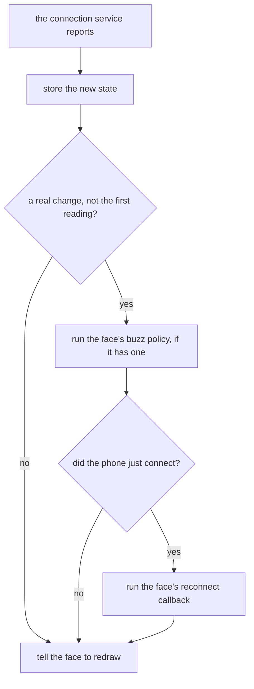

# The System Store

The system store holds the watch's own state: how full the battery is, whether it is charging, whether the phone is connected, and when the next alarm goes off. It subscribes to the watch's battery and connection services itself, buzzes when the phone connects or drops in whatever way the face chooses, and tells the face when the phone comes back so the readings that come from the phone can catch up. A face starts it once and reads the values back.

It lives in [`system_store.h`](../../src/c/pebble/io/stores/system_store.h) and [`system_store.c`](../../src/c/pebble/io/stores/system_store.c).

## Setting It Up

```c
system_store_init((SystemConfig){.live = true, .vibe = vibe_bt_transition}, NULL);

system_store_subscribe(engine_mark_dirty);
system_store_on_reconnect(on_phone_reconnected);
```

A live store subscribes to both services and then asks each one for its current reading, so it holds the real battery level and connection state straight away rather than waiting for the first change. The face reads them with `system_store_battery`, `system_store_charging`, and `system_store_bluetooth`.

The store has no reconfigure, since nothing in it comes from settings. `system_store_deinit` drops both service subscriptions.

## The Battery

Each battery event stores the level, from 0 to 100, and whether the watch is plugged in, then tells the face to redraw. The battery service sends an event when either one changes, so a battery panel stays current without polling.

## The Phone Connection

The connection the store tracks is the link to the Pebble app on the phone, rather than the bluetooth radio on its own. That is the link the phone-fed stores need, since their data comes through the app.

**The First Reading Only Seeds.** The reading taken at init sets the state and nothing else. A face that launched with the phone away never buzzes at launch, and a face that launched with the phone there never runs its reconnect work at launch, where the stores' own first fetch already covers it.

**A Real Change.** After that, every report from the connection service runs through the same steps:



The new state goes in first, so a buzz policy or a reconnect callback that reads the store sees the phone as connected.

**Buzzing.** The store never buzzes on its own. It calls the policy the face handed it, with true when the phone connected and false when it dropped, and a NULL policy keeps every change silent. The store knows nothing about settings or vibration patterns, so a face can swap in a rule of its own without touching the store, such as always buzzing twice on a drop and never on a connect:

```c
static void on_link_change(bool connected)
{
    if (!connected)
    {
        vibe_pulse(VibePulseDouble);
    }
}

system_store_init((SystemConfig){.live = true, .vibe = on_link_change}, NULL);
```

The framework's own policy, `vibe_bt_transition`, plays the buzz the wearer picked on the settings page, as [Vibrations](vibrations.md#phone-connect-and-disconnect) covers.

**Catching Up after a Reconnect.** The phone's PebbleKit JS may have been closed the whole time the phone was away, so the weather, stocks, or calendar can be stale when it comes back. The store runs the face's reconnect callback only on a change from disconnected to connected. The face decides which readings to ask for again, and [How the Stores Work](stores.md#polling-on-wall-clock-deadlines) shows the check that keeps a flapping connection from fetching faster than the normal polling. The store holds one callback, so a face with several phone-fed stores catches them all up from the same function.

## The Next Alarm

The alarm service has nothing to subscribe to, so the store does not hold the alarm. `system_store_next_alarm` asks the service on every call:

```c
time_t when;
if (system_store_next_alarm(&when))
{
    struct tm *at = localtime(&when);
    // draw at->tm_hour and at->tm_min
}
```

It returns false and sets the time to 0 when no alarm is on, and the time it gives is UTC. On a platform without the alarm service the SDK defines the call away to false, so the same face code reads as no alarm there.

Nothing tells the face when the wearer sets or clears an alarm. An alarm panel picks up the change on the next redraw, which on the minute tick is within a minute. The store spends no memory on it and the reading can never go stale.

## Seeding

```c
SystemSeed seed = {.battery = 64, .charging = false, .bluetooth = true, .next_alarm = 0};
system_store_init((SystemConfig){.live = false}, &seed);
```

The next alarm reads back the seeded time, with 0 for none. The seed is written straight into the store, so seeding a disconnected phone never runs the buzz policy. A store that is not live and has no seed reads 0 percent and disconnected, so a screenshot build sets the battery and the connection it shows. A seed with `live` true lasts no time at all, since init reads both services straight after it. [How the Stores Work](stores.md#seeded-for-screenshots) covers the rest of seeding.
