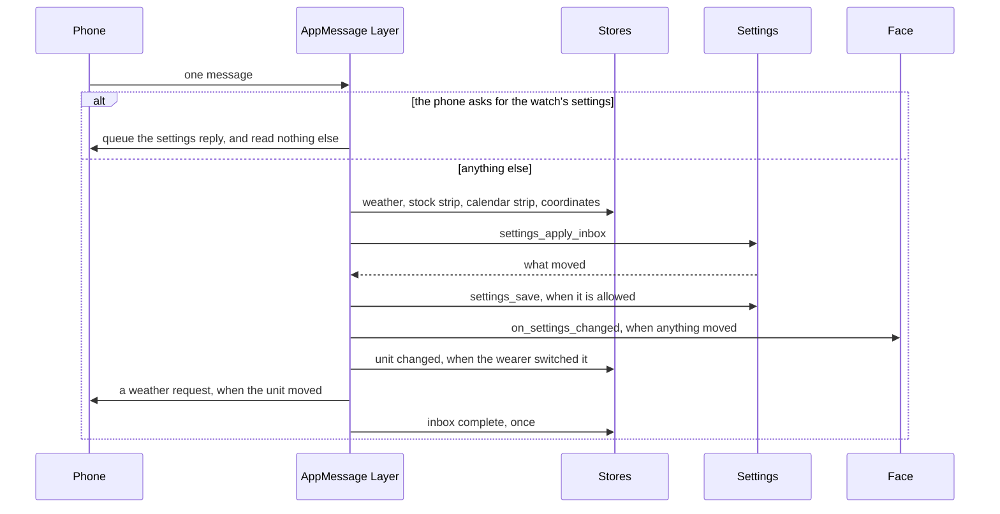
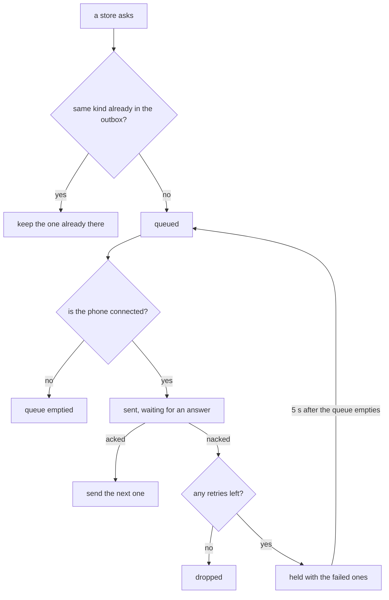

# Talking to the Phone

The AppMessage layer is the watch's side of every conversation with the phone. It opens the connection with buffers sized for the face, reads each message the phone sends and hands each part to the store or setting that owns it, and sends the watch's own requests one at a time with retries. A store asks for weather with one call and never touches the SDK's message API, and a face does no more than pick its inbox size and open the connection.

It lives in [`appmessage.h`](../../src/c/pebble/io/appmessage/appmessage.h) and [`appmessage.c`](../../src/c/pebble/io/appmessage/appmessage.c), with the feature switches in [`appmessage_features.h`](../../src/c/pebble/io/appmessage/appmessage_features.h), the send queue in [`outbox_queue.h`](../../src/c/pebble/io/outbox_queue.h), the safe readers in [`tuple_read.h`](../../src/c/pebble/io/tuple_read.h), and the list of after-message work in [`callback_list.h`](../../src/c/core/io/callback_list.h). The phone's half of the conversation, its own send queue included, is on [The Phone Side](phone-side.md).

## Opening the Connection

A face opens the connection once at startup, after its settings and stores are set up:

```c
settings_init(face_settings_schema());
weather_store_init((WeatherConfig){.live = true, .poll_min = 30,
                                   .persist_key = WEATHER_KEY}, NULL);
appmessage_on_settings_changed(on_settings_changed);
appmessage_open(4096);
```

`settings_init` has to come first, because the outbox is sized from the settings table.

**The Outbox Sizes Itself.** The biggest message the watch ever sends is its copy of the settings: a marker saying it is a settings reply, every setting, the fresh flag, and the custom colours on a face that has them. `appmessage_open` adds those up with every text setting counted at its full buffer and every choice at four bytes, the three digits of 255 and a terminator, so no later change to a setting can outgrow the outbox. Each value costs 7 bytes of header on top of itself, so a face with fifteen settings, two of them text fields of 16 and 32 bytes, needs a little over 200 bytes. A table too big for the platform's largest outbox is logged at open, and a reply that would not fit goes out empty, as [Sending, One at a Time](#sending-one-at-a-time) explains.

**The Inbox Is the Face's to Size.** The biggest message in is a save from the settings page, and Clay puts every key on the page in it, including keys the watch never reads. Only the face knows what its page holds, so it passes the number. Both buffers come off the app's heap, which is why the inbox is not simply opened at the platform's largest: every byte of inbox the face does not need is heap it cannot use for anything else. The number is pinned between the SDK's smallest and largest inbox. Each key on the page costs 7 bytes of header plus its longest value, and the sum is the number to pass. A save bigger than the inbox is dropped whole, and the watch only logs `Message dropped`, so a face adding settings keeps the number in step.

## What Happens to a Message

Each message from the phone goes through the same steps in the same order:



**A Settings Request Stands Alone.** The phone asks for the watch's settings when its code starts, and again if the watch turned the first ask away, each time in a message of its own. The watch queues its reply and stops there. It queues the reply before it acks the ask, so an ack tells the phone the reply is on its way. A phone that already holds settings only needs to know whether the watch booted empty, so it can ask for just that, and the answer is one flag rather than the whole table.

**The Readings Go First.** Weather, the stock and calendar strips, and the coordinates each go to the store that registered for them. A part nobody registered for is skipped.

**Settings Are Looked For in Every Message.** `settings_apply_inbox` runs on every message, a weather reply included. Most carry no settings keys, and it finds nothing. When something did move, the settings are saved, except while the watch is waiting to be restored after a wipe, which [Settings on the Watch](settings-on-the-watch.md#the-fresh-state) explains.

**Then the Reactions.** The face's `on_settings_changed` runs when any setting moved. A change of temperature unit made by the wearer tells the weather store, which converts the reading it holds. A restore does not, since the reading on the watch was already fetched in the restored unit. A change that affects the weather also queues a weather request.

**Inbox Complete Comes Last.** Once every part of the message is handled, the layer runs each function on its inbox complete list, described below.

## Who Gets What

Each part of a message has one handler slot, set with an `appmessage_on_*` call, and setting it again replaces the one before. The stores register their own when they start live, so a face that starts a store gets that store's messages with no code of its own.

**Only for the Length of the Call.** Everything a handler is given points into the inbox, which the SDK reuses for the next message. A handler copies whatever it keeps. The stock and calendar strips go over raw because each store owns its format and decodes it itself, which [The Message Formats](message-formats.md) covers.

**Work for the End of a Message.** One message can reach a store through more than one handler, such as a unit change landing beside the weather. A store adds a function with `appmessage_add_inbox_complete`, and the layer runs it once after the whole message, so the store can redraw and save once. [The Weather Store](weather-store.md#one-redraw-and-one-save-per-message) shows it in use. Unlike the handler slots, this is a list, so several stores can each add one. It holds four, runs them in the order they were added, ignores a function added twice, and logs an error if a fifth is turned away. The list itself is a small fixed array its owner provides, so nothing is allocated.

## Sending, One at a Time

AppMessage lets the watch have one message on its way at a time, and a second send started before the first is answered fails. The watch sends a weather, stock, or calendar request, its settings reply, and the short reply that only says whether it booted empty, and all of them go through one queue:



**One of Each Kind.** A request is only added when the same kind is not already in flight, queued, or held after a failure. A store whose poll comes round again while its last request is still waiting keeps the one already there, so a fast cadence or a flapping connection can never stack up copies. The queue has room for one more job than there are kinds, so it never fills.

**Retries Wait for the Phone to Wake.** A nack usually means the phone's PebbleKit JS was asleep or busy, and the send it turned away is often what woke it. A retry a moment later would hit the same sleeping code. So a failed job waits with the others that failed until the queue has drained, then the whole set goes back in after 5 seconds. Each job gets its first send and three retries, so a request turned away by a phone that is starting up keeps trying for at least fifteen seconds before it is given up. The phone's own queue retries after 250 ms instead, for the reason on [The Phone Side](phone-side.md#the-send-queue).

**A Refused Send Is a Failed Send.** If the SDK will not even start a send while the phone is there, the job is held for a retry the same way and the queue moves on, so one stuck job can never block the rest.

**The Settings Reply Is Built as It Goes Out.** The reply is written when it is sent, not when it is queued, so a retry carries the settings as they are at that moment rather than as they were at the first try.

**A Reply That Does Not Fit Goes Out Empty.** When the settings run out of room partway, the message is emptied and still sent. An outbox that was started and never sent leaves every later send failing, so it has to go. The phone only reads a reply that carries the settings marker, so it ignores the empty one rather than filling its page from half the settings.

**A Lost Connection Empties the Queue.** Each time the queue goes to send and finds no phone, it forgets everything waiting and cancels the retry timer. What is already in flight still waits for its answer. A request saved up while the phone was away would only fetch old news, and each store asks again on its next poll or when the phone comes back.

## Reading Values Safely

Every value in an incoming message is read through two helpers, `tuple_int_or` and `tuple_str_or`. Each takes the value and a fallback, and returns the fallback whenever the value is missing or is not what it should be:

```c
int32_t humidity = tuple_int_or(dict_find(iter, MESSAGE_KEY_WEATHER_HUMIDITY), INT_MIN);
const char *condition = tuple_str_or(dict_find(iter, MESSAGE_KEY_WEATHER_CONDITIONS), NULL);
```

The SDK packs each value as a small header followed by the value, all back to back:

| Bytes | Holds |
| :-- | :-- |
| 4 | the message key |
| 1 | the type: text, bytes, signed, or unsigned |
| 2 | the length of the value |
| the length | the value |

**The Length Is the Width.** The phone can send a number one, two, or four bytes wide, and the type only says whether it is signed. Reading a four-byte number off a one-byte value takes three bytes of the next value's key along with it, and the result is a nonsense number with no error. `tuple_int_or` reads exactly as many bytes as the length says. A width other than 1, 2, or 4, or a type that is not a number, gives the fallback.

**Text Has to End inside Itself.** The phone is meant to include each string's terminator, and nothing in the SDK checks that it did. A string without one runs on into whatever follows it. `tuple_str_or` only returns a string whose last byte is its terminator, and gives the fallback otherwise.

**The Fallback Carries Meaning.** Each caller picks a fallback the phone never sends, so missing and wrong look the same and are handled once. The weather uses `INT_MIN` as its mark for a reading the phone left out. A toggle uses -1, so a value of the wrong type leaves the setting as it was. The helpers only unwrap the SDK's packing, and the reading itself lives in [`wire_read.h`](../../src/c/core/wire/wire_read.h) with the rest of [The Message Formats](message-formats.md).

## Switches from the Message Keys

A face lists its message keys in its appinfo, and the build defines a `HAS_MESSAGE_KEY_` switch for each one. `appmessage_features.h` turns those into one switch per feature, so every file asking whether the face has weather gets the same answer.

**A Face Only Pays for What It Declares.** The code that reads, requests, and hands on each feature is left out of the build when its keys are missing. A face with no calendar carries no calendar code in its message handling, and a face with no weather sends no weather requests. A face that starts the weather store live without declaring the weather keys logs a warning the first time it asks, rather than polling a phone that never answers.

**Groups of Keys Come Together or Not at All.** Some keys only make sense as a set. Weather needs `WEATHER_REQUEST`, `WEATHER_TEMPERATURE`, `WEATHER_CONDITIONS`, and `WEATHER_OK`, and the last one is what tells a failed fetch from a reading. Without it a failed fetch's status text would show as a live 0 degrees. A face that declares part of a set fails to build, with each missing key named in the error. A typo in a key name would otherwise build cleanly and leave those panels on dashes with nothing to say why.
