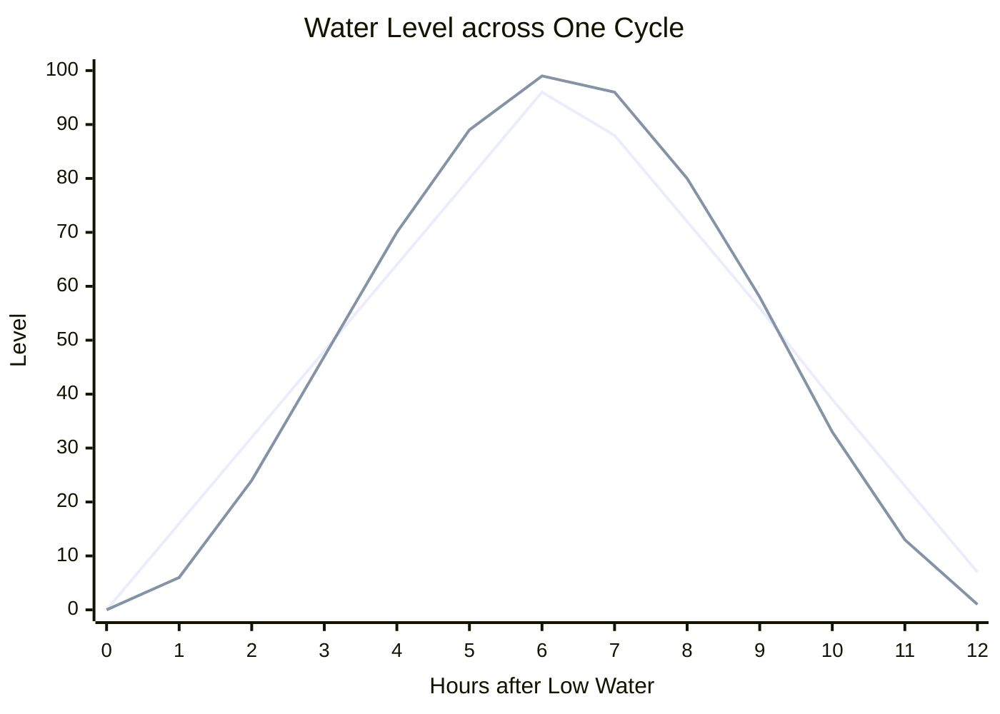

# Tides

The tide code gives a face water that rises and falls like a real sea. It comes in for a little over six hours and goes out for a little over six, stands nearly still at the turns, runs fastest in between, and arrives about 50 minutes later each day. The Shoreline face uses it to float a boat up and down the sand.

It is a rhythm, not a tide table. It knows nothing about any port, so it cannot tell a wearer when high water is on their beach. What it gives is water that moves at the right speed and in the right shape, with no phone, no location, and no network.

It lives in [`tide.h`](../../src/c/core/clock/tide.h) and [`tide.c`](../../src/c/core/clock/tide.c) under `src/c/core/clock/`.

## A Running Count of Minutes

`tide_level(minutes)` and `tide_rising(minutes)` both take a count of minutes that keeps going up, such as the minutes since the epoch. A time of day would not do, since it goes back to 0 at midnight and the water would snap back with it every night. Low water is wherever the count is 0 or a whole number of cycles on.

**The Cycle.** One cycle is 745 minutes, 12 hours 25 minutes. That is the moon's main tide, which comes round twice in the 24 hours 50 minutes it takes the moon to come back overhead. Two cycles run 50 minutes past a day, so each low water comes 50 minutes later than the day before, and the times of low and high water come round to where they started in about a fortnight.

**Counts before 0.** A count before the epoch gives a negative remainder in C, and one cycle is added to it, the same as for [the moon](moon.md).

## The Shape of the Water

The level starts as a triangle, rising in a straight line from 0 to 100 over the first half of the cycle and falling back over the second:

```c
int32_t pos = (phase(minutes) * 200) / TIDE_PERIOD_MIN;  // 0 to 199
int32_t tri = pos <= 100 ? pos : 200 - pos;              // 0 to 100
```

Then the triangle is eased so the water slows into each turn:

```c
return (int)((tri * tri * (300 - 2 * tri)) / 10000);
```

That is the smoothstep curve, 3t² − 2t³, scaled to run from 0 to 100. It is exact at 0, 50, and 100, so low and high water really do reach the ends. In between it flattens both turns and steepens the middle. The chart shows a cycle hour by hour. The pointed line is the triangle, and the rounder one is the level the code returns:



The triangle crawls up the beach at one steady rate, which is the giveaway that nothing real is behind it. A real tide is close to a cosine wave, and the smoothstep curve stays within about one point of a cosine. With the rounding down to whole numbers, the level the code returns is never more than about three points off it.

Sailors have a rule of thumb for the same shape, the rule of twelfths. It says the tide rises a twelfth of its range in the first hour, two in the second, three in each of the third and fourth, two in the fifth, and one in the sixth. Added up that is 8, 25, 50, 75, 92, and 100. The code reads 6, 24, 47, 70, 89, and 99 at the same hours.

**Rising or Falling.** `tide_rising` is true over the first half of the cycle and false over the second, so a face can point an arrow or tilt a boat the right way. The flood and the ebb are the same length here.

## What It Leaves Out

**The Real Sea.** Nothing ties the count to the moon or to any port. Even lined up by hand with a tide table, the 745-minute cycle is about a quarter of a minute shorter than the real 12 hours 25.2 minutes, so it drifts nearly three hours a year.

**Spring and Neap Tides.** Every tide here has the same range. Real tides grow and shrink over a fortnight as the sun and the moon line up and pull apart.

**Other Kinds of Coast.** This is two equal tides a day, which is what much of the Atlantic gets. Some coasts, such as parts of the Gulf of Mexico, get one tide a day, and others, such as the Pacific coast of North America, get two of different heights. Up a river the flood is often shorter than the ebb.

None of that shows on a picture of a boat, and leaving it out keeps the whole thing to two short functions in whole-number maths.

## Using It in a Face

Any count that only goes up will do. The minutes since the epoch are the simplest:

```c
int32_t minutes = (int32_t)(time(NULL) / 60);

int level = tide_level(minutes);      // 0 at low water to 100 at high
bool rising = tide_rising(minutes);   // which way the water is going

int water_y = low_y + ((high_y - low_y) * level) / 100;
```

Even at mid tide the level moves less than half a point a minute, so reading it on the face's minute redraw is plenty.
