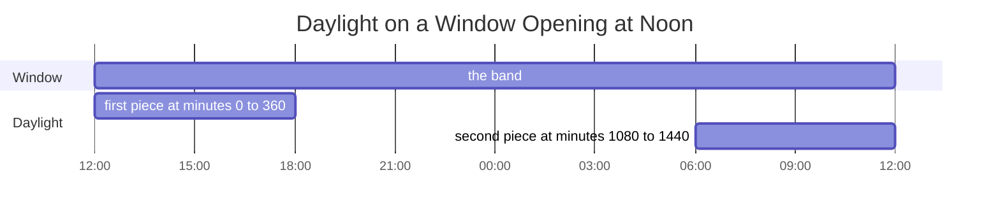
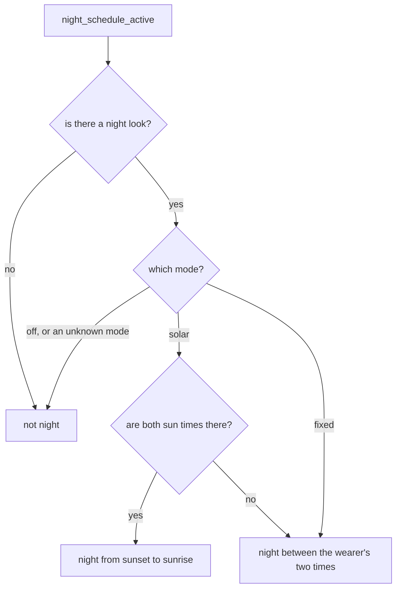

# Time Bands and Night Hours

A face that draws the day as a line or a ring has to place times along it: the hour hand on a 24 hour dial, the daylight shaded behind it, the meetings on a strip of the next few hours. The line can start at any hour and run past midnight, and that is the normal case, not the odd one. A window that opens in the evening and runs into the next afternoon puts 01:00 near the middle, not before the start. The time band code does that wrapping once, so nothing that draws on the line ever sees a midnight.

The night schedule answers the other question such a face asks every minute: is it night, so the night look should be showing?

The band lives in [`timeband.h`](../../src/c/core/clock/timeband.h) and [`timeband.c`](../../src/c/core/clock/timeband.c), and the night schedule in [`nightsched.h`](../../src/c/core/clock/nightsched.h) and [`nightsched.c`](../../src/c/core/clock/nightsched.c), both under `src/c/core/clock/` (see [Where the Code Lives](index.md#where-the-code-lives)).

## A Window on the Day

A `TimeBand` is two numbers, the minute of the day it opens on and how many minutes it runs, up to a whole day.

**`timeband_full_day`.** Midnight to midnight, for a 24 hour dial.

**`timeband_rolling`.** A window that keeps the moment it is built around a set distance in, such as a strip that always shows the last two hours and the next ten.

**`timeband_from_hour`.** A window that opens on the top of an hour. The hourly forecast carries the hour it starts on, so a strip built from that hour lands each forecast column on an even share of the axis.

## Placing a Moment

`timeband_offset` measures a minute of the day from the window's start, wrapping round midnight:

```c
int offset = wrap_day(minute_of_day - band.start_min);

return offset < band.span_min ? offset : -1;
```

For a 12 hour window opening at 20:00, 01:00 is 300 minutes in. 19:59 is one minute before the start, which wraps to 1439 minutes in. That is past the end of the window, so it reads -1, outside, rather than nearly a whole day in.

**Half Open.** The window holds its first minute but not the minute it ends on, which belongs to whatever comes next. Two windows laid end to end never both claim the same minute.

**Onto an Axis.** `timeband_pos` turns the offset into a position along an axis of any length, rounding down, so the last minute of the window lands on the last unit rather than past it. The unit is the face's: pixels along a strip, or `TRIG_MAX_ANGLE` for the SDK's full turn round a ring. `timeband_pos_offset` does the same for a value already measured from the start, and it takes the far end too, so a block that ends with the window reaches the end of the axis rather than stopping a unit short.

Every answer is an offset counting up from the window's start, so a span never runs backwards and a ring and a strip use the same sums.

## Clipping Events onto the Window

`timeband_clip` takes an event as two epochs, the way a calendar carries it, and gives back the minutes of the window it covers, with a flag for each end that was cut off.

The window's own start is an epoch too, so an event from yesterday or from next week falls outside rather than being wrapped onto today's strip. One that ends exactly as the window opens is outside as well. A start partway through a minute rounds down and an end rounds up, so a meeting always covers the minutes it touches. An event with no length still gets one minute, so a reminder pinned to a moment still draws. An end before the start is read as no length.

**Finding the Window's Start.** `timeband_window_epoch` gives the epoch of the window's first minute. It counts back from now rather than forward from midnight. On the morning the clocks go forward, the day is an hour short. Midnight plus 600 minutes is 11:00 on the wall that day, while a window from 10:00 seen at 11:30 opened 90 real minutes ago, which is 10:00. Counting back also finds a rolling window that opened yesterday evening without being told. A window that has not opened yet, such as a forecast strip that starts at the next hour, is the one coming up later today.

## Spans That Repeat Every Day

The daylight is a span that comes round every day. `timeband_clip_daily` takes one as two minutes of the day and clips it onto the window. A window that runs past midnight can see the end of one day's span and the start of the next, so it hands back up to two pieces, earliest first. A window opening at noon for 24 hours, with sunrise at 06:00 and sunset at 18:00:



The first piece says it was cut at the start and the second says it was cut at the end, so a face can tell a real sunrise or sunset from the edge of the window.

**A Span That Wraps by Itself.** An end at or before the start is read as running past midnight. A night from sunset to sunrise works that way, and so does a far northern summer's daylight that ends after midnight, without the caller knowing which it has.

**No Reading.** A -1 on either side gives no pieces. A sunrise and sunset on the same minute is read as a sun that never sets and covers the whole day. [Sunrise and Sunset](sunrise-and-sunset.md#polar-day-and-night) reads the same pair its own way.

## Is It Night?

A face that swaps its look after dark asks every minute whether it is night. `clock_window_contains` answers it by asking whether now is inside the night window, not by watching for the moment it crosses into it.

That choice matters more than it looks. A check that waits for the crossing misses it when the clocks jump an hour over the start, when the face was not running at the moment, or when a tick is dropped, and then stays wrong until the next crossing comes round the next day. Asking whether now is inside is right again on the very next minute, whatever happened before.

The window works like a band's. It holds its start and not its end, and one with its start later in the day than its end runs past midnight. A window that starts and ends on the same minute is empty rather than all day, which is what someone who set both times the same by accident expects. A missing reading gives false.

## Following the Sun or the Clock

`night_schedule_active` picks the window. The face hands it the mode, the clock, the sun times from the weather store, the two times the wearer set, and whether the face has a night look at all:



**The Fallback.** Following the sun needs a sunrise and a sunset. A watch that has never had weather still switches at the wearer's own times rather than never, so those two times do a job in both modes.

**Old Sun Times Count.** A sunset from an old reading is used, not treated as missing. Near the solstices it barely moves from day to day. Near the equinoxes it moves up to a couple of minutes a day at middle latitudes, so a reading a few weeks old can switch the look noticeably early or late. The weather store replaces the times with each poll, so this only shows when the weather has stopped arriving.

**Sunrise and Sunset on the Same Minute.** Both times are there, so the solar mode uses them, and the window they make is empty. The night look stays off all day, and the wearer's times are not used. That suits a midnight sun. Under a polar night it is off too.

The framework gives the sums. The settings that feed them, the mode and the two times, are the face's own:

```c
const struct tm *t = time_store_tm();
int now = t->tm_hour * 60 + t->tm_min;

bool night = night_schedule_active(night_mode, now,
                                   weather_store_sunrise(), weather_store_sunset(),
                                   night_start_min, night_end_min, has_night_look);
```
