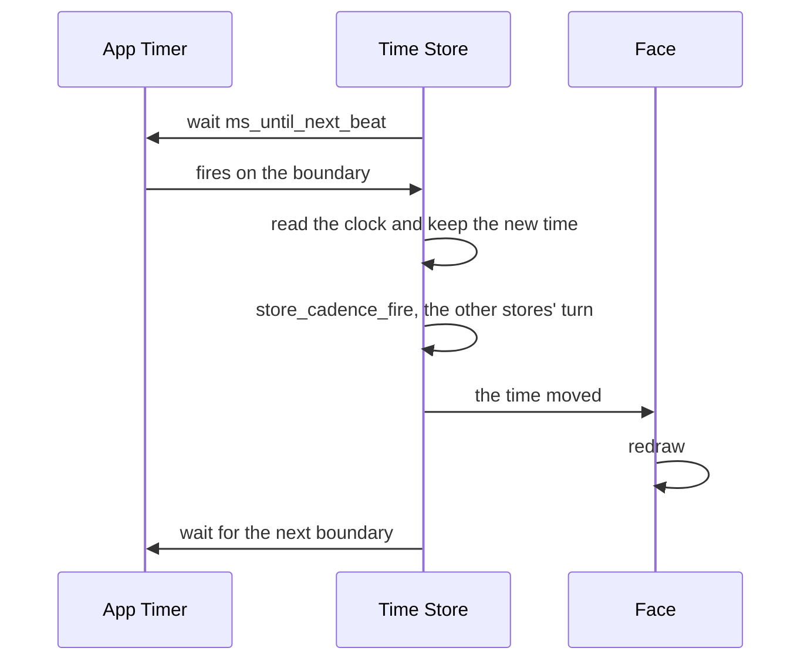

# The Time Store

The time store holds the current time and runs the ticker that moves it on: the minute tick, the .beats timer, or both. A face picks the ticker from its settings and reads the time back, and the store swaps tickers when the wearer changes the time format. Every other store's regular work rides on the same ticker, so the time store also decides when the weather is polled and when the step count is read.

It lives in [`time_store.h`](../../src/c/pebble/io/stores/time_store.h) and [`time_store.c`](../../src/c/pebble/io/stores/time_store.c).

## Setting It Up

A face builds the store's rules from its own settings, so the store never reads a setting itself:

```c
static TimeConfig time_config(void)
{
    bool beats = settings_u8(SETTING_TIME_FORMAT) == TIME_FORMAT_BEATS;
    return (TimeConfig){.live = true, .minute_tick = !beats, .beats = beats};
}

time_store_init(time_config(), NULL);
time_store_subscribe(on_time_changed);
```

**`minute_tick`** runs the SDK's minute tick, which is what a clock and most readouts need.

**`beats`** runs a timer that fires on each .beats boundary, every 86.4 seconds. [.beats](beats.md) covers how it finds the boundary.

**`live`** runs whichever tickers are on. With `live` false the store runs none and the clock stays at the time it was seeded with.

Init takes the current time straight away, so the face's first paint has a time to draw before any tick arrives. It redraws nothing, since the face subscribes afterwards.

`time_store_tm()` returns the store's own copy of the time. The SDK's `localtime` hands back one shared buffer that the next call overwrites, so a face reading the store's copy never sees it change under it because some other code broke a time apart.

## Picking the Tickers

The two tickers are independent, so a face can run either one or both.

**The Minute Tick Alone.** The usual clock. The store wakes once a minute, on the minute.

**The .beats Timer Alone.** For a face whose clock shows .beats instead of hours and minutes, as in the snippet above. The minute tick would be wasted work, since nothing on screen changes on the minute.

**Both.** For a clock face that also shows a beat somewhere, such as in the date line. Each ticker moves the time and runs the stores on its own. The stores' polls go by deadline, so the extra turns never ask the phone for more.

**Neither.** The time never moves and the other stores never get their turn, so nothing polls. Only a seeded face runs this way.

The face's callback runs on every tick from either ticker. A face that does something on the hour, such as an hourly buzz, checks `tm_min == 0` and needs the minute tick running. On the .beats timer alone it can miss the hour, as [Vibrations](vibrations.md#on-the-hour) explains.

## Each Tick, in Order

Both tickers end in the same few lines:

```c
static void set(const struct tm *t)
{
    s_tm = *t;
    store_cadence_fire();
    if (s_cb) s_cb();
}
```

The store keeps the new time first, then gives every other store its turn on the cadence, then tells the face, so the face redraws once from fresh numbers. [How the Stores Work](stores.md#riding-the-faces-cadence) covers what the other stores do with their turn.

The minute tick hands the store the time the SDK broke apart for it. The .beats timer reads the clock itself, then sets itself again for the next boundary each time it fires, so a beat that wakes late never pushes the ones after it later:



[.beats](beats.md#redrawing-on-each-beat) covers how the wait to the next boundary is worked out.

## Seeding a Fixed Time

A face taking screenshots pins the clock:

```c
time_t now = time(NULL);
struct tm pinned = *localtime(&now);
pinned.tm_hour = 10;
pinned.tm_min = 8;
pinned.tm_sec = 0;

time_store_init((TimeConfig){.live = false}, &pinned);
```

With `live` false no ticker runs, whatever `minute_tick` and `beats` say, so the face shows 10:08 for as long as it runs. Starting from today's date and changing only the hour and the minute keeps the date line real. [How the Stores Work](stores.md#seeded-for-screenshots) covers the rest of seeding.

## Changing the Time Format

`time_store_reconfigure` takes new rules, and a face runs it from its settings handler, so switching between a clock and .beats swaps the ticker on the spot:

```c
static void on_settings_changed(bool time_or_date_changed)
{
    // rebuild the screen from the new settings first
    time_store_reconfigure(time_config());
}
```

The minute tick is turned on or off to match. A .beats timer that is already running is left alone, so the next beat still lands on its boundary rather than one timer later. One that is no longer wanted is cancelled. With `live` false both tickers stop and the time stays at the last tick.

Reconfigure never touches the time the store holds and never redraws. The settings handler rebuilds the screen anyway, and the next tick brings the time up to date.
