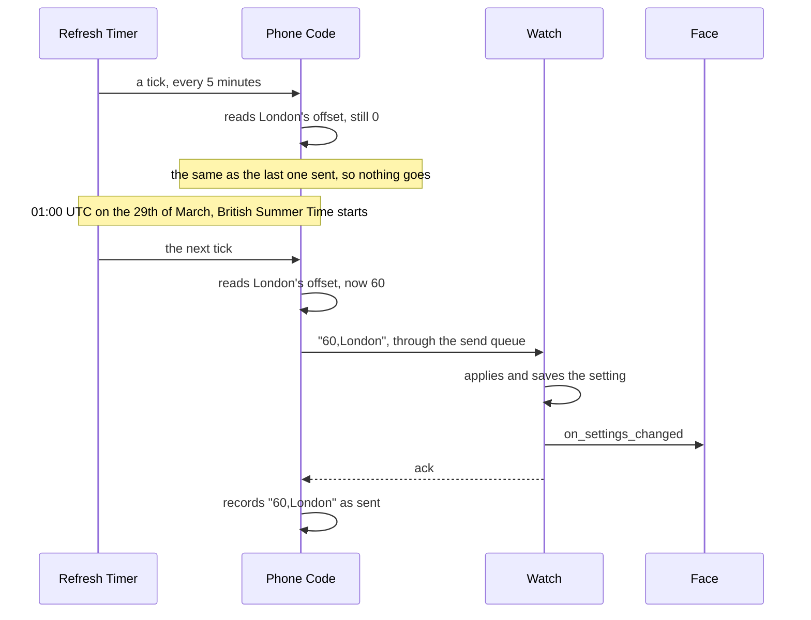

# Time Zones

A second clock shows the time somewhere else, such as a head office or family abroad. The framework handles the whole road for it: a picker on the settings page that finds a city, a zone name, or a plain UTC offset, a phone side that works out how far ahead of UTC the place is today and sends it again when the clocks change there, and small functions on the watch that read the setting. A face only has to draw the time.

The picker is the location search in [`location-component.ts`](../../src/ts/clay/location-component.ts), turned on for the clock by [`config-builder.ts`](../../src/ts/pkjs/config-builder.ts). The phone side is [`timezone.ts`](../../src/ts/pkjs/timezone.ts) and the push in [`app.ts`](../../src/ts/pkjs/app.ts). The watch side is [`zone_setting.h`](../../src/c/core/clock/zone_setting.h) and [`zone_setting.c`](../../src/c/core/clock/zone_setting.c) under `src/c/core/clock/`.

## What the Watch Is Sent

The watch gets one text setting: the minutes ahead of UTC, a comma, and the place's name. On the 5th of October 2026 these read:

```
60,London, England, United Kingdom      a city from the search
-240,New York                           the America/New_York zone
330,UTC+05:30                           an offset typed in
0,UTC
```

The minutes come first, so when a long name is cut to fit the space the face gave the setting, only the name gets shorter. The name keeps any commas of its own, and a face showing only the city cuts it at the next comma.

The watch never sees the zone itself, only the minutes for now. It has no database of zone rules, and the Pebble SDK has no way to ask for another zone's time. The phone already has that database in its JavaScript runtime, kept current by the phone's own updates, so the zone stays on the phone and the phone keeps the minutes right.

## Picking a Place

A face asks for the picker with `clock: { timeZone: true }` in its `buildConfig` options, which adds an **Alternate Time Zone** search to the Clock section under the `CLOCK_TIMEZONE_1` message key. As the wearer types, it offers matching rows.

**Zones by Name.** The page's runtime lists the zones it knows, about four hundred, and the search matches the city on the end first, so `london` finds Europe/London. A query such as `pacific` matches anywhere in the name. UTC is offered for `utc`, `gmt`, `zulu`, and `greenwich`. Each row shows its offset now as a hint.

**Typed Offsets.** `utc+5`, `+05:30`, `gmt-8`, and `-0330` all turn into a row. A whole hour is saved as its real zone, so UTC+5 becomes `Etc/GMT-5`, a name whose sign runs the other way round. Anything finer, such as UTC+05:30, has no zone behind it and is saved as the minutes alone, marked as a fixed offset. A fixed offset has no daylight saving to follow, so nothing is lost.

**Cities.** The same Open-Meteo geocoder as the weather location finds cities, and it names each city's zone. A second request to Open-Meteo fills in the minutes ahead of UTC for today, or the zone for a city the geocoder gave none.

Whichever row is picked, the page saves it as JSON, such as `{"lat":51.5,"lon":-0.13,"label":"London, England, United Kingdom","offset":60,"tz":"Europe/London"}`. The `tz` is the part that matters. The `offset` is only the answer on the day it was picked, kept for a phone that cannot look the zone up.

## From the Saved Place to the Setting

`timezone.toWire` turns the saved place into the string for the watch. It reads the minutes off the zone at the moment of sending, never from what was saved:

```ts
const live = place.tz ? offsetMinutes(place.tz, nowMs) : null;
const offset = live === null ? place.offset || 0 : live;

return offset + ',' + wire.toAscii(place.label);
```

**Reading a Zone's Offset.** `offsetMinutes` asks `Intl.DateTimeFormat` what the zone's wall clock reads now, builds that wall clock as if it were UTC, and subtracts the real UTC time. What is left is the offset, which comes out right for the half hour and three quarter hour zones too: 330 for Kolkata, 345 for Kathmandu, and -150 for St. John's in summer. Building a formatter is the slow part, so each zone keeps the one it built.

**Plain Letters.** The name is flattened to ASCII on the way out, the same as every text the phone sends, as [The Message Formats](message-formats.md#text-on-the-way-over) covers. São Paulo goes over as Sao Paulo.

**When There Is No Zone.** A runtime that cannot read the zone falls back to the offset saved at the pick, and so does a place with no zone saved. Either one stays on the offset it was picked with and goes an hour out when the clocks change. The picker shows a note under a place saved with no zone, asking the wearer to pick it again, which is the whole fix.

## Following Daylight Saving

Nothing about the saved settings changes when the clocks go forward, only what the zone reads. So the phone checks every timezone field when its code starts and then every 5 minutes, and sends any whose string has changed since the last one the watch took. Take a London picked in January, which first goes out as `0,London`:



**Only Once the Watch Has It.** A string counts as sent only when the watch acks it. A send that fails every retry is picked up again on the next tick rather than counted as delivered. The send goes through the same queue as everything else, which [The Phone Side](phone-side.md#the-send-queue) covers.

**Up to 5 Minutes Late.** For the first few minutes after the change the second clock can still show the old hour. The check is a few lookups and sends nothing when nothing moved, so it costs the watch nothing between changes.

**Only While the Phone Code Runs.** The timer is the phone code's background refresh, covered on [The Phone Side](phone-side.md#the-background-refresh). A phone that suspends the code sends nothing until it starts again, and every start sends every zone afresh, so the watch catches up then.

## Reading It on the Watch

The setting is an ordinary text setting in the face's own schema, saved to flash with the rest:

```c
{ .id = SETTING_COUNT, .message_key = &MESSAGE_KEY_CLOCK_TIMEZONE_1,
  .type = SETTING_CSTRING, .offset = offsetof(MySettings, zone_1),
  .size = 32, .default_str = "" },
```

The face also lists `CLOCK_TIMEZONE_1` under `messageKeys`. The string holds the minutes ahead of UTC and then the place's name, and `zone_setting_offset` and `zone_setting_label` read the two halves. An empty string means no place is picked, which is what the phone sends when the wearer clears the picker, so `zone_setting_is_set` reads it as no zone and a face shows dashes rather than a clock for a place nobody chose. `0,UTC` is a real zone and counts as set.

## Showing a Second Clock

The watch's clock counts seconds in UTC, so adding the zone's minutes and breaking the result apart with `gmtime` gives that place's wall clock:

```c
const char *zone = s_settings.zone_1;

if (!zone_setting_is_set(zone))
{
    snprintf(out, n, "--:--");
    return;
}

time_t there = time(NULL) + zone_setting_offset(zone) * 60;
struct tm *wall = gmtime(&there);

snprintf(out, n, "%02d:%02d", wall->tm_hour, wall->tm_min);
```

For a short label, a face copies `zone_setting_label` up to the next comma, so `London, England, United Kingdom` shows as `London`.

The second clock changes on the same minute tick as the main one. Only the offset waits on the phone.
