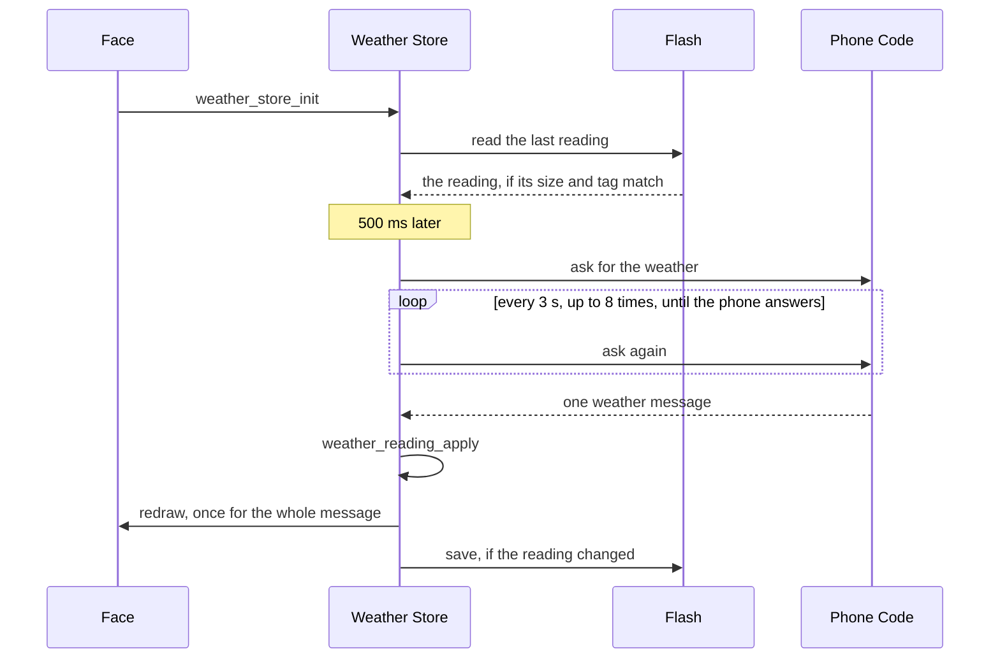

# The Weather Store

The weather store keeps the latest weather on the watch, asks the phone for more on the face's schedule, and saves the last good reading to flash. A face starts it once, subscribes its redraw, and reads the readings back. The polling, the saved copy, and the skipped writes are shared with the other stores and covered in [How the Stores Work](stores.md), and the rules for turning a message into a reading are on [Weather Readings](weather-readings.md). This page covers what is the weather store's own.

It lives in [`weather_store.h`](../../src/c/pebble/io/stores/weather_store.h) and [`weather_store.c`](../../src/c/pebble/io/stores/weather_store.c) under `src/c/pebble/io/stores/`.

## Setting It Up

```c
weather_store_init((WeatherConfig){.live = true, .poll_min = WEATHER_POLL_MIN,
                                   .persist_key = WEATHER_STORE_KEY}, NULL);
weather_store_subscribe(engine_mark_dirty);
```

`WEATHER_SEED_EMPTY` starts every field at its no-data value, so a seed for screenshots sets only what it shows:

```c
WeatherSeed seed = WEATHER_SEED_EMPTY;
seed.temp = 23;
seed.cond = "CLEAR";
weather_store_init((WeatherConfig){.live = false}, &seed);
```

## From Launch to the First Reading



**Asking While the Phone Starts.** On a cold launch the phone's PebbleKit JS can take several seconds to come up, and a request that arrives before it is ready is lost. So until the phone answers, the store asks again every 3 seconds, up to 8 times. It stops as soon as any answer arrives, a failed fetch included, since asking again would only start the same failing fetch on the phone. A store that restored a reading from flash stops after the first ask, since it already has something to show and the phone fetches weather on its own once its code starts.

## One Redraw and One Save per Message

A unit change can arrive in the same message as the weather. The store's handlers never redraw or save themselves. They only mark the store as changed, and once the whole message is handled the AppMessage layer runs the store's `inbox_done`, which redraws once and saves once. A panel built from several readings, such as one that follows the sunset, never shows the new temperature beside the old sun times, and flash gets at most one write per message.

**A Failed Write Tries Again.** If the write does not land, the store stays marked as changed, so the next message tries again whatever it brings rather than leaving flash out of date until the weather moves. Clearing the reading never saves, so a failed fetch cannot overwrite the last good reading on flash.

## Reading It Back

Each reading has its own getter, such as `weather_store_temp` or `weather_store_humidity`, and each returns its no-data value when there is nothing to show. A change of temperature unit converts the reading in hand, and the forecast strips drop the columns already gone each time they are read, both covered on [Weather Readings](weather-readings.md). `weather_store_age_s` gives the seconds since the last reading, or -1 for none.

**Today's Readings Expire.** The high, the low, the UV index, and the chance of rain are only good for the day they came. For some providers they come from a second request, and when only that one fails the rest of the reading keeps arriving. So the store remembers the day they came, and their getters return no-data once that day is over rather than showing yesterday's high as today's.
